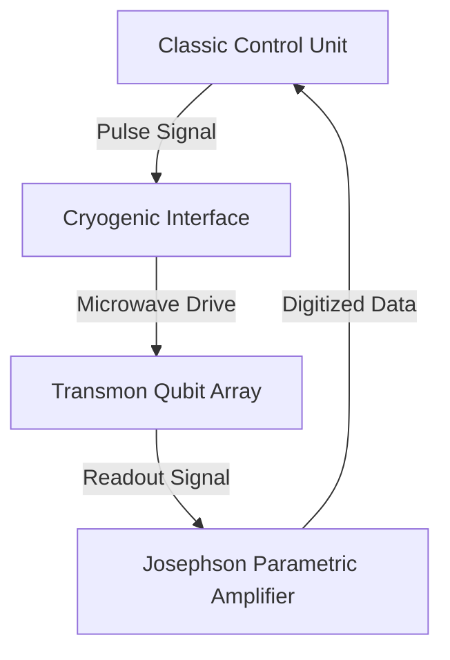

# Quantum Computing & Algorithms

Author: GateHub Quantum Institute

## 1. Introduction & Mathematics
Schrödinger equation representation:
$$\mathbf{H} |\psi\rangle = E |\psi\rangle$$

Key Pauli matrices:
- $\sigma_x = \begin{matrix} 0 & 1 \\ 1 & 0 \end{matrix}$
- $\sigma_z = \begin{matrix} 1 & 0 \\ 0 & -1 \end{matrix}$

## 2. Quantum Circuit Simulation in Python
```python
import numpy as np

def apply_hadamard(state):
    H = (1 / np.sqrt(2)) * np.array([[1, 1], [1, -1]])
    return np.dot(H, state)

state_0 = np.array([1, 0])
superposition = apply_hadamard(state_0)
print("Superposition:", superposition)
```

## 3. Quantum Architecture Diagram


## 4. Performance Comparison Table
| Architecture | Qubit Count | Coherence Time (us) | Gate Error Rate |
| Superconducting | 127 | 100 | 0.1% |
| Trapped Ion | 32 | 1000000 | 0.01% |
| Photonic | 216 | N/A | 0.5% |

## 5. Assessment Questions

Q1: What is the matrix representation of the Hadamard gate operator?
A) \frac{1}{\sqrt{2}} \begin{matrix} 1 & 1 \\ 1 & -1 \end{matrix}
B) \begin{matrix} 0 & 1 \\ 1 & 0 \end{matrix}
C) \begin{matrix} 1 & 0 \\ 0 & 1 \end{matrix}
D) \frac{1}{2} \begin{matrix} 1 & 0 \\ 0 & 1 \end{matrix}

Answer: A
Explanation: The Hadamard gate maps basis state |0> to (|0> + |1>)/sqrt(2).

Q2: Which quantum architecture currently exhibits the longest coherence time?
A) Superconducting
B) Trapped Ion
C) Photonic
D) Semiconductor

Answer: B
[Notes]: Trapped Ion qubits feature coherence times exceeding seconds or minutes.
