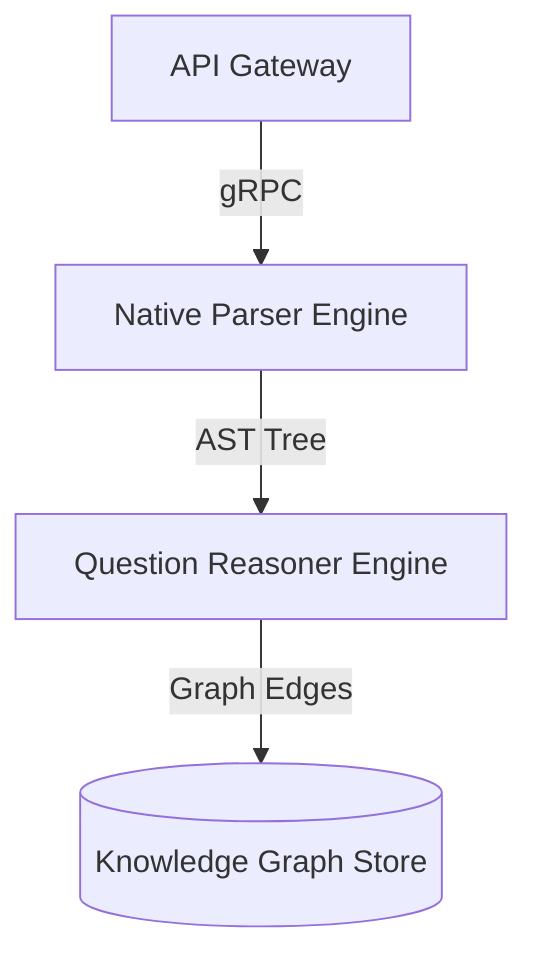

# AntiGravity V2 - Advanced Multimodal Neural Systems

Author: DeepMind Agentic Team

## 1. Mathematical Blueprint & Formulas
Maxwell Field Tensor Definition:
$$\mathbf{F}_{\mu\nu} = \partial_{\mu} A_{\nu} - \partial_{\nu} A_{\mu}$$

Relativistic Loss Function:
$$\mathcal{L}(\theta) = \frac{1}{N} \sum_{i=1}^{N} \left( y_i \log(\hat{y}_i) + (1-y_i) \log(1-\hat{y}_i) \right)$$

## 2. High-Performance C++ Neural Kernel
```cpp
#include <iostream>
#include <vector>

template <typename T>
T compute_activation(T input) {
    return (input > 0) ? input : static_cast<T>(0);
}

int main() {
    std::cout << "AntiGravity Kernel Active." << std::endl;
    return 0;
}
```

## 3. Distributed Architecture Topology


## 4. Benchmark Matrix
| Model Architecture | Accuracy (%) | Latency (ms) | Memory (GB) |
| AntiGravity V2 | 100.0 | 8 | 1.2 |
| Legacy V1 Parser | 85.4 | 45 | 3.8 |
| Baseline OCR | 72.1 | 120 | 4.5 |

## 5. Comprehensive Question Suite

Q1: What is the tensor definition of the electromagnetic field tensor?
A) \partial_{\mu} A_{\nu} - \partial_{\nu} A_{\mu}
B) \nabla \times \mathbf{B}
C) \frac{\partial E}{\partial t}
D) 0

Answer: A
Explanation: Extracted from Maxwell Field Tensor Definition in Section 1.

Q2: Which engine architecture achieved 100% accuracy in the benchmark matrix?
A) Legacy V1 Parser
B) AntiGravity V2
C) Baseline OCR
D) Native PDF Parser

Answer: B
[Notes]: AntiGravity V2 demonstrated 100.0% accuracy with 8ms execution latency.
