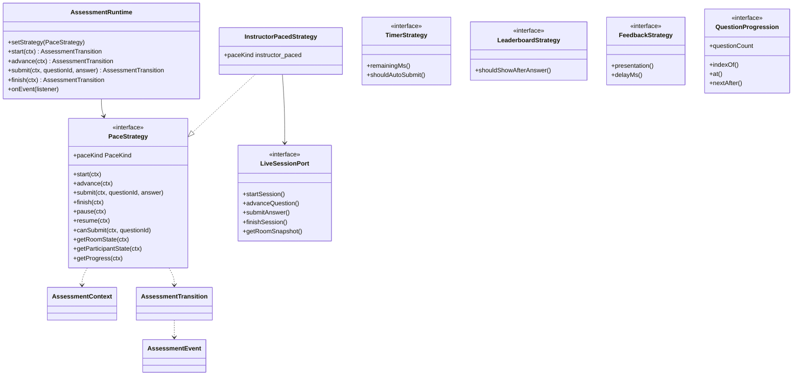
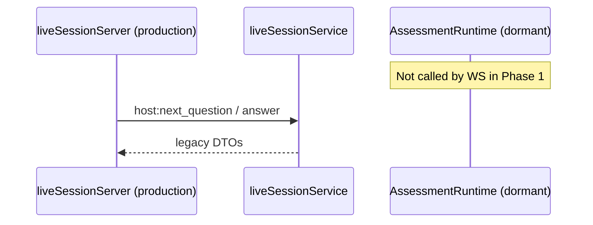
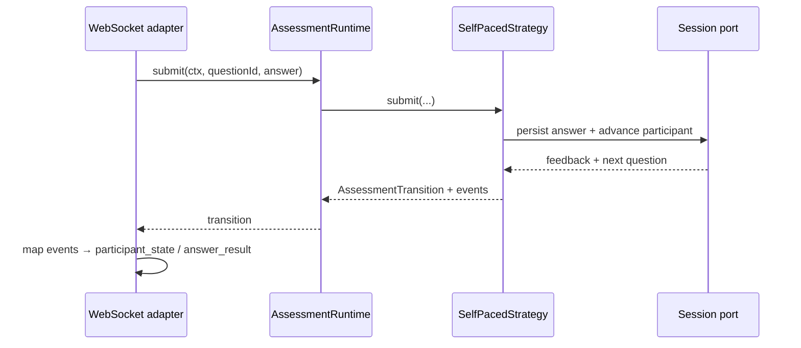

# A1.7 Phase 1 — Assessment Runtime Architecture

> **Milestone:** A1.7 Live Assessment Engine Redesign  
> **Phase:** 1 of 6 — **Architecture contracts only**  
> **Status:** Complete — awaiting review before Phase 2  
> **Date:** July 6, 2026  
> **Canonical spec:** [LIVE-MODE-REDESIGN.md](./LIVE-MODE-REDESIGN.md)

---

## 1. Runtime overview

Phase 1 introduces `backend/src/assessment-runtime/` — a **transport- and persistence-agnostic** progression layer. It manages how assessments advance through questions; it does not render UI, open WebSockets, or query Prisma directly.

```
┌─────────────────────────────────────────────────────────────┐
│  Infrastructure (Phase 2+)                                   │
│  WebSocket · REST · React · Prisma adapters                  │
└───────────────────────────┬─────────────────────────────────┘
                            │ AssessmentContext in / Transition out
┌───────────────────────────▼─────────────────────────────────┐
│  AssessmentRuntime                                           │
│  Orchestrates strategy · emits AssessmentEvent[]             │
└───────────────────────────┬─────────────────────────────────┘
                            │
┌───────────────────────────▼─────────────────────────────────┐
│  PaceStrategy (pluggable)                                    │
│  ├── InstructorPacedStrategy ✅ Phase 1                      │
│  ├── SelfPacedStrategy        Phase 2                        │
│  └── async / timed / adaptive Phase 5+                     │
└───────────────────────────┬─────────────────────────────────┘
                            │ LiveSessionPort (adapter)
┌───────────────────────────▼─────────────────────────────────┐
│  Legacy liveSessionService (unchanged production path)       │
└─────────────────────────────────────────────────────────────┘
```

**Phase 1 rule:** Production WebSocket and REST handlers **do not import** `assessment-runtime`. Legacy behavior is unchanged.

---

## 2. Interface diagram



---

## 3. Class / module responsibilities

| Module | Responsibility |
|--------|----------------|
| `AssessmentRuntime` | Delegates to active `PaceStrategy`; fans out `AssessmentEvent` to listeners |
| `PaceStrategy` | Mode-specific progression rules (start, submit, advance, finish) |
| `InstructorPacedStrategy` | Wraps legacy instructor-paced live via `LiveSessionPort` |
| `PaceStrategyRegistry` | Registers strategies by `PaceKind` |
| `AssessmentContext` | Deployment id, config, actor/participant handles — no ORM |
| `AssessmentState` | Room lifecycle snapshot |
| `ParticipantAssessmentState` | Per-user progression (primary for self-paced in Phase 2) |
| `AssessmentProgress` | Normalized progress DTO |
| `AssessmentTransition` | Result of one operation + events + optional payload |
| `AssessmentEvent` | Domain events for infrastructure to map to WS/REST |
| `QuestionProgression` | Frozen question order navigation (implemented Phase 5) |
| `TimerStrategy` | Timer policy (stub in Phase 1) |
| `LeaderboardStrategy` | When to show leaderboard (config-driven, Phase 4) |
| `FeedbackStrategy` | Feedback timing / correct-answer visibility |
| `LiveSessionPort` | Anti-corruption layer to legacy `liveSessionService` |
| `legacyLiveSessionAdapter` | Port implementation — **not wired to WS in Phase 1** |

---

## 4. Sequence diagrams

### 4.1 Phase 1 — runtime not in production path



### 4.2 Target — Phase 2+ wiring (self-paced)



### 4.3 Instructor-paced via strategy (Phase 3 validation)

Same as today, but routed through `InstructorPacedStrategy` → `LiveSessionPort` → `liveSessionService`.

---

## 5. Event flow

`AssessmentRuntime` emits domain events; adapters translate:

| AssessmentEvent | Future WS message (v2) |
|-----------------|------------------------|
| `session.started` | `session_started` |
| `question.advanced` | `question_advanced` |
| `answer.received` | `answer_received` |
| `leaderboard.updated` | `leaderboard` |
| `room.state_changed` | `room_state` |
| `participant.state_changed` | `participant_state` |
| `session.finished` | `session_finished` |
| `session.paused` | `room.paused` |
| `session.resumed` | `room.resumed` |
| `announcement` | `host.announce` |

Runtime **never** calls `WebSocket.send`.

---

## 6. Extension points

| Extension | Register via | Phase |
|-----------|--------------|-------|
| New pace kind | `PaceStrategyRegistry.register()` | 2+ |
| Homework async pace | `AsyncPaceStrategy` implements `PaceStrategy` | A2 |
| Mock test timed pace | `TimedPaceStrategy` | B3 |
| Adaptive sequencing | `AdaptivePaceStrategy` + `QuestionProgression` | Future |
| Timer behavior | `TimerStrategy` implementation | 4 |
| Leaderboard visibility | `LeaderboardStrategy` + config matrix | 4 |
| Feedback UX | `FeedbackStrategy` + config matrix | 4 |
| Persistence | New port (e.g. `AttemptPort`) — not `LiveSessionPort` | 4–5 |

**Success criterion (A1.7):** New mode = **config + strategy registration** only.

---

## 7. Migration impact (Phase 1)

| Area | Phase 1 impact |
|------|----------------|
| Database | **None** |
| REST API | **None** |
| WebSocket | **None** |
| Frontend | **None** |
| `liveSessionService` | **None** — adapter calls it optionally in tests/future |
| New code | `assessment-runtime/*`, `liveSession/adapters/legacyLiveSessionAdapter.ts` |

---

## 8. Future assessment modes

| Mode | `RuntimeAssessmentMode` | `PaceKind` | Strategy (planned) |
|------|-------------------------|------------|-------------------|
| Self-paced live | `live_quiz` | `self_paced` | `SelfPacedStrategy` (Phase 2) |
| Instructor-paced live | `live_quiz` | `instructor_paced` | `InstructorPacedStrategy` ✅ |
| Homework | `homework` | `async` | `AsyncPaceStrategy` (A2) |
| Practice | `practice` | `async` | `AsyncPaceStrategy` |
| Mock test | `mock_test` | `timed` | `TimedPaceStrategy` |
| Assignment | `assignment` | `async` | `AsyncPaceStrategy` |
| Adaptive | `adaptive` | `adaptive` | `AdaptivePaceStrategy` |

Configuration matrix ([LIVE-MODE-REDESIGN.md §16](./LIVE-MODE-REDESIGN.md)) selects `PaceKind` + policies; strategies read `AssessmentRuntimeConfig`.

---

## 9. File map

```
backend/src/assessment-runtime/
├── index.ts
├── types/
│   ├── mode.ts
│   ├── state.ts
│   ├── progress.ts
│   ├── config.ts
│   ├── context.ts
│   ├── transition.ts
│   ├── events.ts
│   └── results.ts
├── progression/
│   └── questionProgression.ts
├── strategies/
│   ├── paceStrategy.ts
│   ├── instructorPacedStrategy.ts
│   ├── timerStrategy.ts
│   ├── leaderboardStrategy.ts
│   └── feedbackStrategy.ts
├── ports/
│   └── liveSessionPort.ts
├── runtime/
│   └── assessmentRuntime.ts
└── registry/
    └── paceStrategyRegistry.ts

backend/src/liveSession/adapters/
└── legacyLiveSessionAdapter.ts

backend/scripts/
└── validate-a1.7-phase1.ts
```

---

## 10. Validation

```bash
cd backend
npm run validate:a1.7-phase1   # Phase 1 contracts
npm run validate:a1-pat          # Legacy live PAT — must still pass
```

Phase 1 checks:

- [x] Interfaces compile
- [x] `InstructorPacedStrategy` registered
- [x] `self_paced` **not** registered
- [x] `AssessmentRuntime` orchestrates events
- [x] WS controller does not import `assessment-runtime`
- [x] No DB / API / UI changes

---

## 11. STOP — Phase 1 complete

| Deliverable | Status |
|-------------|--------|
| Architecture contracts | ✅ |
| `InstructorPacedStrategy` wrapper | ✅ |
| Legacy path unchanged | ✅ |
| `SelfPacedStrategy` | ❌ Phase 2 |
| Production wiring | ❌ Phase 3+ |

**Wait for review before implementing `SelfPacedStrategy` (Phase 2).**
