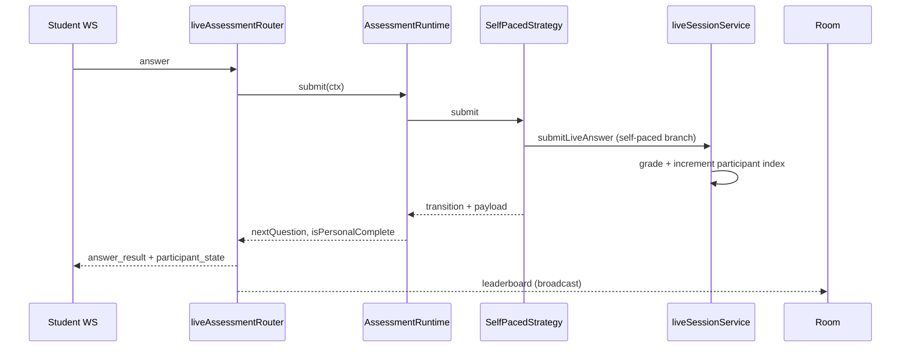

# A1.7 Phase 2 — Self-Paced Live Strategy

> **Milestone:** A1.7 Live Assessment Engine Redesign  
> **Phase:** 2 of 6 — **SelfPacedStrategy + runtime wiring**  
> **Status:** Complete — awaiting review before Phase 3  
> **Date:** July 6, 2026  
> **Prerequisite:** [A1.7-PHASE1-ARCHITECTURE.md](./A1.7-PHASE1-ARCHITECTURE.md) ✅

---

## 1. Problem (root cause)

Students saw **"Waiting for next question…"** because progression used **`LiveSession.currentQuestionIndex`** (instructor-paced / Kahoot model). The client waited for `host:next_question` / broadcast `session_state` before loading the next question.

**Fix:** Participant-owned `currentQuestionIndex` + auto-advance on submit for `paceMode: self_paced` (default).

---

## 2. Root changes

### Database (`LiveParticipant`)

| Column | Purpose |
|--------|---------|
| `currentQuestionIndex` | Participant's active question (0-based) |
| `questionStartedAt` | Per-participant timer anchor |
| `finishedAt` | Personal completion timestamp |

### Settings

| Field | Default |
|-------|---------|
| `paceMode` | `"self_paced"` |

Legacy `autoNextQuestion: true` maps to self-paced on read.

### Server progression

| Mode | Advance trigger | Question pointer |
|------|-----------------|------------------|
| `self_paced` | `submitLiveAnswer` → increment participant index | `LiveParticipant.currentQuestionIndex` |
| `instructor_paced` | `host:next_question` | `LiveSession.currentQuestionIndex` |

---

## 3. Files modified

### Backend

| File | Change |
|------|--------|
| `prisma/schema.prisma` | Participant progression columns |
| `services/liveSession/paceMode.ts` | `resolvePaceMode`, `isSelfPaced` |
| `services/liveSession/selfPacedProgression.ts` | Submit, init, advance logic |
| `services/liveSession/liveSessionService.ts` | Branch start/submit/player-view |
| `assessment-runtime/strategies/selfPacedStrategy.ts` | **New** PaceStrategy impl |
| `assessment-runtime/registry/paceStrategyRegistry.ts` | Register both strategies |
| `liveSession/liveAssessmentRouter.ts` | **New** WS/REST router |
| `liveSession/adapters/selfPacedLiveSessionAdapter.ts` | Port adapter |
| `ws/liveSessionServer.ts` | `routeLiveSubmit`, `participant_state` |
| `controllers/liveSessionController.ts` | REST submit via router |

### Frontend

| File | Change |
|------|--------|
| `lib/liveSession/paceMode.ts` | Client pace helpers |
| `lib/liveSession/types.ts` | `paceMode`, WS messages, answer payload |
| `lib/liveSession/playerStateMachine.ts` | Self-paced phase transitions |
| `hooks/useLivePlayerFlow.ts` | No `READY_FOR_NEXT` in self-paced |
| `hooks/useLiveSessionSocket.ts` | `participant_state` handler |
| `pages/student/LiveSessionPlayerPage.tsx` | Hide wait bar when self-paced |
| `pages/instructor/LiveSessionHostPage.tsx` | Hide **Next Question** when self-paced |

---

## 4. Strategy wiring



`resolveSessionPaceKind()` selects `self_paced` or `instructor_paced` per session settings.

---

## 5. State transitions (student)

### Self-paced (new default)

```
QUESTION_ACTIVE → SUBMITTING → SHOW_FEEDBACK (2s)
  → [optional] SHOW_LEADERBOARD (1.8s)
  → QUESTION_ACTIVE (next question)
  → … → QUIZ_FINISHED (personal complete)
```

**No `READY_FOR_NEXT`** in self-paced mode.

### Instructor-paced (unchanged)

```
SHOW_FEEDBACK → READY_FOR_NEXT → (host next) → QUESTION_ACTIVE
```

---

## 6. WebSocket events

| Event | Self-paced | Instructor-paced |
|-------|:----------:|:----------------:|
| `answer_result` | Includes `nextQuestion`, `participantQuestionIndex` | Standard payload |
| `participant_state` | Unicast after submit + on connect | N/A |
| `session_state` broadcast on answer | **No** | **Yes** |
| `leaderboard` | Yes | Yes |
| `host:next_question` | Ignored | Advances room |

---

## 7. Regression tests

```bash
cd backend && npm run validate:a1.7-phase1   # 14/14 (strategies + WS wired)
cd backend && npm run validate:a1-pat        # 10/10
cd frontend && npm test -- playerStateMachine.test.ts  # 7 tests
```

---

## 8. Manual QA checklist

**Start a new live session** (existing in-flight sessions may need re-start after deploy).

- [ ] Instructor clicks **Start** once only
- [ ] **Next Question** button hidden on host dashboard
- [ ] Student Q1 → submit → feedback ~2s → **auto Q2** (no wait pill)
- [ ] Complete all questions → personal results
- [ ] Leaderboard updates on each answer (host + student header)
- [ ] Host analytics pulse on answers
- [ ] Create session with `paceMode: instructor_paced` → Next button visible, wait behavior preserved
- [ ] Refresh mid-quiz restores participant question index

---

## 9. Known limitations (Phase 3+)

- Pause/resume not implemented (returns `no_op`)
- Configuration matrix UI not built (Phase 4)
- Early finisher spectator lobby (product spec) — personal complete shows results; room may still be active
- Existing sessions started before deploy: first submit bootstraps `currentQuestionIndex` from -1 → 0

---

## 10. STOP — Phase 2 complete

| Deliverable | Status |
|-------------|--------|
| `SelfPacedStrategy` | ✅ |
| Runtime wired (WS + REST) | ✅ |
| Participant progression in DB | ✅ |
| Client auto-advance | ✅ |
| Instructor-paced preserved | ✅ |
| Phase 3 (`InstructorPacedStrategy` production wiring cleanup) | ☐ Review |

**Wait for review before Phase 3.**
