# THE GATEHUB — Universal Assessment Platform Architecture

> **Canonical Reference — FROZEN**  
> **Phase 0:** ✅ Approved (with final enhancements)  
> **Phase 1:** In progress — Module 05 complete; see [Section 38](#38-phase-1-execution-order)  
> **Status:** This document is the single source of truth. Changes require explicit architecture review.  
> **Supersedes:** Quiz-centric design in `QUIZ-ECOSYSTEM-PRODUCT-RESEARCH.md`  
> **Principle:** One engine, many modes — not a Quizizz clone

---

## Table of Contents

1. [Executive Summary](#1-executive-summary)
2. [Architectural Principles](#2-architectural-principles)
3. [Platform Context Map](#3-platform-context-map)
4. [Complete ER Diagram](#4-complete-er-diagram)
5. [Database Schema](#5-database-schema)
6. [Migration from Current Schema](#6-migration-from-current-schema)
7. [API Specification](#7-api-specification)
8. [WebSocket Event Specification](#8-websocket-event-specification)
9. [Folder Structure](#9-folder-structure)
10. [Feature Dependency Graph](#10-feature-dependency-graph)
11. [UI Component Hierarchy](#11-ui-component-hierarchy)
12. [State Management Flow](#12-state-management-flow)
13. [Permission Matrix](#13-permission-matrix)
14. [Sequence Diagrams — Every Assessment Mode](#14-sequence-diagrams--every-assessment-mode)
15. [Real-time Production Architecture](#15-real-time-production-architecture)
16. [Multi-Tenant & White-Label Design](#16-multi-tenant--white-label-design)
17. [Updated Roadmap](#17-updated-roadmap)
18. [Approval Checklist](#18-approval-checklist)
19. [Assessment Lifecycle](#19-assessment-lifecycle)
20. [Immutable Versioning](#20-immutable-versioning)
21. [Event-Driven Architecture](#21-event-driven-architecture)
22. [Notification Service](#22-notification-service)
23. [Media Service](#23-media-service)
24. [Plugin Architecture](#24-plugin-architecture)
25. [Rules Engine](#25-rules-engine)
26. [Audit & Compliance](#26-audit--compliance)
27. [Search Layer](#27-search-layer)
28. [Observability](#28-observability)
29. [Security Model](#29-security-model)
30. [Offline Support](#30-offline-support)
31. [Accessibility](#31-accessibility)
32. [Internationalization](#32-internationalization)
33. [Reporting Pipeline](#33-reporting-pipeline)
34. [AI Governance](#34-ai-governance)
35. [Public SDK](#35-public-sdk)
36. [Feature Flags](#36-feature-flags)
37. [Domain Glossary](#37-domain-glossary)
38. [Phase 1 Execution Order](#38-phase-1-execution-order)

---

## 1. Executive Summary

THE GATEHUB will not build a "Quiz Room feature." It will build a **Universal Assessment Platform** — a single engine that powers every evaluative and formative interaction across the LMS.

| Consumer Module | Uses Assessment Engine For |
|-----------------|---------------------------|
| Courses | Lecture quizzes, section tests |
| Learning Universe | Practice steps, module checks |
| Coding Challenges | Code/debug/SQL assessments |
| Placement Preparation | Mock tests, company tracks |
| Company Assessments | Branded hiring tests |
| Mock Tests | Full-length simulations |
| Practice Sessions | Self-paced drills |
| Live Competitions | Real-time rooms |
| Faculty Exams | Formal timed assessments |
| Department Events | Scoped leaderboards |
| Campus Challenges | University-wide competitions |

**Core sub-engines (shared, never duplicated):**

```
┌─────────────────────────────────────────────────────────────┐
│                  UNIVERSAL ASSESSMENT ENGINE                   │
├─────────────┬─────────────┬─────────────┬─────────────────────┤
│  Question   │  Scoring    │  Analytics  │  Gamification       │
│  Engine     │  Engine     │  Engine     │  Engine             │
├─────────────┴─────────────┴─────────────┴─────────────────────┤
│  Live Engine  │  AI Service  │  Notification  │  Audit         │
└─────────────────────────────────────────────────────────────┘
```

---

## 2. Architectural Principles

### 2.1 One Assessment Engine, Many Modes

Modes are **runtime configurations**, not separate codebases.

| Mode | `AssessmentMode` | Primary Use |
|------|------------------|-------------|
| Practice | `practice` | Self-paced, unlimited attempts, learning-first |
| Live Quiz | `live_quiz` | Real-time competition via LiveRoom |
| Homework | `homework` | Async, deadline, partial credit |
| Assignment | `assignment` | Course-graded, LMS sync |
| Mock Test | `mock_test` | Full simulation, strict rules |
| Timed Assessment | `timed_assessment` | Exam conditions, lock timer |
| Coding Assessment | `coding_assessment` | Sandbox execution, test cases |
| Adaptive Assessment | `adaptive` | AI-driven question sequencing |
| AI Interview Assessment | `ai_interview` | Voice/video + AI rubric grading |
| Survey | `survey` | No scoring, aggregate insights |
| Poll | `poll` | Single-question live pulse |

Each mode configures: timer policy, scoring weights, gamification enabled, retry policy, proctoring, visibility.

### 2.2 Separate Score from Learning (Non-Negotiable)

Every `Attempt` produces **two immutable metric tracks**:

```
Attempt
 ├── LearningRecord     ← pedagogy, LMS, mastery (NEVER affected by power-ups)
 └── EngagementRecord   ← XP, coins, rank, combos (NEVER affects grades)
```

| Track | Fields | Used By |
|-------|--------|---------|
| **Learning** | accuracy, topicMastery, bloomLevels, difficultySolved, weakConcepts, strongConcepts, timePerConcept, marksEarned, discrimination | Reports, LMS, placement readiness, faculty analytics |
| **Gamification** | xpEarned, coinsEarned, streak, combo, sessionRank, powerUpsUsed, achievementPoints | Leaderboards, badges, student dashboard |

**Rule:** Gamification metrics may *display alongside* learning metrics but must never overwrite or mutate them.

### 2.3 Universal Assessment Player

```
QuestionType ──register──► QuestionRenderer ──plug into──► AssessmentPlayer
```

- One player shell: timer, progress, navigation, accessibility, proctoring chrome
- Per-type renderers: MCQ, coding, essay, video-response, hotspot, etc.
- Per-type graders: registered in Scoring Engine
- Adding a new type = register renderer + grader + validator (no player fork)

### 2.4 Isolated Real-time Services (Production)

```
Redis Pub/Sub
    ↓
Socket Gateway (stateless, horizontally scaled)
    ↓
Room Service → Participant Service → Scoring Service
    ↓              ↓                      ↓
Leaderboard Service → Analytics Service → Notification Service
```

### 2.5 Platform-Wide Gamification

Badges, XP, coins, achievements are **not quiz-owned**. They are awarded by event listeners across the entire platform.

### 2.6 Generic Leaderboard System

Leaderboards are a query over pre-aggregated rankings with configurable scope and period — not hardcoded to quiz sessions.

### 2.7 Shared AI Layer

All AI capabilities route through one `AiAssessmentService` (extends existing `AiRouter`).

### 2.8 Analytics as Query Engine

Event-sourced `AnalyticsEvent` + materialized views answer institutional questions.

### 2.9 Normalized, Decoupled Schema

Nothing is tightly coupled to "quizzes." Legacy `Quiz` maps to `Assessment`.

### 2.10 Scale Targets

- 100,000+ concurrent live participants
- Multi-university tenancy
- White-label: branding, badges, XP rules, scoring, certificates per org

---

## 3. Platform Context Map

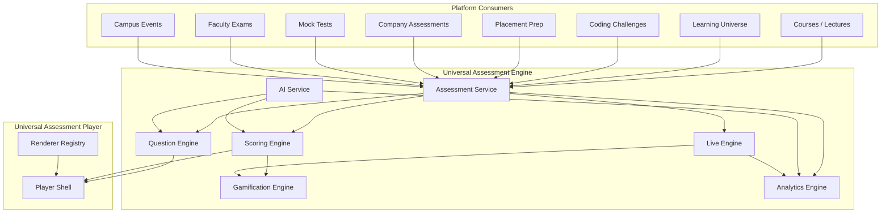

---

## 4. Complete ER Diagram

```mermaid
erDiagram
    Organization ||--o{ Department : has
    Organization ||--o{ OrganizationMember : has
    Organization ||--o{ TenantConfig : configures
    User ||--o{ OrganizationMember : belongs

    User ||--o{ Assessment : authors
    Assessment ||--o{ AssessmentVersion : versions
    Assessment ||--o{ AssessmentSection : sections
    AssessmentSection ||--o{ AssessmentItem : contains
    AssessmentItem }o--|| Question : references
    Question ||--o{ QuestionVersion : versions
    Question }o--|| QuestionType : typed
    Question ||--o{ Choice : has
    Question ||--o{ QuestionMedia : has
    Question ||--o{ QuestionTag : tagged

    Assessment ||--o{ AssessmentDeployment : deployed
    AssessmentDeployment ||--o{ Attempt : produces
    Attempt ||--|| LearningRecord : has
    Attempt ||--o| EngagementRecord : has
    Attempt ||--o{ AttemptQuestion : contains
    AttemptQuestion ||--o| Response : has

    AssessmentDeployment ||--o| LiveRoom : may_have
    LiveRoom ||--o{ Participant : has
    Participant ||--o{ Response : submits
    LiveRoom ||--o{ LeaderboardSnapshot : snapshots

    AssessmentDeployment ||--o| Homework : may_be
    AssessmentDeployment ||--o| Assignment : may_be

    User ||--o{ UserGamificationProfile : has
    UserGamificationProfile ||--o{ XPTransaction : earns
    UserGamificationProfile ||--o{ CoinTransaction : earns
    BadgeDefinition ||--o{ BadgeAward : defines
    User ||--o{ BadgeAward : receives
    AchievementDefinition ||--o{ Achievement : defines
    User ||--o{ Achievement : unlocks
    PowerUpDefinition ||--o{ PowerUpInventory : defines
    User ||--o{ PowerUpInventory : holds

    LeaderboardDefinition ||--o{ LeaderboardEntry : aggregates
    AnalyticsEvent }o--|| User : actor
    AnalyticsEvent }o--o| Assessment : context
    AnalyticsEvent }o--o| Question : context

    AIHistory }o--|| User : requested_by
    AuditLog }o--|| User : actor

    Organization {
        string id PK
        string slug UK
        string name
        string plan
        json branding
    }

    Assessment {
        string id PK
        string organizationId FK
        string authorId FK
        string kind
        string status
        string title
    }

    AssessmentVersion {
        string id PK
        string assessmentId FK
        int version
        json snapshot
        datetime publishedAt
    }

    Question {
        string id PK
        string organizationId FK
        string typeId FK
        string stem
        json metadata
        string difficulty
        string bloomLevel
    }

    Attempt {
        string id PK
        string deploymentId FK
        string userId FK
        string mode
        string status
        datetime startedAt
        datetime submittedAt
    }

    LearningRecord {
        string id PK
        string attemptId FK UK
        float accuracy
        json topicMastery
        json weakConcepts
        json strongConcepts
        json timePerConcept
        int marksEarned
        int totalMarks
    }

    EngagementRecord {
        string id PK
        string attemptId FK UK
        int xpEarned
        int coinsEarned
        int streak
        int combo
        int sessionRank
        int achievementPoints
    }

    LiveRoom {
        string id PK
        string deploymentId FK
        string roomCode UK
        string status
        json settings
    }

    Participant {
        string id PK
        string roomId FK
        string userId FK
        string displayName
        float engagementScore
        int learningCorrectCount
    }
```

---

## 5. Database Schema

### 5.1 Enums & Constants

```typescript
// assessment.types.ts — canonical enums (not DB enums for flexibility)

export const ASSESSMENT_KINDS = [
  "formative", "summative", "diagnostic", "placement",
  "coding", "survey", "interview", "competition"
] as const;

export const ASSESSMENT_MODES = [
  "practice", "live_quiz", "homework", "assignment",
  "mock_test", "timed_assessment", "coding_assessment",
  "adaptive", "ai_interview", "survey", "poll"
] as const;

// Assessment lifecycle (Section 19) — content-level status on Assessment entity
export const ASSESSMENT_LIFECYCLE = [
  "draft", "review", "approved", "published", "scheduled",
  "live", "completed", "archived"
] as const;

// Deployment runtime status (on AssessmentDeployment / LiveRoom)
export const DEPLOYMENT_STATUSES = [
  "draft", "scheduled", "lobby", "active", "paused", "completed", "cancelled", "archived"
] as const;

/** @deprecated Use ASSESSMENT_LIFECYCLE */
export const ASSESSMENT_STATUSES = ASSESSMENT_LIFECYCLE;

export const ATTEMPT_STATUSES = [
  "in_progress", "submitted", "graded", "abandoned", "expired", "voided"
] as const;

export const LIVE_ROOM_STATUSES = [
  "draft", "scheduled", "lobby", "active", "paused", "finished", "cancelled"
] as const;

export const LEADERBOARD_SCOPES = [
  "quiz", "course", "department", "semester", "year",
  "university", "global", "friends", "placement",
  "coding", "event", "custom"
] as const;

export const LEADERBOARD_PERIODS = [
  "session", "daily", "weekly", "monthly", "yearly", "all_time"
] as const;

export const ANALYTICS_EVENT_TYPES = [
  "attempt.started", "attempt.submitted", "question.answered",
  "question.skipped", "room.joined", "room.finished",
  "badge.earned", "xp.earned", "hint.used", "powerup.used",
  "mastery.updated", "concept.weak_detected"
] as const;
```

### 5.2 Prisma Schema (Target State)

```prisma
// ─── Multi-Tenant Foundation ───────────────────────────────────────────────

model Organization {
  id          String   @id @default(cuid())
  slug        String   @unique
  name        String
  plan        String   @default("standard")  // standard | enterprise | white_label
  branding    Json     @default("{}")        // logo, colors, domain
  settings    Json     @default("{}")
  createdAt   DateTime @default(now()) @map("created_at")
  updatedAt   DateTime @updatedAt @map("updated_at")

  departments Department[]
  members     OrganizationMember[]
  config      TenantConfig?
  assessments Assessment[]
  questions   Question[]
  deployments AssessmentDeployment[]

  @@index([slug])
}

model Department {
  id             String @id @default(cuid())
  organizationId String @map("organization_id")
  name           String
  code           String?
  parentId       String? @map("parent_id")

  organization Organization @relation(fields: [organizationId], references: [id], onDelete: Cascade)
  parent       Department?  @relation("DeptTree", fields: [parentId], references: [id])
  children     Department[] @relation("DeptTree")
  members      OrganizationMember[]

  @@unique([organizationId, code])
  @@index([organizationId])
}

model OrganizationMember {
  id             String   @id @default(cuid())
  organizationId String   @map("organization_id")
  userId         String   @map("user_id")
  departmentId   String?  @map("department_id")
  role           String   @default("student")  // student | faculty | admin | dept_admin
  employeeId     String?  @map("employee_id")
  joinedAt       DateTime @default(now()) @map("joined_at")

  organization Organization @relation(fields: [organizationId], references: [id], onDelete: Cascade)
  user         User         @relation(fields: [userId], references: [id], onDelete: Cascade)
  department   Department?  @relation(fields: [departmentId], references: [id])

  @@unique([organizationId, userId])
  @@index([userId])
  @@index([departmentId])
}

model TenantConfig {
  id             String @id @default(cuid())
  organizationId String @unique @map("organization_id")
  scoringRules   Json   @default("{}") @map("scoring_rules")
  xpRules        Json   @default("{}") @map("xp_rules")
  badgeOverrides Json   @default("[]") @map("badge_overrides")
  certTemplates  Json   @default("[]") @map("cert_templates")
  featureFlags   Json   @default("{}") @map("feature_flags")

  organization Organization @relation(fields: [organizationId], references: [id], onDelete: Cascade)
}

// ─── Assessment Core ─────────────────────────────────────────────────────────

model Assessment {
  id             String    @id @default(cuid())
  organizationId String?   @map("organization_id")
  authorId       String    @map("author_id")
  kind           String    @default("formative")   // formative | summative | placement | ...
  status         String    @default("draft")
  title          String
  description    String?
  subject        String?
  visibility     String    @default("private")   // private | org | public
  totalMarks     Int       @default(0) @map("total_marks")
  metadata       Json      @default("{}")
  pinned         Boolean   @default(false)
  favorited      Boolean   @default(false)
  archivedAt     DateTime? @map("archived_at")
  publishedVersionId String? @unique @map("published_version_id")
  legacyQuizId   String?   @unique @map("legacy_quiz_id")  // migration bridge
  createdAt      DateTime  @default(now()) @map("created_at")
  updatedAt      DateTime  @updatedAt @map("updated_at")

  organization Organization? @relation(fields: [organizationId], references: [id])
  author       User          @relation("AssessmentAuthor", fields: [authorId], references: [id])
  publishedVersion AssessmentVersion? @relation("PublishedVersion", fields: [publishedVersionId], references: [id])
  versions     AssessmentVersion[] @relation("AssessmentVersions")
  sections     AssessmentSection[]
  deployments  AssessmentDeployment[]

  @@index([authorId])
  @@index([organizationId])
  @@index([status])
  @@index([kind])
}

model AssessmentVersion {
  id            String    @id @default(cuid())
  assessmentId  String    @map("assessment_id")
  version       Int
  snapshot      Json      // immutable full assessment + question refs
  changeLog     String?   @map("change_log")
  createdById   String    @map("created_by_id")
  publishedAt   DateTime? @map("published_at")
  createdAt     DateTime  @default(now()) @map("created_at")

  assessment       Assessment  @relation("AssessmentVersions", fields: [assessmentId], references: [id], onDelete: Cascade)
  publishedFor       Assessment? @relation("PublishedVersion")
  createdBy          User        @relation(fields: [createdById], references: [id])

  @@unique([assessmentId, version])
  @@index([assessmentId])
}

model AssessmentSection {
  id           String @id @default(cuid())
  assessmentId String @map("assessment_id")
  title        String?
  order        Int    @default(0)
  metadata     Json   @default("{}")

  assessment Assessment @relation(fields: [assessmentId], references: [id], onDelete: Cascade)
  items      AssessmentItem[]

  @@index([assessmentId, order])
}

model AssessmentItem {
  id           String  @id @default(cuid())
  sectionId    String  @map("section_id")
  questionId   String  @map("question_id")
  order        Int     @default(0)
  marks        Int     @default(1)
  required     Boolean @default(true)
  metadata     Json    @default("{}")

  section  AssessmentSection @relation(fields: [sectionId], references: [id], onDelete: Cascade)
  question Question          @relation(fields: [questionId], references: [id])

  @@unique([sectionId, questionId])
  @@index([sectionId, order])
}

// ─── Question Engine ─────────────────────────────────────────────────────────

model QuestionType {
  id          String  @id @default(cuid())
  slug        String  @unique   // multiple_choice, coding, essay, ...
  label       String
  category    String            // choice | text | interactive | media | code
  schema      Json    @default("{}")  // JSON schema for metadata validation
  graderKey   String  @map("grader_key")
  rendererKey String  @map("renderer_key")
  enabled     Boolean @default(true)

  questions Question[]
}

model Question {
  id             String   @id @default(cuid())
  organizationId String?  @map("organization_id")
  authorId       String   @map("author_id")
  typeId         String   @map("type_id")
  stem           String   @db.Text
  difficulty     String?  // easy | medium | hard | expert
  bloomLevel     String?  @map("bloom_level")
  estimatedSecs  Int?     @map("estimated_seconds")
  explanation    String?  @db.Text
  hints          Json     @default("[]")
  metadata       Json     @default("{}")  // type-specific payload
  tags           Json     @default("[]")
  concepts       Json     @default("[]")   // canonical concept IDs
  status         String   @default("draft")
  version        Int      @default(1)
  legacyBankId   String?  @unique @map("legacy_bank_id")
  legacyQuizQId  String?  @unique @map("legacy_quiz_q_id")
  createdAt      DateTime @default(now()) @map("created_at")
  updatedAt      DateTime @updatedAt @map("updated_at")

  organization  Organization? @relation(fields: [organizationId], references: [id])
  author        User          @relation("QuestionAuthor", fields: [authorId], references: [id])
  type          QuestionType  @relation(fields: [typeId], references: [id])
  versions      QuestionVersion[]
  choices       Choice[]
  media         QuestionMedia[]
  assessmentItems AssessmentItem[]
  responses     Response[]
  analytics     QuestionAnalytics?

  @@index([authorId])
  @@index([typeId])
  @@index([difficulty])
  @@index([organizationId])
}

model QuestionVersion {
  id          String   @id @default(cuid())
  questionId  String   @map("question_id")
  version     Int
  snapshot    Json
  createdById String   @map("created_by_id")
  createdAt   DateTime @default(now()) @map("created_at")

  question Question @relation(fields: [questionId], references: [id], onDelete: Cascade)

  @@unique([questionId, version])
}

model Choice {
  id         String  @id @default(cuid())
  questionId String  @map("question_id")
  text       String  @db.Text
  isCorrect  Boolean @default(false) @map("is_correct")
  order      Int     @default(0)
  metadata   Json    @default("{}")

  question Question @relation(fields: [questionId], references: [id], onDelete: Cascade)

  @@index([questionId, order])
}

model QuestionMedia {
  id         String @id @default(cuid())
  questionId String @map("question_id")
  type       String // image | video | audio | document
  url        String
  alt        String?
  order      Int    @default(0)
  metadata   Json   @default("{}")

  question Question @relation(fields: [questionId], references: [id], onDelete: Cascade)

  @@index([questionId])
}

model QuestionAnalytics {
  id                String @id @default(cuid())
  questionId        String @unique @map("question_id")
  attempts          Int    @default(0)
  correctCount      Int    @default(0) @map("correct_count")
  avgTimeMs         Int?   @map("avg_time_ms")
  discriminationIdx Float? @map("discrimination_index")
  pValue            Float? @map("p_value")
  confusionScore    Float? @map("confusion_score")
  updatedAt         DateTime @updatedAt @map("updated_at")

  question Question @relation(fields: [questionId], references: [id], onDelete: Cascade)
}

// ─── Deployment (links assessment to a context + mode) ─────────────────────

model AssessmentDeployment {
  id             String    @id @default(cuid())
  organizationId String?   @map("organization_id")
  assessmentId   String    @map("assessment_id")
  versionId      String    @map("version_id")      // pinned version
  mode           String                          // practice | live_quiz | homework | ...
  title          String
  hostId         String?   @map("host_id")
  contextType    String?   @map("context_type")    // course | lu | placement | event | standalone
  contextId      String?   @map("context_id")
  settings       Json      @default("{}")          // mode-specific config
  scheduledAt    DateTime? @map("scheduled_at")
  dueAt          DateTime? @map("due_at")
  status         String    @default("draft")
  createdAt      DateTime  @default(now()) @map("created_at")
  updatedAt      DateTime  @updatedAt @map("updated_at")

  organization Organization? @relation(fields: [organizationId], references: [id])
  assessment   Assessment    @relation(fields: [assessmentId], references: [id])
  version      AssessmentVersion @relation(fields: [versionId], references: [id])
  host         User?         @relation("DeploymentHost", fields: [hostId], references: [id])
  attempts     Attempt[]
  liveRoom     LiveRoom?
  homework     Homework?
  assignment   Assignment?

  @@index([assessmentId])
  @@index([mode])
  @@index([contextType, contextId])
  @@index([hostId])
  @@index([status])
}

// ─── Attempts & Dual Metrics ─────────────────────────────────────────────────

model Attempt {
  id           String    @id @default(cuid())
  deploymentId String    @map("deployment_id")
  userId       String    @map("user_id")
  mode         String
  status       String    @default("in_progress")
  startedAt    DateTime  @default(now()) @map("started_at")
  submittedAt  DateTime? @map("submitted_at")
  gradedAt     DateTime? @map("graded_at")
  metadata     Json      @default("{}")

  deployment       AssessmentDeployment @relation(fields: [deploymentId], references: [id])
  user             User                 @relation(fields: [userId], references: [id])
  learningRecord   LearningRecord?
  engagementRecord EngagementRecord?
  attemptQuestions AttemptQuestion[]
  participant      Participant?

  @@index([deploymentId])
  @@index([userId])
  @@index([userId, deploymentId])
  @@index([status])
}

model AttemptQuestion {
  id           String  @id @default(cuid())
  attemptId    String  @map("attempt_id")
  questionId   String  @map("question_id")
  order        Int
  marks        Int     @default(1)
  status       String  @default("pending")  // pending | answered | skipped | flagged

  attempt  Attempt  @relation(fields: [attemptId], references: [id], onDelete: Cascade)
  question Question @relation(fields: [questionId], references: [id])
  response Response?

  @@unique([attemptId, questionId])
  @@index([attemptId, order])
}

model Response {
  id                String   @id @default(cuid())
  attemptQuestionId String   @unique @map("attempt_question_id")
  questionId        String   @map("question_id")
  participantId     String?  @map("participant_id")
  answer            Json
  isCorrect         Boolean? @map("is_correct")
  marksAwarded      Float?   @map("marks_awarded")
  responseTimeMs    Int?     @map("response_time_ms")
  gradedBy          String?  @map("graded_by")   // auto | ai | manual
  gradedAt          DateTime? @map("graded_at")
  feedback          String?  @db.Text
  createdAt         DateTime @default(now()) @map("created_at")

  attemptQuestion AttemptQuestion @relation(fields: [attemptQuestionId], references: [id], onDelete: Cascade)
  question        Question        @relation(fields: [questionId], references: [id])
  participant     Participant?    @relation(fields: [participantId], references: [id])

  @@index([questionId])
  @@index([participantId])
}

model LearningRecord {
  id              String @id @default(cuid())
  attemptId       String @unique @map("attempt_id")
  accuracy        Float
  marksEarned     Float  @map("marks_earned")
  totalMarks      Int    @map("total_marks")
  topicMastery    Json   @default("{}") @map("topic_mastery")
  bloomBreakdown  Json   @default("{}") @map("bloom_breakdown")
  difficultySolved Json  @default("{}") @map("difficulty_solved")
  weakConcepts    Json   @default("[]") @map("weak_concepts")
  strongConcepts  Json   @default("[]") @map("strong_concepts")
  timePerConcept  Json   @default("{}") @map("time_per_concept")
  computedAt      DateTime @default(now()) @map("computed_at")

  attempt Attempt @relation(fields: [attemptId], references: [id], onDelete: Cascade)
}

model EngagementRecord {
  id                String @id @default(cuid())
  attemptId         String @unique @map("attempt_id")
  xpEarned          Int    @default(0) @map("xp_earned")
  coinsEarned       Int    @default(0) @map("coins_earned")
  streak            Int    @default(0)
  combo             Int    @default(0)
  sessionRank       Int?   @map("session_rank")
  achievementPoints Int    @default(0) @map("achievement_points")
  powerUpsUsed      Json   @default("[]") @map("power_ups_used")
  computedAt        DateTime @default(now()) @map("computed_at")

  attempt Attempt @relation(fields: [attemptId], references: [id], onDelete: Cascade)
}

// ─── Live Engine ─────────────────────────────────────────────────────────────

model LiveRoom {
  id                   String    @id @default(cuid())
  deploymentId         String    @unique @map("deployment_id")
  roomCode             String?   @unique @map("room_code")
  pin                  String?
  status               String    @default("lobby")
  currentQuestionIndex Int       @default(-1) @map("current_question_index")
  questionStartedAt    DateTime? @map("question_started_at")
  startedAt            DateTime? @map("started_at")
  endedAt              DateTime? @map("ended_at")
  legacySessionId      String?   @unique @map("legacy_session_id")
  createdAt            DateTime  @default(now()) @map("created_at")
  updatedAt            DateTime  @updatedAt @map("updated_at")

  deployment  AssessmentDeployment @relation(fields: [deploymentId], references: [id], onDelete: Cascade)
  participants Participant[]
  snapshots   LeaderboardSnapshot[]
  analytics   LiveRoomAnalytics?

  @@index([roomCode])
  @@index([status])
}

model Participant {
  id              String   @id @default(cuid())
  roomId          String   @map("room_id")
  userId          String?  @map("user_id")
  attemptId       String?  @unique @map("attempt_id")
  displayName     String   @map("display_name")
  avatar          String?
  teamId          String?  @map("team_id")
  status          String   @default("online")
  engagementScore Float    @default(0) @map("engagement_score")
  learningCorrect Int      @default(0) @map("learning_correct")
  learningWrong   Int      @default(0) @map("learning_wrong")
  streak          Int      @default(0)
  joinedAt        DateTime @default(now()) @map("joined_at")
  lastSeenAt      DateTime @default(now()) @map("last_seen_at")

  room     LiveRoom  @relation(fields: [roomId], references: [id], onDelete: Cascade)
  user     User?     @relation(fields: [userId], references: [id])
  attempt  Attempt?  @relation(fields: [attemptId], references: [id])
  team     Team?     @relation(fields: [teamId], references: [id])
  responses Response[]

  @@unique([roomId, userId])
  @@index([roomId, engagementScore])
}

model Team {
  id       String @id @default(cuid())
  roomId   String @map("room_id")
  name     String
  color    String?
  score    Float  @default(0)

  participants Participant[]
}

model LeaderboardSnapshot {
  id             String   @id @default(cuid())
  roomId         String?  @map("room_id")
  scopeType      String?  @map("scope_type")
  scopeId        String?  @map("scope_id")
  period         String?
  questionIndex  Int?     @map("question_index")
  rankings       Json
  capturedAt     DateTime @default(now()) @map("captured_at")

  room LiveRoom? @relation(fields: [roomId], references: [id], onDelete: Cascade)

  @@index([roomId, questionIndex])
  @@index([scopeType, scopeId, period])
}

model LiveRoomAnalytics {
  id                 String @id @default(cuid())
  roomId             String @unique @map("room_id")
  totalParticipants  Int    @default(0) @map("total_participants")
  avgAccuracy        Float  @default(0) @map("avg_accuracy")
  avgResponseTimeMs  Int?   @map("avg_response_time_ms")
  questionStats      Json   @default("[]") @map("question_stats")

  room LiveRoom @relation(fields: [roomId], references: [id], onDelete: Cascade)
}

// ─── Homework & Assignment ─────────────────────────────────────────────────

model Homework {
  id           String   @id @default(cuid())
  deploymentId String   @unique @map("deployment_id")
  dueAt        DateTime @map("due_at")
  allowLate    Boolean  @default(false) @map("allow_late")
  maxAttempts  Int      @default(1) @map("max_attempts")
  createdAt    DateTime @default(now()) @map("created_at")

  deployment AssessmentDeployment @relation(fields: [deploymentId], references: [id], onDelete: Cascade)
}

model Assignment {
  id              String  @id @default(cuid())
  deploymentId    String  @unique @map("deployment_id")
  courseId        String? @map("course_id")
  lectureId       String? @map("lecture_id")
  weightPercent   Float?  @map("weight_percent")
  syncToGradebook Boolean @default(true) @map("sync_to_gradebook")

  deployment AssessmentDeployment @relation(fields: [deploymentId], references: [id], onDelete: Cascade)
}

// ─── Gamification Platform ─────────────────────────────────────────────────

model UserGamificationProfile {
  userId         String @id @map("user_id")
  organizationId String? @map("organization_id")
  totalXp        Int    @default(0) @map("total_xp")
  level          Int    @default(1)
  coins          Int    @default(0)
  currentStreak  Int    @default(0) @map("current_streak")
  bestStreak     Int    @default(0) @map("best_streak")
  updatedAt      DateTime @updatedAt @map("updated_at")

  user User @relation(fields: [userId], references: [id], onDelete: Cascade)
}

model XPTransaction {
  id         String   @id @default(cuid())
  userId     String   @map("user_id")
  amount     Int
  source     String   // assessment | course | attendance | coding | login | ...
  sourceId   String?  @map("source_id")
  reason     String
  createdAt  DateTime @default(now()) @map("created_at")

  user User @relation(fields: [userId], references: [id], onDelete: Cascade)

  @@index([userId, createdAt])
  @@index([source, sourceId])
}

model CoinTransaction {
  id        String   @id @default(cuid())
  userId    String   @map("user_id")
  amount    Int      // positive = earn, negative = spend
  source    String
  sourceId  String?  @map("source_id")
  createdAt DateTime @default(now()) @map("created_at")

  user User @relation(fields: [userId], references: [id], onDelete: Cascade)

  @@index([userId, createdAt])
}

model BadgeDefinition {
  id          String @id @default(cuid())
  slug        String @unique
  name        String
  description String
  category    String  // daily | weekly | achievement | participation | milestone
  rarity      String  @default("common")
  icon        String
  criteria    Json
  xpReward    Int    @default(0) @map("xp_reward")
  coinReward  Int    @default(0) @map("coin_reward")
  enabled     Boolean @default(true)

  awards BadgeAward[]
}

model BadgeAward {
  id        String   @id @default(cuid())
  userId    String   @map("user_id")
  badgeId   String   @map("badge_id")
  source    String
  sourceId  String?  @map("source_id")
  earnedAt  DateTime @default(now()) @map("earned_at")

  user  User            @relation(fields: [userId], references: [id], onDelete: Cascade)
  badge BadgeDefinition @relation(fields: [badgeId], references: [id])

  @@unique([userId, badgeId, sourceId])
  @@index([userId, earnedAt])
}

model AchievementDefinition {
  id          String @id @default(cuid())
  slug        String @unique
  name        String
  tiers       Json   @default("[]")
  criteria    Json
  enabled     Boolean @default(true)

  achievements Achievement[]
}

model Achievement {
  id            String @id @default(cuid())
  userId        String @map("user_id")
  definitionId  String @map("definition_id")
  tier          Int    @default(1)
  progress      Float  @default(0)
  unlockedAt    DateTime? @map("unlocked_at")

  user       User                  @relation(fields: [userId], references: [id], onDelete: Cascade)
  definition AchievementDefinition @relation(fields: [definitionId], references: [id])

  @@unique([userId, definitionId])
}

model PowerUpDefinition {
  id          String @id @default(cuid())
  slug        String @unique
  name        String
  effect      Json
  enabled     Boolean @default(true)

  inventory PowerUpInventory[]
}

model PowerUpInventory {
  id        String @id @default(cuid())
  userId    String @map("user_id")
  powerUpId String @map("power_up_id")
  quantity  Int    @default(0)

  user    User              @relation(fields: [userId], references: [id], onDelete: Cascade)
  powerUp PowerUpDefinition @relation(fields: [powerUpId], references: [id])

  @@unique([userId, powerUpId])
}

model LeaderboardDefinition {
  id         String @id @default(cuid())
  slug       String @unique
  scopeType  String @map("scope_type")
  period     String
  metric     String @default("engagement_score")  // or xp | accuracy
  enabled    Boolean @default(true)

  entries LeaderboardEntry[]
}

model LeaderboardEntry {
  id            String   @id @default(cuid())
  definitionId  String   @map("definition_id")
  userId        String   @map("user_id")
  rank          Int
  score         Float
  metadata      Json     @default("{}")
  periodStart   DateTime @map("period_start")
  periodEnd     DateTime @map("period_end")
  computedAt    DateTime @default(now()) @map("computed_at")

  definition LeaderboardDefinition @relation(fields: [definitionId], references: [id])
  user       User                  @relation(fields: [userId], references: [id])

  @@unique([definitionId, userId, periodStart])
  @@index([definitionId, rank])
}

// ─── Analytics & AI ──────────────────────────────────────────────────────────

model AnalyticsEvent {
  id             String   @id @default(cuid())
  organizationId String?  @map("organization_id")
  eventType      String   @map("event_type")
  actorId        String?  @map("actor_id")
  assessmentId   String?  @map("assessment_id")
  questionId     String?  @map("question_id")
  deploymentId   String?  @map("deployment_id")
  attemptId      String?  @map("attempt_id")
  payload        Json     @default("{}")
  createdAt      DateTime @default(now()) @map("created_at")

  @@index([eventType, createdAt])
  @@index([organizationId, createdAt])
  @@index([assessmentId])
  @@index([questionId])
  @@index([actorId, createdAt])
}

model AIHistory {
  id         String   @id @default(cuid())
  userId     String   @map("user_id")
  feature    String   // generate | grade | hint | adapt | classify | ...
  model      String?
  input      Json
  output     Json?
  tokens     Int?
  latencyMs  Int?     @map("latency_ms")
  createdAt  DateTime @default(now()) @map("created_at")

  user User @relation(fields: [userId], references: [id])

  @@index([userId, createdAt])
  @@index([feature, createdAt])
}

model AuditLog {
  id             String   @id @default(cuid())
  organizationId String?  @map("organization_id")
  actorId        String   @map("actor_id")
  action         String
  entityType     String   @map("entity_type")
  entityId       String   @map("entity_id")
  before         Json?
  after          Json?
  ipAddress      String?  @map("ip_address")
  createdAt      DateTime @default(now()) @map("created_at")

  @@index([entityType, entityId])
  @@index([actorId, createdAt])
  @@index([organizationId, createdAt])
}
```

### 5.3 Normalization Notes

| Decision | Rationale |
|----------|-----------|
| `Assessment` ≠ `AssessmentDeployment` | Same assessment can be deployed as homework, live, mock test |
| `Question` is org-scoped, reusable | Bank + quiz questions merge into one entity |
| `Attempt` always via `Deployment` | Decouples content from runtime context |
| `LearningRecord` / `EngagementRecord` 1:1 with `Attempt` | Hard separation, no overwrites |
| `Response` links to `AttemptQuestion` | Per-question granularity for analytics |
| `legacyQuizId` / `legacySessionId` | Zero-downtime migration bridges |
| `AnalyticsEvent` append-only | Query engine, not report tables |
| `LeaderboardEntry` materialized | Fast reads; recomputed by cron/stream |

---

## 6. Migration from Current Schema

| Current Model | Target Model | Strategy |
|---------------|--------------|----------|
| `Quiz` | `Assessment` | `legacyQuizId` bridge; `kind` from context |
| `Question` (quiz) | `Question` | `legacyQuizQId`; migrate options → `Choice` |
| `BankQuestion` | `Question` | `legacyBankId`; dedupe by stem hash |
| `QuizAttempt` | `Attempt` + `LearningRecord` | Split score into learning metrics |
| `LiveSession` | `AssessmentDeployment` + `LiveRoom` | `legacySessionId` on LiveRoom |
| `LiveParticipant` | `Participant` | Link to `Attempt` |
| `LiveAnswer` | `Response` | Via `AttemptQuestion` |
| `SessionAnalytics` | `LiveRoomAnalytics` + `AnalyticsEvent` | Eventify |
| `QuizRoomTemplate` | `AssessmentDeployment.settings` preset | Template table optional |
| `LeaderboardSnapshot` | `LeaderboardSnapshot` | Add scope fields |

**Compatibility layer (Phase 1):** Existing `/live-sessions/*` and `/quiz-builder/*` routes proxy to new services until frontend migrates.

---

## 7. API Specification

Base path: `/api/v2/assessments` (v2 = new engine; v1 = legacy proxy)

### 7.1 Assessment CRUD

| Method | Path | Description | Auth |
|--------|------|-------------|------|
| `POST` | `/assessments` | Create assessment | Faculty+ |
| `GET` | `/assessments` | List (filter: kind, status, author) | Faculty+ |
| `GET` | `/assessments/:id` | Get with sections/items | Owner/Org |
| `PATCH` | `/assessments/:id` | Update metadata | Owner |
| `DELETE` | `/assessments/:id` | Archive | Owner |
| `POST` | `/assessments/:id/publish` | Create version, set published | Owner |
| `GET` | `/assessments/:id/versions` | Version history | Owner |
| `POST` | `/assessments/:id/versions/:v/restore` | Restore version | Owner |

### 7.2 Question Bank

| Method | Path | Description |
|--------|------|-------------|
| `POST` | `/questions` | Create question |
| `GET` | `/questions` | Search (tags, difficulty, type, concept) |
| `GET` | `/questions/:id` | Get question |
| `PATCH` | `/questions/:id` | Update (creates new version if used in published assessment) |
| `POST` | `/questions/:id/duplicate` | Clone |
| `GET` | `/question-types` | List registered types |

### 7.3 Deployments

| Method | Path | Description |
|--------|------|-------------|
| `POST` | `/deployments` | Deploy assessment in a mode |
| `GET` | `/deployments/:id` | Get deployment + settings |
| `PATCH` | `/deployments/:id` | Update settings/schedule |
| `POST` | `/deployments/:id/launch` | Activate (lobby for live, open for homework) |
| `DELETE` | `/deployments/:id` | Cancel/delete |

**Deploy request body:**

```json
{
  "assessmentId": "asmt_xxx",
  "versionId": "ver_xxx",
  "mode": "homework",
  "title": "Week 3 Practice",
  "contextType": "course",
  "contextId": "course_xxx",
  "settings": {
    "timerPolicy": "per_question",
    "questionTimerSeconds": 60,
    "shuffleQuestions": true,
    "gamificationEnabled": false,
    "maxAttempts": 3,
    "dueAt": "2026-07-10T23:59:00Z"
  }
}
```

### 7.4 Attempts (Universal Player API)

| Method | Path | Description |
|--------|------|-------------|
| `POST` | `/deployments/:id/attempts` | Start attempt |
| `GET` | `/attempts/:id` | Get attempt state (player bootstrap) |
| `GET` | `/attempts/:id/questions` | Question list (sanitized, no answers) |
| `GET` | `/attempts/:id/questions/:qid` | Single question payload |
| `POST` | `/attempts/:id/questions/:qid/respond` | Submit response |
| `POST` | `/attempts/:id/submit` | Finalize attempt |
| `GET` | `/attempts/:id/results` | Learning + engagement results (separate objects) |
| `POST` | `/attempts/:id/flag` | Flag question for review |

**Results response (dual track):**

```json
{
  "attemptId": "att_xxx",
  "status": "graded",
  "learning": {
    "accuracy": 0.82,
    "marksEarned": 41,
    "totalMarks": 50,
    "topicMastery": { "binary-search": 0.9, "sorting": 0.6 },
    "weakConcepts": ["quicksort-partition"],
    "strongConcepts": ["binary-search"],
    "timePerConcept": { "binary-search": 12400 }
  },
  "engagement": {
    "xpEarned": 320,
    "coinsEarned": 15,
    "streak": 4,
    "combo": 2,
    "sessionRank": 3,
    "achievementPoints": 50
  }
}
```

### 7.5 Live Engine

| Method | Path | Description |
|--------|------|-------------|
| `POST` | `/live/rooms` | Create live room (via deployment) |
| `GET` | `/live/rooms/:id` | Room state |
| `GET` | `/live/lookup/:code` | Resolve code/PIN |
| `POST` | `/live/rooms/:id/join` | Join (creates participant + attempt) |
| `POST` | `/live/rooms/:id/start` | Host: start |
| `POST` | `/live/rooms/:id/pause` | Host: pause |
| `POST` | `/live/rooms/:id/resume` | Host: resume |
| `POST` | `/live/rooms/:id/next` | Host: advance question |
| `POST` | `/live/rooms/:id/finish` | Host: end |
| `GET` | `/live/rooms/:id/analytics` | Real-time host analytics |

### 7.6 Gamification

| Method | Path | Description |
|--------|------|-------------|
| `GET` | `/gamification/profile` | XP, level, coins, streak |
| `GET` | `/gamification/badges` | Earned badges |
| `GET` | `/gamification/achievements` | Progress + unlocked |
| `GET` | `/gamification/leaderboards/:slug` | Scoped leaderboard |
| `POST` | `/gamification/powerups/:slug/use` | Use power-up in active attempt |

### 7.7 Analytics

| Method | Path | Description |
|--------|------|-------------|
| `GET` | `/analytics/assessments/:id` | Assessment performance |
| `GET` | `/analytics/questions/:id` | Question discrimination, p-value |
| `GET` | `/analytics/students/:id` | Student learning profile |
| `GET` | `/analytics/departments/:id` | Department aggregates |
| `GET` | `/analytics/placement-readiness/:id` | Placement score |
| `POST` | `/analytics/query` | Custom query (admin) |
| `GET` | `/analytics/export` | CSV/XLSX/PDF |

### 7.8 AI Service

| Method | Path | Description |
|--------|------|-------------|
| `POST` | `/ai/assessments/generate` | Generate assessment |
| `POST` | `/ai/questions/improve` | Improve question |
| `POST` | `/ai/questions/distractors` | Generate distractors |
| `POST` | `/ai/questions/classify` | Bloom, difficulty, tags |
| `POST` | `/ai/responses/grade` | Auto-grade open/audio/video/code |
| `POST` | `/ai/hints` | Contextual hint |
| `POST` | `/ai/adaptive/next` | Next question selection |
| `POST` | `/ai/insights/weak-topics` | Weak topic detection |
| `POST` | `/ai/interview/feedback` | Interview rubric feedback |

### 7.9 Legacy Proxy (Transition)

| Legacy Path | Proxies To |
|-------------|------------|
| `/live-sessions/*` | `/live/rooms/*` + deployment adapter |
| `/quiz-builder/*` | `/assessments/*` + `/questions/*` |

---

## 8. WebSocket Event Specification

**Endpoint:** `wss://{host}/ws/live/:roomId?token={jwt}`

### 8.1 Client → Server

| Event | Payload | Sender | Description |
|-------|---------|--------|-------------|
| `ping` | `{}` | All | Heartbeat |
| `room.join` | `{ displayName?, guestToken? }` | Student | Join room |
| `room.ready` | `{}` | Student | Signal ready in lobby |
| `question.respond` | `{ questionId, answer, clientTimestamp }` | Student | Submit answer |
| `question.skip` | `{ questionId }` | Student | Skip (if allowed) |
| `powerup.use` | `{ powerUpSlug, questionId? }` | Student | Deploy power-up |
| `host.start` | `{}` | Host | Start session |
| `host.pause` | `{}` | Host | Pause timer |
| `host.resume` | `{}` | Host | Resume timer |
| `host.next` | `{}` | Host | Next question |
| `host.finish` | `{}` | Host | End session |
| `host.announce` | `{ message }` | Host | Broadcast message |
| `host.kick` | `{ participantId }` | Host | Remove participant |

### 8.2 Server → Client

| Event | Payload | Description |
|-------|---------|-------------|
| `connected` | `{ participantId, attemptId, isHost, roomState }` | Connection ack |
| `room.state` | `{ room, deployment, currentQuestion, timer }` | Full state sync |
| `room.participant_joined` | `{ participant }` | New player |
| `room.participant_left` | `{ participantId, reason }` | Disconnect/kick |
| `room.started` | `{ startedAt }` | Session began |
| `room.paused` | `{ pausedAt }` | Timer frozen |
| `room.resumed` | `{ resumedAt }` | Timer resumed |
| `question.advanced` | `{ index, question, timer }` | New question |
| `response.result` | `{ questionId, learning: {...}, engagement: {...} }` | Dual-track result |
| `leaderboard.updated` | `{ rankings, scope }` | Engagement rankings |
| `streak.milestone` | `{ streak, label }` | Celebration trigger |
| `powerup.spawned` | `{ powerUpSlug, expiresAt }` | Power-up available |
| `room.finished` | `{ finalLeaderboard, learningSummary }` | Session end |
| `error` | `{ code, message }` | Error |
| `pong` | `{}` | Heartbeat ack |

### 8.3 Redis Pub/Sub Channels

```
live:room:{roomId}:events     → all room events (gateway subscribes)
live:room:{roomId}:state      → state cache key
live:room:{roomId}:scores     → sorted set for engagement rankings
analytics:events              → AnalyticsEvent ingestion
gamification:events           → Badge/XP evaluation
```

### 8.4 Response Result Payload (Dual Track)

```json
{
  "type": "response.result",
  "questionId": "q_xxx",
  "learning": {
    "isCorrect": true,
    "marksAwarded": 2,
    "explanation": "...",
    "conceptDelta": { "binary-search": 0.05 }
  },
  "engagement": {
    "pointsEarned": 1240,
    "xpDelta": 124,
    "streak": 5,
    "combo": 2,
    "rank": 2,
    "rankMovement": "up"
  }
}
```

---

## 9. Folder Structure

```
backend/src/
├── assessment/                          # Universal Assessment Engine
│   ├── assessmentService.ts             # CRUD, publish, version
│   ├── deploymentService.ts             # Mode deployments
│   ├── attemptService.ts                # Attempt lifecycle
│   ├── questionService.ts               # Question bank
│   ├── questionTypeRegistry.ts          # Type → grader/renderer keys
│   ├── modes/
│   │   ├── modeRegistry.ts
│   │   ├── practiceMode.ts
│   │   ├── homeworkMode.ts
│   │   ├── liveQuizMode.ts
│   │   ├── mockTestMode.ts
│   │   ├── timedAssessmentMode.ts
│   │   ├── codingAssessmentMode.ts
│   │   ├── adaptiveMode.ts
│   │   ├── aiInterviewMode.ts
│   │   ├── surveyMode.ts
│   │   └── pollMode.ts
│   ├── scoring/
│   │   ├── learningScorer.ts            # Accuracy, mastery — NEVER gamification
│   │   ├── engagementScorer.ts          # XP, streak, rank
│   │   └── graders/
│   │       ├── multipleChoiceGrader.ts
│   │       ├── codingGrader.ts
│   │       └── ...                      # One per QuestionType
│   ├── analytics/
│   │   ├── analyticsEventBus.ts
│   │   ├── queryEngine.ts
│   │   └── materializedViews.ts
│   └── types.ts
│
├── live/                                # Live Engine (isolated)
│   ├── roomService.ts
│   ├── participantService.ts
│   ├── liveScoringOrchestrator.ts       # Delegates to assessment/scoring
│   ├── liveAnalyticsService.ts
│   └── types.ts
│
├── gamification/                        # Platform-wide
│   ├── profileService.ts
│   ├── xpService.ts
│   ├── coinService.ts
│   ├── badgeEngine.ts
│   ├── achievementEngine.ts
│   ├── powerUpEngine.ts
│   ├── leaderboardService.ts
│   └── eventListeners/                  # Subscribe to analytics:events
│       ├── assessmentListener.ts
│       ├── courseListener.ts
│       ├── attendanceListener.ts
│       └── codingListener.ts
│
├── ai/                                  # (extend existing)
│   ├── assessmentAi/                    # Assessment-specific AI
│   │   ├── generateAssessment.ts
│   │   ├── gradeResponse.ts
│   │   ├── adaptiveSequencer.ts
│   │   └── interviewCoach.ts
│   └── ...existing AiRouter, providers
│
├── realtime/
│   ├── gateway/
│   │   ├── socketGateway.ts             # Stateless WS handlers
│   │   └── eventRouter.ts
│   ├── redis/
│   │   ├── pubsub.ts
│   │   ├── roomCache.ts
│   │   └── leaderboardCache.ts
│   └── notificationService.ts
│
├── controllers/
│   ├── assessmentController.ts
│   ├── deploymentController.ts
│   ├── attemptController.ts
│   ├── liveController.ts
│   ├── gamificationController.ts
│   └── analyticsController.ts
│
├── routes/
│   ├── assessments.ts                   # /api/v2/assessments
│   ├── live.ts
│   ├── gamification.ts
│   └── analytics.ts
│
└── legacy/                              # Transition adapters
    ├── liveSessionAdapter.ts            # /live-sessions → new engine
    └── quizBuilderAdapter.ts            # /quiz-builder → new engine

frontend/src/
├── assessment-platform/                 # Universal Assessment Platform
│   ├── player/
│   │   ├── AssessmentPlayer.tsx         # Shell only
│   │   ├── PlayerHeader.tsx
│   │   ├── PlayerTimer.tsx
│   │   ├── PlayerNavigation.tsx
│   │   ├── PlayerResults.tsx            # Dual-track results display
│   │   ├── rendererRegistry.ts
│   │   └── renderers/
│   │       ├── MultipleChoiceRenderer.tsx
│   │       ├── MultipleSelectRenderer.tsx
│   │       ├── FillBlankRenderer.tsx
│   │       ├── CodingRenderer.tsx       # wraps TryItPlayground
│   │       ├── EssayRenderer.tsx
│   │       ├── VideoResponseRenderer.tsx
│   │       ├── HotspotRenderer.tsx
│   │       └── ...                      # One file per type
│   ├── authoring/
│   │   ├── AssessmentStudio.tsx         # evolves from QuizBuilderPage
│   │   ├── QuestionEditor.tsx
│   │   └── editorRegistry.ts
│   ├── live/
│   │   ├── LiveHostDashboard.tsx
│   │   ├── LiveWaitingRoom.tsx
│   │   ├── LiveProjectorView.tsx
│   │   └── useLiveSocket.ts
│   ├── dashboards/
│   │   ├── InstructorAssessmentDashboard.tsx
│   │   ├── StudentLearningDashboard.tsx
│   │   └── AnalyticsDashboard.tsx
│   ├── gamification/
│   │   ├── XpBar.tsx
│   │   ├── BadgeGrid.tsx
│   │   ├── LeaderboardPanel.tsx
│   │   └── PowerUpTray.tsx
│   ├── api/
│   │   ├── assessments.ts
│   │   ├── attempts.ts
│   │   ├── live.ts
│   │   ├── gamification.ts
│   │   └── analytics.ts
│   ├── stores/
│   │   ├── attemptStore.ts
│   │   ├── playerStore.ts
│   │   └── liveRoomStore.ts
│   └── types/
│       ├── assessment.ts
│       ├── attempt.ts
│       ├── learning.ts
│       └── engagement.ts
│
├── modules/                             # Consumers (thin wrappers)
│   ├── course-player/                   # uses AssessmentPlayer
│   ├── learning-universe/               # uses AssessmentPlayer
│   ├── placement/                       # uses AssessmentPlayer
│   ├── coding-challenges/               # uses AssessmentPlayer
│   └── quiz-room/                       # legacy → redirects to assessment-platform
```

---

## 10. Feature Dependency Graph

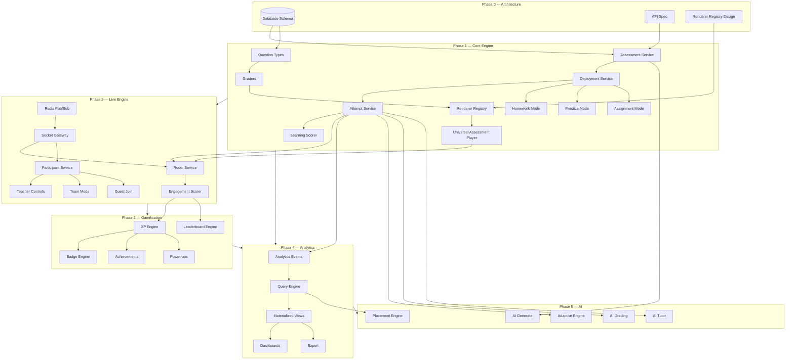

**Hard dependencies:**

| Feature | Requires |
|---------|----------|
| Universal Player | Renderer Registry, Question Types, Attempt API |
| Live Engine | Attempt Service, Engagement Scorer, Redis |
| Gamification | Analytics Events, Attempt completion |
| AI Adaptive | Learning Scorer, Analytics Query Engine |
| Team Mode | Live Engine, Participant Service |
| Placement Engine | Analytics, AI Grading, Mock Test mode |

---

## 11. UI Component Hierarchy

```
App
└── AssessmentPlatform (route group: /assess, /live, /practice)
    ├── InstructorShell
    │   ├── AssessmentDashboard
    │   │   ├── AssessmentCardGrid
    │   │   ├── DeploymentList
    │   │   └── QuickDeployMenu
    │   ├── AssessmentStudio (authoring)
    │   │   ├── StudioHeader
    │   │   ├── SectionNavigator
    │   │   ├── QuestionCanvas
    │   │   │   └── QuestionEditor → editorRegistry[type]
    │   │   ├── PropertiesPanel
    │   │   └── AiAssistPanel
    │   ├── DeploymentWizard
    │   │   ├── ModePicker
    │   │   ├── ContextLinker (course/LU/placement)
    │   │   ├── SettingsForm
    │   │   └── LaunchPanel
    │   ├── LiveHostDashboard
    │   │   ├── WaitingRoomPanel
    │   │   ├── RoomInvitePanel
    │   │   ├── LiveAnalyticsPanel
    │   │   ├── HostControls
    │   │   └── LeaderboardPanel → LiveLeaderboard
    │   └── AnalyticsDashboard
    │       ├── ClassReport
    │       ├── QuestionHeatmap
    │       └── ExportToolbar
    │
    └── StudentShell
        ├── JoinPage (code/PIN)
        ├── AssessmentPlayer ◄── SINGLE PLAYER FOR ALL MODES
        │   ├── PlayerHeader (mode badge, progress, dual metrics bar)
        │   ├── PlayerTimer
        │   ├── QuestionViewport
        │   │   └── rendererRegistry[type] → *Renderer
        │   ├── PlayerFooter (submit, skip, flag, hint)
        │   ├── EngagementOverlay (streak, powerups — only if enabled)
        │   └── PlayerResults
        │       ├── LearningResultsPanel (accuracy, concepts)
        │       └── EngagementResultsPanel (XP, rank — if enabled)
        ├── StudentLearningDashboard
        │   ├── MasteryMap
        │   ├── WeakTopicsCard
        │   ├── XpLevelBar
        │   └── BadgeGrid
        └── LeaderboardPage
            └── ScopedLeaderboard (tabs: class, dept, global, ...)

Consumer Wrappers (thin, no duplicate player):
├── CoursePlayerPage → embeds AssessmentPlayer for lecture quizzes
├── LearningUniversePlayer → embeds AssessmentPlayer for practice steps
├── PlacementTrackPage → embeds AssessmentPlayer for mock tests
└── CodingChallengePage → embeds AssessmentPlayer with CodingRenderer
```

**Key rule:** `CourseLectureQuizBlock` and `LiveQuestionDisplay` will be **deprecated** and replaced by `AssessmentPlayer` + renderers.

---

## 12. State Management Flow

### 12.1 Attempt / Player State (Zustand + React Query)

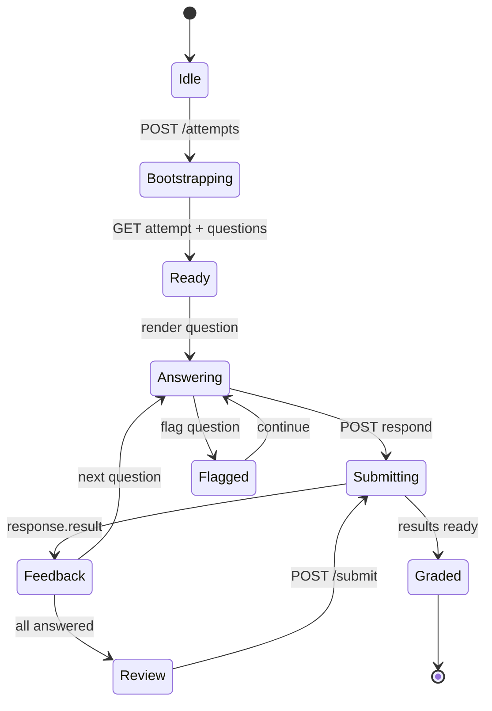

**Store: `attemptStore`**

```typescript
interface AttemptStore {
  // Server state (React Query)
  attemptId: string | null;
  mode: AssessmentMode;
  questions: SanitizedQuestion[];
  currentIndex: number;

  // Learning state (never mixed with engagement)
  responses: Map<string, LearningResponseState>;
  learningProgress: { answered: number; correct: number };

  // Engagement state (only if mode.gamificationEnabled)
  engagement: {
    sessionScore: number;
    streak: number;
    combo: number;
    rank: number | null;
    powerUps: PowerUpState[];
  } | null;

  // UI state
  status: AttemptStatus;
  timerMs: number;
}
```

### 12.2 Live Room State

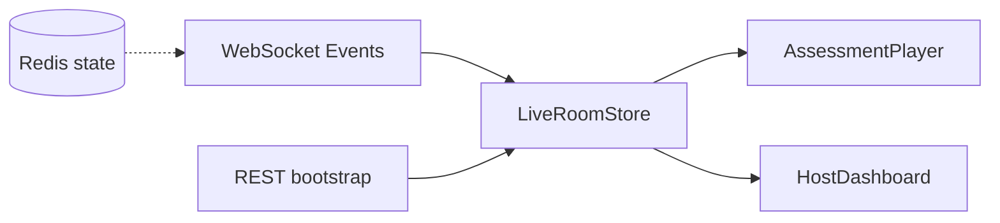

**Store: `liveRoomStore`**

- Synced from `room.state` WS events
- Optimistic UI only for `question.respond` (reconciled on `response.result`)
- Leaderboard from `leaderboard.updated` (engagement only)
- Host actions via `host.*` WS messages

### 12.3 Cache Invalidation (GateHub Rule)

On assessment/deployment save:

```typescript
invalidateAssessmentCaches({ courseId, lectureId, learningUniverseId })
// → course-learn, sections, assessment-deployments
```

### 12.4 Data Flow Summary

```
User Action
  → API/WS
    → Service Layer (isolated)
      → LearningScorer ──► LearningRecord (DB)
      → EngagementScorer ──► EngagementRecord (DB)
      → AnalyticsEventBus ──► AnalyticsEvent (DB) + Redis
        → GamificationListeners ──► XP/Badges
        → LeaderboardService ──► Redis ZSET + materialized
  → React Query invalidation
  → Store update
  → AssessmentPlayer re-render via rendererRegistry
```

---

## 13. Permission Matrix

Roles: `student`, `faculty`, `dept_admin`, `admin`, `super_admin`

| Resource / Action | Student | Faculty | Dept Admin | Admin | Super Admin |
|-------------------|---------|---------|------------|-------|-------------|
| **Assessment** | | | | | |
| View published (enrolled) | ✅ | ✅ | ✅ | ✅ | ✅ |
| Create / edit own | ❌ | ✅ | ✅ | ✅ | ✅ |
| Publish | ❌ | ✅ | ✅ | ✅ | ✅ |
| View org assessments | ❌ | 🔶 own | ✅ dept | ✅ | ✅ |
| Delete any | ❌ | 🔶 own | 🔶 dept | ✅ | ✅ |
| **Question Bank** | | | | | |
| View (org) | ❌ | ✅ | ✅ | ✅ | ✅ |
| Create / edit | ❌ | ✅ | ✅ | ✅ | ✅ |
| **Deployment** | | | | | |
| Deploy (any mode) | ❌ | ✅ | ✅ | ✅ | ✅ |
| Start live room | ❌ | ✅ host | ✅ | ✅ | ✅ |
| Join live / attempt | ✅ | ✅ | ✅ | ✅ | ✅ |
| Guest join (if enabled) | ✅ | — | — | — | — |
| **Attempt** | | | | | |
| Start own attempt | ✅ | ✅ | ✅ | ✅ | ✅ |
| View own results | ✅ | ✅ | ✅ | ✅ | ✅ |
| View student results | ❌ | 🔶 own students | ✅ dept | ✅ | ✅ |
| Void / reset attempt | ❌ | 🔶 own deploy | ✅ dept | ✅ | ✅ |
| **Live Host Controls** | | | | | |
| Start / pause / next / finish | ❌ | ✅ host | ✅ | ✅ | ✅ |
| Kick participant | ❌ | ✅ host | ✅ | ✅ | ✅ |
| **Gamification** | | | | | |
| View own profile | ✅ | ✅ | ✅ | ✅ | ✅ |
| View leaderboards | ✅ | ✅ | ✅ | ✅ | ✅ |
| Configure badges/XP rules | ❌ | ❌ | ❌ | 🔶 | ✅ |
| **Analytics** | | | | | |
| View own learning profile | ✅ | ✅ | ✅ | ✅ | ✅ |
| View class reports | ❌ | 🔶 own | ✅ dept | ✅ | ✅ |
| View org / dept analytics | ❌ | ❌ | ✅ | ✅ | ✅ |
| Custom analytics query | ❌ | ❌ | ❌ | ✅ | ✅ |
| Export reports | ❌ | 🔶 own | ✅ dept | ✅ | ✅ |
| **AI** | | | | | |
| Generate questions | ❌ | ✅ | ✅ | ✅ | ✅ |
| AI grade / interview | ❌ | ✅ | ✅ | ✅ | ✅ |
| Configure AI models | ❌ | ❌ | ❌ | ✅ | ✅ |
| **Admin** | | | | | |
| Tenant config / branding | ❌ | ❌ | ❌ | 🔶 | ✅ |
| Organization management | ❌ | ❌ | ❌ | ✅ | ✅ |
| Audit logs | ❌ | ❌ | 🔶 dept | ✅ | ✅ |

Legend: ✅ = full access, ❌ = denied, 🔶 = scoped to own resources/students

**Context-scoped checks (always applied):**

- Course: must be enrolled student or course instructor
- LU: must be enrolled or LU author
- Placement: must be on placement track
- Live room: `lockLateJoin`, `roomPassword`, `maxPlayers`
- Org: `OrganizationMember.role` gates dept-level access

---

## 14. Sequence Diagrams — Every Assessment Mode

### 14.1 Practice Mode

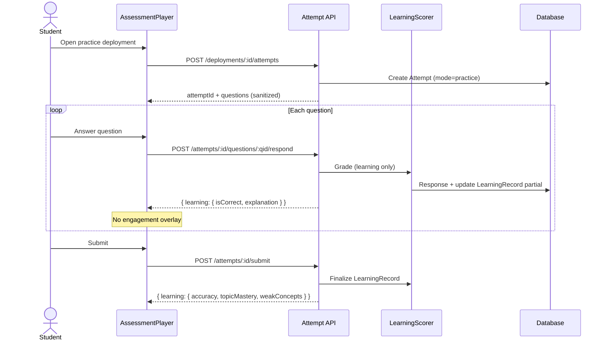

### 14.2 Live Quiz Mode

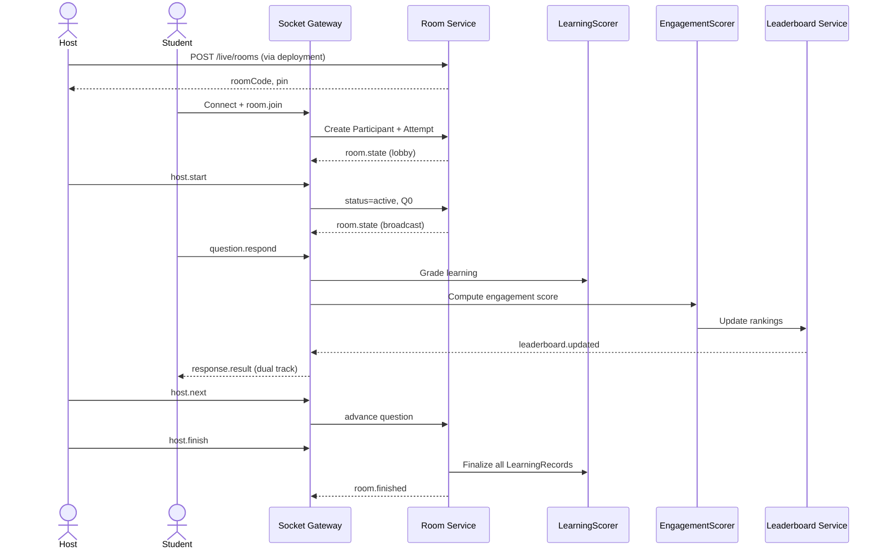

### 14.3 Homework Mode

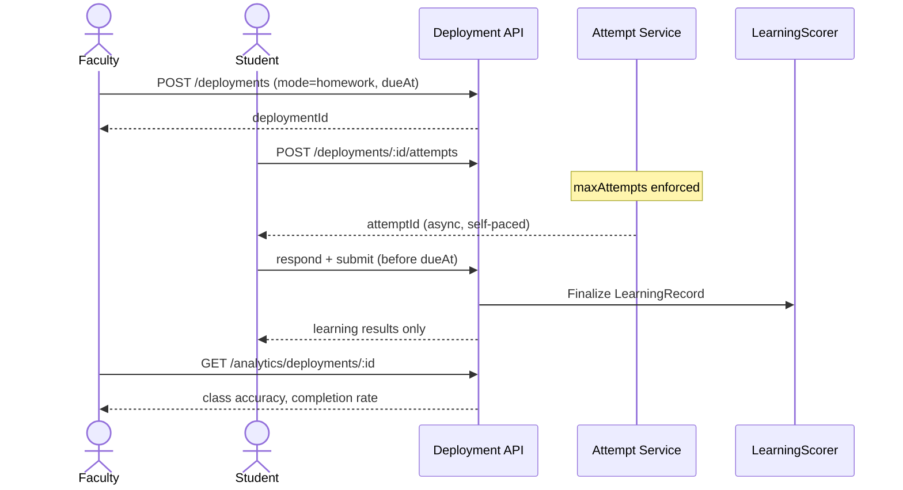

### 14.4 Assignment Mode

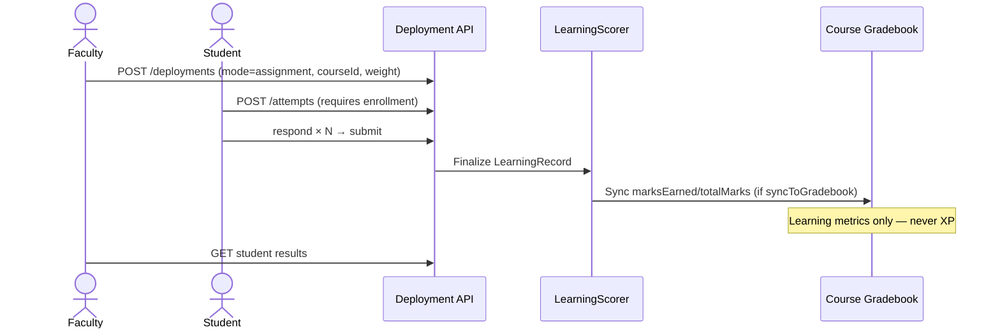

### 14.5 Mock Test Mode

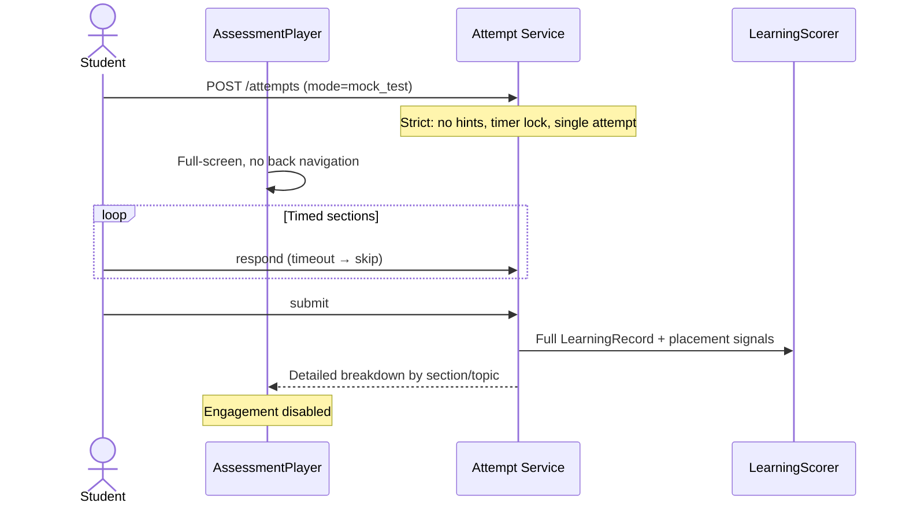

### 14.6 Timed Assessment Mode

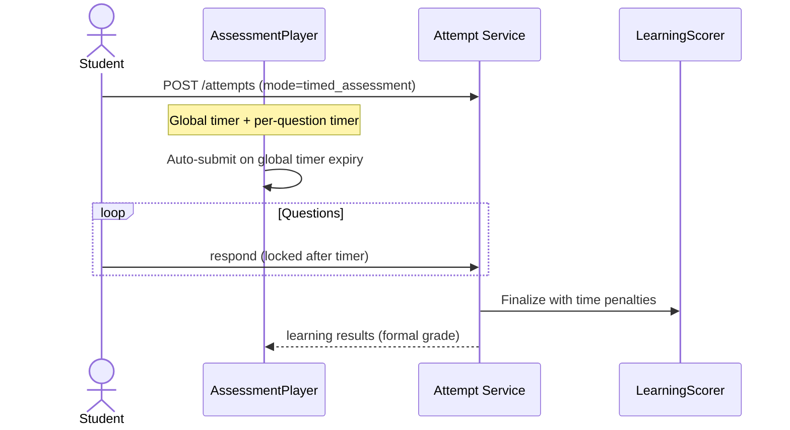

### 14.7 Coding Assessment Mode

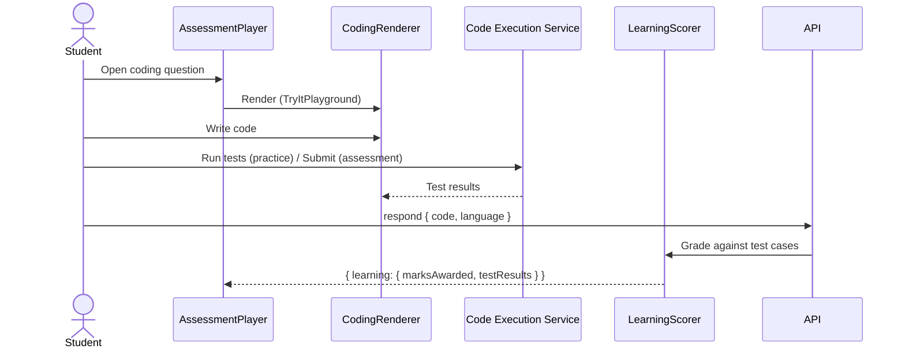

### 14.8 Adaptive Assessment Mode

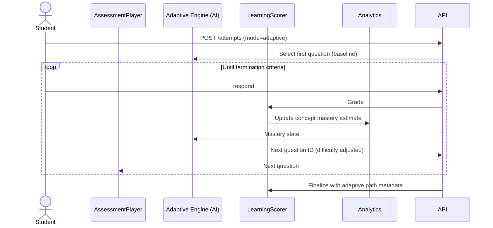

### 14.9 AI Interview Assessment Mode

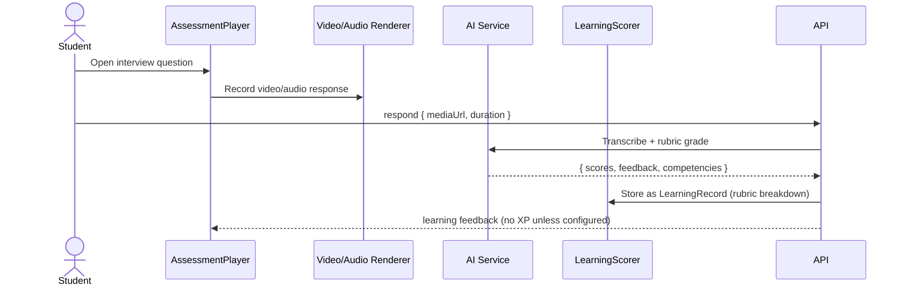

### 14.10 Survey Mode

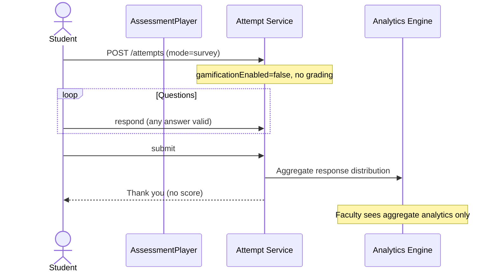

### 14.11 Poll Mode

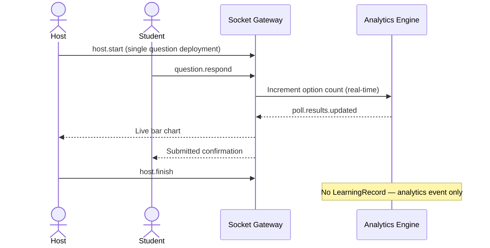

---

## 15. Real-time Production Architecture

```
                    ┌──────────────────────────────────────┐
                    │           Load Balancer               │
                    └───────────┬──────────────────────────┘
                                │
           ┌────────────────────┼────────────────────┐
           ▼                    ▼                    ▼
    ┌─────────────┐     ┌─────────────┐     ┌─────────────┐
    │  API Pod 1  │     │  API Pod 2  │     │  API Pod N  │
    └──────┬──────┘     └──────┬──────┘     └──────┬──────┘
           │                    │                    │
           └────────────────────┼────────────────────┘
                                │
                    ┌───────────▼───────────┐
                    │   PostgreSQL Primary   │
                    │   + Read Replicas      │
                    └───────────┬───────────┘
                                │
    ┌───────────────────────────┼───────────────────────────┐
    ▼                           ▼                           ▼
┌─────────┐              ┌─────────────┐            ┌─────────────┐
│  Redis  │◄────────────►│  WS Pod 1   │            │  WS Pod N   │
│ Cluster │   pub/sub    └─────────────┘            └─────────────┘
│         │
│ Keys:   │
│ room:*  │         ┌──────────────────────────────────────────┐
│ lb:*    │         │  Background Workers                       │
│ sess:*  │         │  - Leaderboard materializer (cron)        │
└─────────┘         │  - Analytics aggregator                   │
                    │  - Badge evaluator                        │
                    │  - AI grading queue                       │
                    └──────────────────────────────────────────┘
```

**100K concurrent target:**

| Component | Scale Strategy |
|-----------|---------------|
| WS Gateway | 50 pods × 2K connections = 100K |
| Redis | Cluster mode, room state TTL 24h |
| Leaderboard | Redis ZSET per room, flush on finish |
| Postgres | Read replicas for analytics queries |
| Analytics | Append-only events → ClickHouse (Phase 4+) |

---

## 16. Multi-Tenant & White-Label Design

| Capability | Implementation |
|------------|----------------|
| Multi-university | `Organization` table, all entities scoped by `organizationId` |
| White-label | `TenantConfig.branding` + custom domain routing |
| Custom badges | `TenantConfig.badgeOverrides` merges with `BadgeDefinition` |
| Custom XP rules | `TenantConfig.xpRules` JSON |
| Custom scoring | `TenantConfig.scoringRules` per org |
| Custom certificates | `TenantConfig.certTemplates` |
| Regional leaderboards | `LeaderboardDefinition.scopeType = university` |
| Feature flags | `TenantConfig.featureFlags` |

**Default org:** Migration creates one `Organization` for existing data.

---

## 17. Updated Roadmap

### Phase 0 — Platform Architecture Finalization ✅ COMPLETE

- [x] Product research (Quizizz benchmark)
- [x] Universal Assessment Engine design
- [x] ER diagram, database schema, API, WebSocket specs
- [x] Folder structure, dependency graph, UI hierarchy
- [x] State management, permissions, sequence diagrams
- [x] Final enhancements (Sections 19–38)
- [x] **Approved and frozen**

### Phase 1 — Universal Assessment Engine (6–8 weeks) ⬅ IN PROGRESS

See [Section 38](#38-phase-1-execution-order) for module-by-module order.

### Phase 2 — Live Engine (5–6 weeks)

- Redis pub/sub + stateless socket gateway
- Room / Participant / Live scoring orchestrator
- Teacher controls, team mode, guest join
- Migrate LiveSession → LiveRoom

### Phase 3 — Gamification Platform (4–5 weeks)

- XP / Coins / Badge / Achievement engines
- Engagement Scorer, power-ups, generic leaderboards

### Phase 4 — Analytics Platform (4–5 weeks)

- AnalyticsEvent bus, query engine, reporting tables
- Dashboards, export (CSV, XLSX, PDF)

### Phase 5 — AI Learning Platform (6–8 weeks)

- Adaptive sequencing, AI tutor, AI grading, interview coach, placement engine

---

## 18. Approval Checklist

**Phase 0 — Approved 2026-07-04 with final enhancements (Sections 19–38).**

- [x] **A.** Universal Assessment Engine (one engine, many modes)
- [x] **B.** Dual-track metrics (`LearningRecord` / `EngagementRecord`)
- [x] **C.** Universal Assessment Player + renderer registry
- [x] **D.** Database schema + immutable versioning
- [x] **E.** Migration strategy (legacy bridges)
- [x] **F.** API v2 surface
- [x] **G.** WebSocket event spec
- [x] **H.** Folder structure
- [x] **I.** Phase order 0 → 5
- [x] **J.** Permission matrix
- [x] **K.** Deprecation plan for parallel players
- [x] **L.** Event-driven architecture
- [x] **M.** Plugin + rules engine
- [x] **N.** Media, notification, search, observability, security layers

---

## 19. Assessment Lifecycle

Every assessment follows a **content lifecycle** (on `Assessment.status`). Runtime states (scheduled, live, completed) live on `AssessmentDeployment`.

```
Draft → Review → Approved → Published → Scheduled → Live → Completed → Archived
```

| State | Who transitions | Rules |
|-------|-----------------|-------|
| **draft** | Author creates | Editable; no deployments |
| **review** | Author submits | Read-only for author; reviewer comments |
| **approved** | Reviewer/faculty lead | Ready to publish; still versioned |
| **published** | Author publishes | Creates immutable `AssessmentVersion`; edits require new version |
| **scheduled** | Deployment scheduled | `AssessmentDeployment.scheduledAt` set |
| **live** | Deployment launched | At least one active deployment or live room |
| **completed** | All deployments ended | No active attempts; historical only |
| **archived** | Author/admin | Hidden from default lists; attempts preserved |

**Rules:**

- Never overwrite published content — publish always creates a new `AssessmentVersion`.
- Old attempts always reference `assessmentVersionId` + per-question `questionVersionId`.
- `completed` and `archived` are terminal for that version line; new work starts from draft copy or new version.

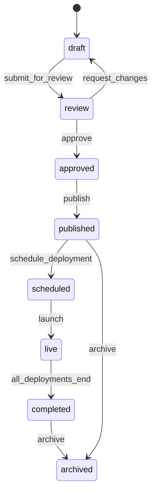

---

## 20. Immutable Versioning

**Golden rule:** Content is immutable once published. Mutations create new versions.

```
Assessment
  └── AssessmentVersion (immutable snapshot)
        └── AssessmentSectionVersion[]
              └── AssessmentItemVersion { questionVersionId, marks, order }
                    └── QuestionVersion (immutable)
                          ├── ChoiceVersion[]
                          └── MediaUsage[] → MediaAsset
```

### Version Pinning on Attempts

Every `Attempt` stores:

| Field | Purpose |
|-------|---------|
| `assessmentVersionId` | Exact assessment structure at attempt start |
| `AttemptQuestion.questionVersionId` | Exact question stem/options at answer time |
| `deploymentId` | Runtime context (mode, settings, due date) |

**Never** join attempts to live `Question` rows for grading or reports — always resolve via version snapshots.

### Schema Additions

```prisma
model AssessmentItemVersion {
  id                  String @id @default(cuid())
  assessmentVersionId String @map("assessment_version_id")
  sectionVersionId    String @map("section_version_id")
  questionVersionId   String @map("question_version_id")
  order               Int
  marks               Int    @default(1)
  metadata            Json   @default("{}")
}

model QuestionVersion {
  id          String   @id @default(cuid())
  questionId  String   @map("question_id")  // lineage only
  version     Int
  snapshot    Json     // full immutable: stem, choices, media refs, metadata
  createdById String   @map("created_by_id")
  createdAt   DateTime @default(now()) @map("created_at")
  @@unique([questionId, version])
}

model Attempt {
  assessmentVersionId String @map("assessment_version_id")
  // ...
}

model AttemptQuestion {
  questionVersionId String @map("question_version_id")
  // ...
}
```

---

## 21. Event-Driven Architecture

All major actions emit **domain events** to a central bus. Core services publish; consumers subscribe without modifying business logic.

### Event Bus

```
Service Action → DomainEvent → EventBus (Redis Streams / in-process Phase 1)
                                    ├── AnalyticsListener
                                    ├── GamificationListener
                                    ├── NotificationListener
                                    ├── SearchIndexerListener
                                    ├── AuditListener
                                    └── RulesEngineListener
```

### Canonical Domain Events

| Event | Payload highlights | Typical consumers |
|-------|-------------------|-----------------|
| `AssessmentCreated` | assessmentId, authorId | Search, Audit |
| `AssessmentPublished` | assessmentId, versionId | Search, Notification |
| `AttemptStarted` | attemptId, userId, mode | Analytics, Audit |
| `QuestionAnswered` | attemptId, questionVersionId, learning delta | Analytics, Adaptive AI |
| `AttemptCompleted` | attemptId, learningRecord, engagementRecord | Gamification, Rules, Notification |
| `BadgeAwarded` | userId, badgeId, source | Notification, Analytics |
| `XPGranted` | userId, amount, source | Profile, Leaderboard |
| `LeaderboardUpdated` | scope, period, rankings | WS broadcast, Cache |
| `HomeworkAssigned` | deploymentId, dueAt, studentIds | Notification |
| `StudentJoinedRoom` | roomId, participantId | Live analytics, WS |
| `StudentLeftRoom` | roomId, participantId, reason | Live analytics |
| `LiveSessionEnded` | roomId, finalLeaderboard | Analytics, Gamification |

### Event Envelope

```typescript
interface DomainEvent<T = unknown> {
  id: string;
  type: string;
  aggregateType: string;
  aggregateId: string;
  organizationId?: string;
  actorId?: string;
  payload: T;
  metadata: { correlationId: string; causationId?: string; timestamp: string };
  version: 1;
}
```

Phase 1: in-process `EventBus` + optional Redis Streams. Phase 2+: dedicated worker consumers.

---

## 22. Notification Service

Dedicated notification architecture with **swappable providers**.

```
NotificationService
  ├── TemplateEngine (i18n-aware)
  ├── ChannelRouter
  │     ├── InAppProvider      (Notification table — exists)
  │     ├── EmailProvider      (SMTP / SendGrid)
  │     ├── PushProvider       (FCM / APNs — future)
  │     └── SmsProvider        (Twilio — future)
  └── PreferenceService        (per-user channel opt-in)
```

### Notification Types

| Type | Channels | Trigger event |
|------|----------|---------------|
| Faculty announcement | in-app, email | Manual / `AnnouncementCreated` |
| Live session reminder | in-app, push | `DeploymentScheduled` (T-15min) |
| Homework reminder | in-app, email | `HomeworkAssigned`, due soon |
| Placement alert | in-app, email | Rules engine / placement score |
| Badge earned | in-app | `BadgeAwarded` |
| Attempt graded | in-app | `AttemptCompleted` |

### Schema

```prisma
model NotificationTemplate {
  id        String @id @default(cuid())
  slug      String @unique
  channels  Json   // ["in_app", "email"]
  subject   Json   // i18n key map
  body      Json   // i18n key map
}

model NotificationDelivery {
  id             String @id @default(cuid())
  userId         String
  templateSlug   String
  channel        String
  status         String  // pending | sent | failed
  payload        Json
  sentAt         DateTime?
}
```

---

## 23. Media Service

Questions **never own uploaded files directly**. All media flows through `MediaAsset`.

```
Upload → MediaService → StorageProvider (local | S3 | GCS)
              ↓
         MediaAsset + MediaVariant (thumb, compressed)
              ↓
         MediaUsage (polymorphic: question, assessment, certificate)
              ↓
         CDN URL (signed, TTL)
```

### Models

```prisma
model MediaAsset {
  id             String @id @default(cuid())
  organizationId String?
  uploaderId     String
  mimeType       String
  originalName   String
  storageKey     String
  sizeBytes      Int
  checksum       String
  metadata       Json   @default("{}")
  createdAt      DateTime @default(now())
  variants       MediaVariant[]
  usages         MediaUsage[]
}

model MediaVariant {
  id           String @id @default(cuid())
  assetId      String
  variant      String  // original | thumbnail | preview | transcoded
  storageKey   String
  width        Int?
  height       Int?
  url          String? // CDN path
}

model MediaUsage {
  id         String @id @default(cuid())
  assetId    String
  entityType String  // question | assessment | certificate | ...
  entityId   String
  role       String  // stem_image | option_audio | explanation_video
}

interface StorageProvider {
  upload(buffer, key, mime): Promise<StorageResult>;
  getSignedUrl(key, ttl): Promise<string>;
  delete(key): Promise<void>;
}
```

Supported types: images, PDFs, audio, video, GIFs, LaTeX/equation renders, code attachment files.

---

## 24. Plugin Architecture

**No switch statements** on question types, modes, or integrations. Use registries.

```typescript
// Plugin registration at app bootstrap
pluginRegistry.register("questionType", multipleChoicePlugin);
pluginRegistry.register("renderer", multipleChoiceRendererPlugin);
pluginRegistry.register("grader", multipleChoiceGraderPlugin);
pluginRegistry.register("gamification", streakBadgePlugin);
pluginRegistry.register("leaderboard", departmentLeaderboardPlugin);
pluginRegistry.register("analytics", questionDiscriminationPlugin);
pluginRegistry.register("aiTool", distractorGeneratorPlugin);
pluginRegistry.register("notification", homeworkReminderPlugin);
```

### Plugin Interfaces

| Plugin | Methods |
|--------|---------|
| `QuestionTypePlugin` | `validate`, `sanitize`, `toSnapshot` |
| `RendererPlugin` | `render`, `preview` (frontend) |
| `GraderPlugin` | `grade(answer, questionVersion): GradeResult` |
| `GamificationPlugin` | `evaluate(event): Award[]` |
| `LeaderboardPlugin` | `computeScope(scope): Ranking[]` |
| `AnalyticsPlugin` | `onEvent(event): Metric[]` |
| `AIToolPlugin` | `run(input): AIResult` |
| `NotificationPlugin` | `channels`, `send(payload)` |

```typescript
interface PluginRegistry {
  get<T extends Plugin>(category: PluginCategory, key: string): T;
  register<T extends Plugin>(category: PluginCategory, plugin: T): void;
  list(category: PluginCategory): string[];
}
```

---

## 25. Rules Engine

Business rules are **data-driven**, not hardcoded.

```typescript
interface Rule {
  id: string;
  slug: string;
  organizationId?: string;
  trigger: string;       // "AttemptCompleted", "BadgeAwarded", ...
  condition: RuleCondition;  // JSON DSL or CEL
  actions: RuleAction[];     // award_badge, grant_xp, unlock_course, ...
  priority: number;
  enabled: boolean;
  validFrom?: Date;
  validTo?: Date;
}
```

### Example Rules

| Rule | Trigger | Condition | Action |
|------|---------|-----------|--------|
| Pass threshold | `AttemptCompleted` | `learning.accuracy >= 0.7` | `mark_passed`, notify |
| Perfect five | `AttemptCompleted` | `count(perfect)==5` | `award_badge("perfect_five")` |
| Course unlock | `AttemptCompleted` | `assessmentId==X && passed` | `unlock_course(Y)` |
| XP once | `XPGranted` | `not exists prior same source` | `grant_xp` |
| Double XP Friday | `AttemptCompleted` | `dayOfWeek==5` | `multiply_xp(2)` |
| Placement eligible | `AttemptCompleted` | `placementScore>=80` | `tag_placement_ready` |

Rules evaluated by `RulesEngineListener` on domain events. Org-specific rules in `TenantConfig.rules`.

---

## 26. Audit & Compliance

**Immutable append-only** audit log for sensitive actions.

| Action | Logged fields |
|--------|---------------|
| Assessment edited | before/after snapshot hash, actor |
| Question deleted | questionId, version, actor |
| Result modified | attemptId, old/new marks, reason, actor |
| Report exported | scope, format, actor, student count |
| Scoring rule changed | orgId, old/new rules |
| Exam resumed | attemptId, actor, justification |
| AI content generated | aiHistoryId, model, prompt hash |

Uses `AuditLog` model (Section 5). **No updates or deletes** on audit rows. Retention per org policy.

---

## 27. Search Layer

All assessment entities indexed for full-text and faceted search.

### Indexed Entities

Assessments, Questions, Tags, Topics, Faculty, Courses, Departments, Skills, Companies, Deployments.

### Search Fields (per entity)

| Entity | Fields |
|--------|--------|
| Assessment | title, description, tags, subject, author name |
| Question | stem, tags, concepts, difficulty, bloom |
| Deployment | title, mode, context |

### Architecture

```
Write Path: Service → DB → SearchIndexerListener → SearchIndex
Read Path:  SearchAPI → SearchProvider (Postgres FTS Phase 1 → OpenSearch later)
```

Phase 1: PostgreSQL `tsvector` columns + GIN indexes. Phase 4+: Elasticsearch/OpenSearch adapter via `SearchProvider` plugin.

---

## 28. Observability

### Metrics (Prometheus-compatible)

| Metric | Type | Alert threshold |
|--------|------|-----------------|
| `api_request_duration_ms` | histogram | p99 > 2000ms |
| `ws_message_latency_ms` | histogram | p99 > 500ms |
| `live_rooms_active` | gauge | — |
| `live_participants_total` | gauge | > 80K |
| `redis_memory_bytes` | gauge | > 80% capacity |
| `event_queue_depth` | gauge | > 10000 |
| `leaderboard_update_duration_ms` | histogram | p99 > 100ms |
| `attempt_completion_rate` | counter | drop > 20% |

### Logging

Structured JSON logs with `correlationId`, `organizationId`, `userId`, `service`.

### Tracing

OpenTelemetry spans across API → Service → DB → Redis → WS.

### Health Endpoints

```
GET /health          → liveness
GET /health/ready    → DB + Redis connectivity
GET /health/ws       → WS gateway status
```

---

## 29. Security Model

| Control | Implementation |
|---------|----------------|
| Rate limiting | Redis token bucket per IP + per user |
| JWT | Access token + refresh rotation (`tokenVersion` on User) |
| CSRF | SameSite cookies + CSRF token for mutating browser requests |
| RBAC | Role + org membership + context (Section 13) |
| Tenant isolation | `organizationId` on all queries; middleware enforces |
| Room PIN | bcrypt hash optional; rate-limited lookup |
| Attempt locking | One `in_progress` attempt per user per deployment |
| Question randomization | Server-side shuffle seed stored on attempt |
| Answer encryption | Sensitive deployments: encrypt `Response.answer` at rest |
| Signed media URLs | HMAC-signed CDN URLs, short TTL |
| Cheat detection hooks | `CheatDetectionPlugin`: tab blur, paste, IP change |

---

## 30. Offline Support

Universal Assessment Player survives temporary disconnections.

### Client Cache (IndexedDB)

| Key | Content |
|-----|---------|
| `attempt:{id}` | Bootstrap state, mode, settings |
| `questions:{attemptId}` | Sanitized question payloads |
| `drafts:{attemptId}` | Per-question selected answers |
| `timer:{attemptId}` | Server start offset, elapsed |
| `pending:{attemptId}` | Unsynced responses queue |
| `reconnect:{attemptId}` | Reconnect token from server |

### Sync Protocol

```
1. On disconnect: continue timer locally (monotonic clock offset)
2. Queue responses in pending queue
3. On reconnect: POST /attempts/:id/sync { pending[], clientTimer }
4. Server reconciles; returns conflict resolution if needed
5. Live mode: WS auto-rejoin with reconnect token
```

---

## 31. Accessibility

Universal Assessment Player **must** meet WCAG 2.1 AA.

| Requirement | Implementation |
|-------------|----------------|
| Keyboard navigation | Tab order, Enter/Space submit, arrow keys for options |
| Screen readers | ARIA labels, `role="radiogroup"`, live regions for feedback |
| High contrast | Theme tokens + `prefers-contrast` |
| Font scaling | `rem` units, no fixed px on text |
| Color blind | Never rely on color alone; icons + patterns |
| Timer | `aria-live="polite"` countdown; optional disable animations |
| Focus management | Move focus to feedback after submit |

All renderers must implement `AccessibilityProps` from renderer plugin contract.

---

## 32. Internationalization

**No hardcoded user-facing strings** in assessment platform code.

```
src/assessment-platform/i18n/
  ├── en.json
  ├── hi.json
  └── ar.json  (RTL)
```

| Concern | Approach |
|---------|----------|
| Language packs | `i18next` / existing GATEHUB i18n |
| RTL | `dir="rtl"` on player shell; mirror layouts |
| Timezone | Store UTC; display in user/org timezone |
| Scoring messages | i18n keys: `scoring.correct`, `scoring.streak_milestone` |
| Certificates | Localized templates in `TenantConfig.certTemplates` |

---

## 33. Reporting Pipeline

**Never run heavy reports on transactional tables.**

```
Operational DB (PostgreSQL)
        ↓ emit
AnalyticsEvent (append-only)
        ↓ batch jobs (hourly / nightly)
Aggregation Jobs (workers)
        ↓ write
Reporting Tables (materialized)
        ↓ read
Dashboards / Export API
```

### Reporting Tables (materialized)

| Table | Grain | Refresh |
|-------|-------|---------|
| `report_assessment_daily` | assessment × day | nightly |
| `report_question_stats` | question × org | nightly |
| `report_student_mastery` | user × concept | nightly |
| `report_department_performance` | dept × month | nightly |
| `report_placement_readiness` | user × track | weekly |

Live dashboards read from Redis cache + recent events; historical from reporting tables.

---

## 34. AI Governance

All AI-generated content stores **full provenance** in `AIHistory` (extended).

```prisma
model AIHistory {
  id            String   @id @default(cuid())
  userId        String
  feature       String
  model         String
  provider      String
  prompt        String   @db.Text
  promptHash    String   @map("prompt_hash")
  temperature   Float?
  input         Json
  output        Json?
  confidence    Float?
  entityType    String?  @map("entity_type")  // question | assessment
  entityId      String?  @map("entity_id")
  editedById    String?  @map("edited_by_id")
  approvedById  String?  @map("approved_by_id")
  approvedAt    DateTime? @map("approved_at")
  tokens        Int?
  latencyMs     Int?
  createdAt     DateTime @default(now())
}
```

**Rules:**

- AI-generated questions require `aiHistoryId` on `Question` until human-approved.
- Edits after generation link `editedById`; approval links `approvedById`.
- Never delete AIHistory; soft-link only.

---

## 35. Public SDK

Long-term API design for external clients.

### API Surfaces

| Surface | Audience | Phase |
|---------|----------|-------|
| REST `/api/v2/assessments/*` | Web, mobile, partners | Phase 1 |
| WebSocket `/ws/live/*` | Real-time clients | Phase 2 |
| GraphQL | Partner universities | Phase 5+ |
| Webhooks | External LMS (grade passback) | Phase 4 |

### SDK Targets

- Mobile app (React Native / Flutter)
- Desktop proctoring app
- Partner university LMS (LTI 1.3 grade sync)
- External placement portals

### Design Rules

- Versioned API (`v2`); breaking changes → `v3`
- OAuth2 client credentials for partners
- Rate limits per API key
- OpenAPI spec published at `/api/v2/openapi.json`

---

## 36. Feature Flags

Every major feature behind flags (org + global).

```typescript
export const FEATURE_FLAGS = {
  ADAPTIVE_LEARNING: "adaptive_learning",
  POWER_UPS: "power_ups",
  AI_TUTOR: "ai_tutor",
  VOICE_QUESTIONS: "voice_questions",
  INTERVIEW_MODE: "interview_mode",
  PLACEMENT_MODE: "placement_mode",
  DEPT_RANKINGS: "department_rankings",
  OFFLINE_PLAYER: "offline_player",
  DOUBLE_XP_EVENTS: "double_xp_events",
} as const;
```

Resolution order: `TenantConfig.featureFlags` → `PlatformSettings` → default `false`.

```typescript
featureFlags.isEnabled("adaptive_learning", { organizationId, userId });
```

---

## 37. Domain Glossary

| Term | Definition |
|------|------------|
| **Assessment** | Reusable content artifact (questions, sections, metadata). Not a single student session. |
| **AssessmentVersion** | Immutable published snapshot of an assessment at a point in time. |
| **Deployment** | `AssessmentDeployment` — an assessment version deployed in a specific mode and context (course, LU, standalone). |
| **Attempt** | One student run against a deployment. Holds version pins. |
| **Learning Record** | Pedagogical outcome of an attempt (accuracy, mastery, weak concepts). Never gamification. |
| **Engagement Record** | Gamification outcome (XP, rank, streak). Never affects grades. |
| **Live Room** | Real-time runtime for `live_quiz` deployments. |
| **Renderer** | Plugin that renders one question type in the Universal Assessment Player. |
| **Question Type** | Registered plugin pair (editor + renderer + grader) for a response format. |
| **Badge** | Platform-wide achievement marker; awarded by rules engine. |
| **XP** | Experience points in unified gamification profile. |
| **Achievement** | Tiered long-term goal (e.g., "100 quizzes"). |
| **Analytics Event** | Append-only event for reporting pipeline. |
| **Leaderboard Definition** | Config for scope + period + metric of a ranking. |
| **Media Asset** | Deduplicated uploaded file; referenced via MediaUsage. |
| **Rule** | Data-driven trigger → condition → action in rules engine. |
| **Domain Event** | Bus message emitted after a successful state change. |

---

## 38. Phase 1 Execution Order

Each module: implement → test → document → backward-compatible → approved before next.

| # | Module | Deliverables | Status |
|---|--------|--------------|--------|
| 1 | **Core Domain Models** | `backend/src/assessment-platform/domain/*` | ✅ Complete |
| 2 | **Database Migration** | Prisma models + migration SQL + legacy bridges | ✅ Complete |
| 3 | **Assessment Service** | CRUD, lifecycle, publish, version, v2 API | ✅ Complete |
| 4 | **Question Service** | Bank, version, media, plugins, collections, v2 API | ✅ Complete |
| 5 | **Universal Renderer Framework** | `rendererRegistry`, player shell, overlays, mode presets | ✅ Complete |
| 6 | **Assessment Player** | Shell + offline cache hooks | Pending |
| 7 | **Attempt Engine** | Start, respond, submit, version pins | Pending |
| 8 | **Scoring Engine** | LearningScorer + EngagementScorer (learning only in P1) | Pending |
| 9 | **Practice Mode** | Mode plugin + deployment defaults | Pending |
| 10 | **Homework Mode** | Due dates, max attempts | Pending |
| 11 | **Assignment Mode** | Course link, gradebook sync | Pending |
| 12 | **Migration Adapters** | Quiz→Assessment, LiveSession→Deployment | Pending |
| 13 | **Regression Testing** | Existing course player, quiz room, LU | Pending |
| 14 | **Documentation Update** | API docs, migration guide | Pending |

### Backward Compatibility Guarantee

Until migration is complete:

- `/quiz-builder/*` and `/live-sessions/*` remain functional via legacy adapters
- `CoursePlayerPage` continues using existing quiz APIs; switches via feature flag
- No breaking changes to `Quiz`, `LiveSession` tables — new tables added alongside

---

*This document is **FROZEN** as the canonical architecture reference for THE GATEHUB Assessment Platform. Amendments require explicit architecture review.*
