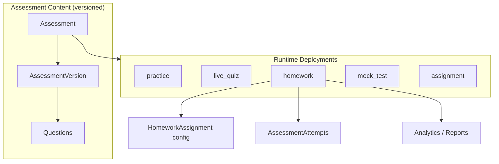
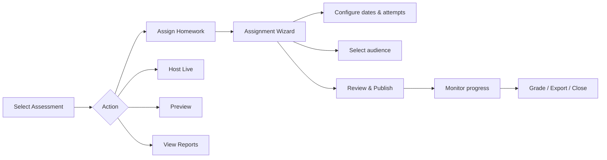
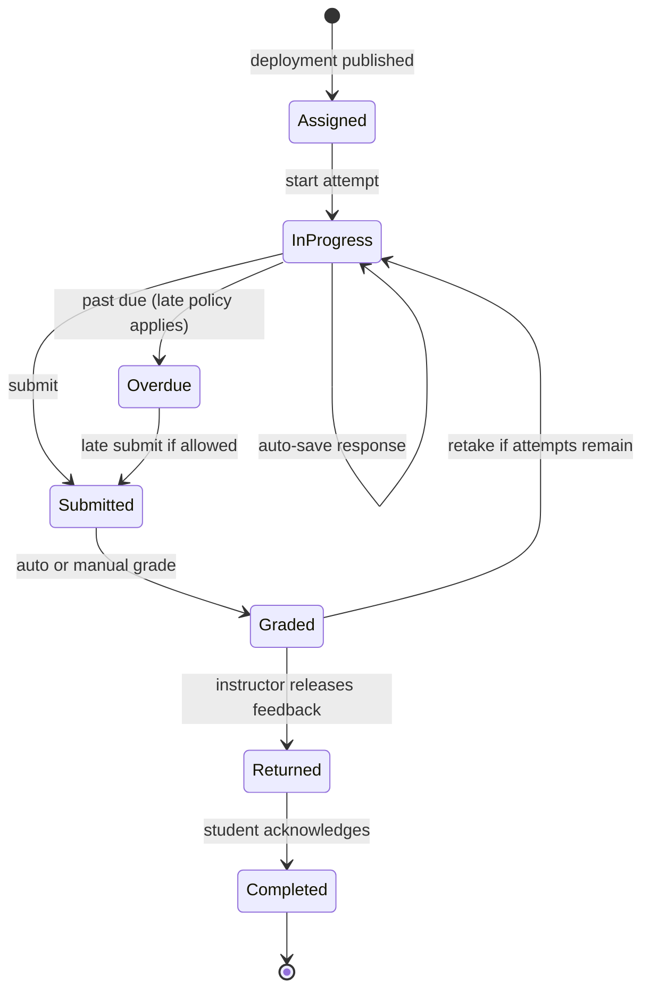
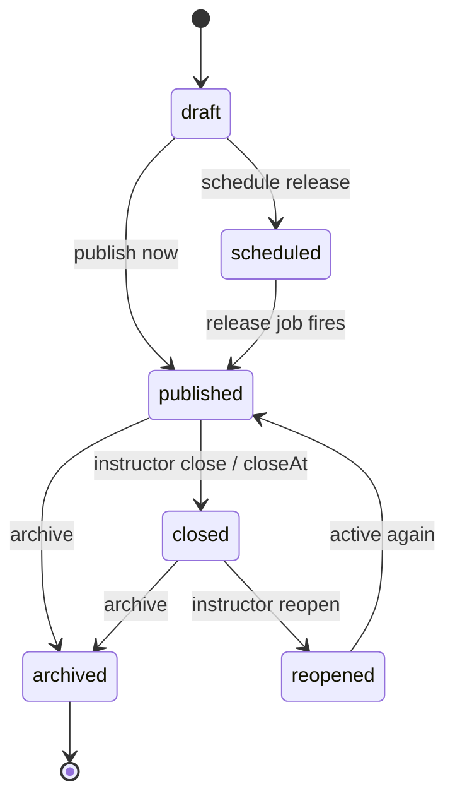
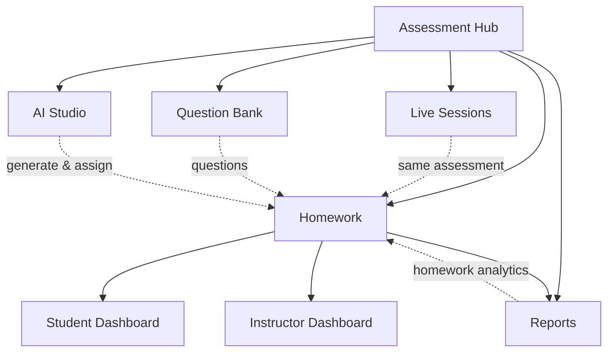

# A2 — Homework Product Specification

> **Status:** Draft — awaiting Product Owner approval  
> **Author:** Principal Engineer / Product  
> **Last updated:** July 6, 2026  
> **Prerequisite:** A1.3 Live Experience ✅ approved  
> **Rule:** No implementation until this document is approved.

---

## Table of contents

1. [Executive summary](#1-executive-summary)
2. [Product principles](#2-product-principles)
3. [Deployment mode model](#3-deployment-mode-model)
4. [Instructor workflow](#4-instructor-workflow)
5. [Student workflow](#5-student-workflow)
6. [Lifecycle & state machine](#6-lifecycle--state-machine)
7. [Permissions](#7-permissions)
8. [UX flows](#8-ux-flows)
9. [Database design](#9-database-design)
10. [API design](#10-api-design)
11. [Notifications](#11-notifications)
12. [Reports & analytics](#12-reports--analytics)
13. [Integration map](#13-integration-map)
14. [Future: AI integration](#14-future-ai-integration)
15. [Future: LMS integration](#15-future-lms-integration)
16. [MVP vs full capability matrix](#16-mvp-vs-full-capability-matrix)
17. [Architecture review](#17-architecture-review)
18. [Implementation phases (post-approval)](#18-implementation-phases-post-approval)
19. [Open questions](#19-open-questions)
20. [Approval checklist](#20-approval-checklist)

---

## 1. Executive summary

Homework is **not a new module**. It is a **deployment mode** of the same assessment that already supports Preview, Practice, Host Live, and (future) Mock Test and Course Assignment.

A faculty member creates **one assessment** in Assessment Hub. From that single artifact they can always answer:

| Question | Action |
|----------|--------|
| Can I host this live? | **Host Live** → `live_quiz` deployment |
| Can I assign this as homework? | **Assign Homework** → `homework` deployment |
| Can I see student performance? | **Reports** → deployment-scoped analytics |

Homework must work for **real universities**: multiple classes, departments, batches, due dates, late policies, manual grading for essays, extensions, grade export, and thousands of async student attempts without live WebSocket dependency.

**Canonical references:**

- [ASSESSMENT-PLATFORM-ARCHITECTURE.md](./ASSESSMENT-PLATFORM-ARCHITECTURE.md) — frozen v2 target
- [ASSESSMENT-PRODUCTION-MIGRATION-PLAN.md](./ASSESSMENT-PRODUCTION-MIGRATION-PLAN.md) — Phase A execution
- [ASSESSMENT-PERMISSIONS.md](./ASSESSMENT-PERMISSIONS.md) — permission model

---

## 2. Product principles

| # | Principle |
|---|-----------|
| P1 | **One assessment, many deployments** — content version is pinned at assign time |
| P2 | **Same player shell** — `AssessmentPlayer` + mode config; not a separate homework UI codebase |
| P3 | **Learning score ≠ engagement score** — grades never include XP/streak; gamification optional overlay |
| P4 | **Assessment Hub is the cockpit** — homework is a tab + action on every assessment card |
| P5 | **Student dashboard is unified** — homework appears alongside courses, live results, practice |
| P6 | **Async-first** — no WebSocket required; REST + auto-save + reconnect token |
| P7 | **Faculty-grade operations** — bulk assign, export, extensions, reopen, archive |
| P8 | **Architecture supports full matrix** — MVP ships subset; schema/API must not block future flags |
| P9 | **Legacy bridge** — Phase A MVP may use `Quiz` + adapter to v2 `AssessmentDeployment`; UI speaks deployment language from day one |
| P10 | **No hidden debt** — postponed items go to [TECHNICAL-DEBT.md](./TECHNICAL-DEBT.md) and [KNOWN-ISSUES.md](./KNOWN-ISSUES.md) |

---

## 3. Deployment mode model



### Mode comparison

| Capability | Practice | Live | Homework | Mock Test | Assignment |
|------------|:--------:|:----:|:--------:|:---------:|:----------:|
| Async | ✅ | ❌ | ✅ | ✅ | ✅ |
| Due date | ❌ | ❌ | ✅ | ✅ | ✅ |
| Time limit | Optional | Per Q | ✅ | ✅ Strict | ✅ |
| Max attempts | Unlimited | 1 | Configurable | 1 | Configurable |
| Show answers | Immediate | After Q | Configurable | After submit | After grade |
| Gamification | Optional | ✅ | ❌ default | ❌ | ❌ |
| Manual grading | ❌ | ❌ | ✅ essays | ❌ | ✅ |
| Class assign | ❌ | Room | ✅ | ❌ | ✅ course |
| Real-time WS | ❌ | ✅ | ❌ | ❌ | ❌ |

### Homework-specific deployment settings (`settings` JSON)

```typescript
interface HomeworkDeploymentSettings {
  // Schedule
  releaseAt?: string | null;          // scheduled release (null = immediate on publish)
  startAt?: string | null;            // earliest start (optional)
  dueAt: string;                      // required
  closeAt?: string | null;            // hard close (optional; defaults to due + late window)

  // Time
  timeLimitMinutes?: number | null;     // null = unlimited
  pauseAllowed?: boolean;

  // Attempts
  maxAttempts: number;                // 1..n or -1 unlimited
  scorePolicy: "highest" | "latest" | "average" | "first";

  // Presentation
  shuffleQuestions: boolean;
  shuffleOptions: boolean;
  password?: string | null;
  openBook: boolean;

  // Feedback
  showAnswersPolicy: "immediate" | "after_due" | "after_submit" | "never";
  showExplanations: boolean;
  showScoreAfterSubmit: boolean;

  // Late policy
  allowLate: boolean;
  latePenaltyPercentPerDay?: number;
  maxLateDays?: number;

  // Grading
  autoGradeEnabled: boolean;
  manualReviewRequired: boolean;      // true if any essay/short_answer needs review
  passingPercent?: number;

  // Proctoring (future)
  proctoringLevel?: "none" | "browser" | "full";
}
```

---

## 4. Instructor workflow

### 4.1 Primary journeys



### 4.2 Step-by-step: Assign homework

| Step | Screen | Actions |
|------|--------|---------|
| 1 | Assessment Hub → My Assessments | Click assessment card → **Assign Homework** (always visible) |
| 2 | Homework Wizard — Audience | Choose: Class(es), Individual students, Batch, Department *(latter two Phase B)* |
| 3 | Homework Wizard — Schedule | Start date, due date, close date, scheduled release |
| 4 | Homework Wizard — Rules | Time limit, attempts, score policy, shuffle, password, open book |
| 5 | Homework Wizard — Feedback | When to show answers/explanations |
| 6 | Homework Wizard — Review | Summary + student count estimate + email/notification toggle |
| 7 | Publish | Creates `AssessmentDeployment` mode=`homework`, status=`published` |
| 8 | Homework tab | Lists all homework deployments with progress chips |

### 4.3 Ongoing management

| Action | When | Effect |
|--------|------|--------|
| **View progress** | Any time | Completion %, avg score, late count |
| **Send reminder** | Before due | Notification to non-submitters |
| **Grant extension** | Per student or group | Extends `dueAt` / personal close |
| **Reopen** | After close | Allows new attempts per policy |
| **Close** | Manual early close | No new starts; submit may still work per policy |
| **Archive** | End of term | Hidden from active lists; data retained |
| **Export grades** | After submissions | CSV, Excel, PDF; LMS format future |
| **Duplicate assignment** | Reuse settings | New deployment, same assessment version option |

### 4.4 Three questions — always visible

On **every** assessment surface (card, detail, bank item):

```
[ Preview ]  [ Host Live ]  [ Assign Homework ]  [ Reports ]
```

Reports links to deployment list filtered by `assessmentId`, even if zero homework yet.

---

## 5. Student workflow

### 5.1 Discovery

Students find homework via:

| Surface | Content |
|---------|---------|
| **Student Dashboard → Assessments** | Assigned, Due Today, Upcoming, Overdue, Completed |
| **Course page** | Homework linked to course/section |
| **Direct link** | `/student/homework/:deploymentId` or tokenized share URL |
| **Notifications** | Email / in-app bell |

### 5.2 Status labels (student-facing)

| Label | Condition |
|-------|-----------|
| **Assigned** | Published, not yet started, before `startAt` |
| **Available** | Within window, no in-progress attempt |
| **In Progress** | Attempt `in_progress` |
| **Due Today** | `dueAt` is today, not submitted |
| **Overdue** | Past `dueAt`, late allowed or not |
| **Submitted** | Attempt submitted, awaiting grade |
| **Graded** | `gradedAt` set, score visible per policy |
| **Returned** | Instructor feedback released |
| **Completed** | Final state, review available if policy allows |
| **Retake available** | Attempts remaining |

### 5.3 Attempt journey



### 5.4 Student actions

| Action | Condition |
|--------|-----------|
| Start | Within schedule window, attempts remain |
| Resume | In-progress attempt exists |
| Submit | All required questions or confirm partial |
| Review answers | Per `showAnswersPolicy` |
| Retake | `maxAttempts` not exhausted, deployment open |
| View feedback | After graded/returned |
| Download receipt | Optional PDF confirmation |

---

## 6. Lifecycle & state machine

### 6.1 Deployment lifecycle (instructor/system)

| State | Meaning | Transitions |
|-------|---------|-------------|
| `draft` | Wizard in progress | → `scheduled`, `published` |
| `scheduled` | `releaseAt` in future | → `published` (job), `draft` |
| `published` | Visible to assigned students | → `closed`, `archived` |
| `started` | *(runtime aggregate)* ≥1 student started | informational |
| `submitted` | *(runtime aggregate)* ≥1 submission | informational |
| `late` | Past due, late window open | informational |
| `graded` | All manual items resolved | informational |
| `reopened` | Instructor reopened after close | → `published` |
| `closed` | No new starts | → `reopened`, `archived` |
| `completed` | All assigned students finalized | → `archived` |
| `archived` | Term ended, read-only | terminal |

> **Note:** `started`, `submitted`, `late`, `graded` are **computed aggregates** for dashboard display, not necessarily stored enum values on `AssessmentDeployment.status`.

### 6.2 Attempt lifecycle

| State | Meaning |
|-------|---------|
| `in_progress` | Student actively working |
| `submitted` | Finalized by student |
| `late_submitted` | Submitted after `dueAt` |
| `grading` | Awaiting manual/AI grade |
| `graded` | Score finalized |
| `returned` | Feedback visible to student |
| `void` | Invalidated by instructor |

### 6.3 State diagram (deployment)



---

## 7. Permissions

Extends [ASSESSMENT-PERMISSIONS.md](./ASSESSMENT-PERMISSIONS.md).

### 7.1 Homework deployment actions

| Action | Owner | Co-instructor | Dept Admin | Student | Admin |
|--------|:-----:|:-------------:|:----------:|:-------:|:-----:|
| Create homework deployment | ✅ | ✅ | ✅ | — | ✅ |
| Edit draft deployment | ✅ | ✅ | ✅ | — | ✅ |
| Publish | ✅ | ✅ | ✅ | — | ✅ |
| View assigned students | ✅ | ✅ | ✅ | own | ✅ |
| View all submissions | ✅ | ✅ | ✅ | own | ✅ |
| Grade manually | ✅ | ✅ | ✅ | — | ✅ |
| Grant extension | ✅ | ✅ | ✅ | — | ✅ |
| Reopen / Close | ✅ | ✅ | ✅ | — | ✅ |
| Export grades | ✅ | ✅ | ✅ | — | ✅ |
| Archive / Delete | ✅ | — | ✅ | — | ✅ |
| Start attempt | — | — | — | ✅* | — |
| Submit attempt | — | — | — | ✅* | — |

\*Only if assigned and within policy window.

### 7.2 Audience assignment rules

| Audience type | MVP | Full |
|---------------|:---:|:----:|
| Single class (course enrollment) | ✅ | ✅ |
| Multiple classes | ✅ | ✅ |
| Individual students | ✅ | ✅ |
| Batch / cohort tag | — | ✅ |
| Department-wide | — | ✅ |
| Public link + password | ✅ | ✅ |

---

## 8. UX flows

### 8.1 Assessment Hub — Homework tab

```
┌─────────────────────────────────────────────────────────────┐
│ Assessment Hub > Homework                                    │
├─────────────────────────────────────────────────────────────┤
│ [+ Assign Homework]  Filter: Active | Closed | Archived      │
├─────────────────────────────────────────────────────────────┤
│ ┌─────────────────────────────────────────────────────────┐ │
│ │ Data Structures Quiz — Due Mar 15          72% submitted │ │
│ │ CS101-A, CS101-B · 45 students · Avg 78%               │ │
│ │ [Progress] [Remind] [Export] [Close]                    │ │
│ └─────────────────────────────────────────────────────────┘ │
└─────────────────────────────────────────────────────────────┘
```

### 8.2 Student dashboard — Assessments widget

```
┌──────────────────────────────────────┐
│ Assessments                           │
├──────────────────────────────────────┤
│ 🔴 Due Today (2)                      │
│   · Physics HW #4 — 11:59 PM         │
│   · Math Set 3 — 5:00 PM             │
│ 🟡 Upcoming (3)                       │
│ 🟢 Completed this week (5)            │
│ ⚠️ Overdue (1) — late allowed        │
└──────────────────────────────────────┘
```

### 8.3 Homework player (reuses AssessmentPlayer)

- Top bar: title, due countdown, attempt `n of m`, save indicator
- Question navigator (sidebar or bottom sheet mobile)
- Flag for review, bookmark
- Submit → confirmation → submitted screen
- No live leaderboard, no host sync

### 8.4 Wireframes priority (implementation phase)

1. Assign Homework wizard (4 steps MVP)
2. Homework tab list + detail
3. Student homework list + player entry
4. Instructor submission grid + single submission review
5. Grade export modal

---

## 9. Database design

### 9.1 Canonical model (v2 — already in Prisma)

| Model | Role |
|-------|------|
| `Assessment` | Content identity |
| `AssessmentVersion` | Immutable snapshot at publish |
| `AssessmentDeployment` | `mode = "homework"`, schedule, settings |
| `HomeworkAssignment` | Homework-specific extension (due, late, attempts) |
| `AssessmentAttempt` | Per-student runtime |
| `AssessmentAttemptQuestion` | Question order in attempt |
| `AssessmentResponse` | Answer + grade |
| `LearningRecord` | Grade track |
| `EngagementRecord` | Optional XP track |

### 9.2 Extensions required for full spec

```prisma
// Proposed additions — not migrated until implementation approved

model HomeworkAssignment {
  // existing: dueAt, allowLate, maxAttempts

  startAt           DateTime? @map("start_at")
  closeAt           DateTime? @map("close_at")
  releaseAt         DateTime? @map("release_at")
  timeLimitMinutes  Int?      @map("time_limit_minutes")
  scorePolicy       String    @default("highest") @map("score_policy")
  passwordHash      String?   @map("password_hash")
  showAnswersPolicy String    @default("after_due") @map("show_answers_policy")
  latePenaltyPct    Float?    @map("late_penalty_pct")
  maxLateDays       Int?      @map("max_late_days")
  // settings JSON on deployment remains overflow for rare flags
}

model HomeworkAudience {
  id             String   @id @default(cuid())
  deploymentId   String   @map("deployment_id")
  audienceType   String   @map("audience_type")  // course | student | batch | department
  audienceId     String   @map("audience_id")
  createdAt      DateTime @default(now()) @map("created_at")

  deployment AssessmentDeployment @relation(...)

  @@unique([deploymentId, audienceType, audienceId])
  @@index([audienceType, audienceId])
}

model HomeworkExtension {
  id           String   @id @default(cuid())
  deploymentId String   @map("deployment_id")
  userId       String   @map("user_id")
  extendedDue  DateTime @map("extended_due")
  reason       String?
  grantedById  String   @map("granted_by_id")
  createdAt    DateTime @default(now()) @map("created_at")

  @@unique([deploymentId, userId])
}

model HomeworkReminder {
  id           String   @id @default(cuid())
  deploymentId String   @map("deployment_id")
  sentAt       DateTime @map("sent_at")
  channel      String   // email | in_app
  recipientCount Int    @map("recipient_count")
  sentById     String   @map("sent_by_id")
}
```

### 9.3 Legacy bridge (MVP)

| Legacy | v2 bridge |
|--------|-----------|
| `Quiz` | `Assessment.legacyQuizId` |
| `QuizAttempt` | Dual-write to `AssessmentAttempt` when flag on |
| Course lecture quiz | `CourseAssignment` deployment context |

MVP may create homework deployments pointing at legacy quiz via adapter without full Assessment authoring migration.

### 9.4 Indexing strategy (scale)

| Query | Index |
|-------|-------|
| Student's active homework | `(audienceType, audienceId)` + `deployment.status` |
| Instructor's homework list | `deployment.hostId`, `mode`, `status` |
| Due soon jobs | `dueAt`, `status` |
| Attempts per deployment | `deploymentId`, `status` |
| Late submissions | `submittedAt`, `dueAt` composite |

---

## 10. API design

Base: `/api/assessment-platform` (v2) with legacy convenience wrappers.

### 10.1 Deployment APIs

| Method | Path | Description |
|--------|------|-------------|
| `POST` | `/deployments` | Create draft homework deployment |
| `PATCH` | `/deployments/:id` | Update draft settings |
| `POST` | `/deployments/:id/publish` | Publish to audience |
| `POST` | `/deployments/:id/close` | Close deployment |
| `POST` | `/deployments/:id/reopen` | Reopen |
| `POST` | `/deployments/:id/archive` | Archive |
| `GET` | `/deployments` | List (filter: mode=homework, status, hostId) |
| `GET` | `/deployments/:id` | Detail + aggregates |
| `DELETE` | `/deployments/:id` | Soft-delete draft only |

**Create body (excerpt):**

```json
{
  "assessmentId": "…",
  "versionId": "…",
  "mode": "homework",
  "title": "Week 4 — Trees & Graphs",
  "audiences": [
    { "type": "course", "id": "course-cs101" }
  ],
  "settings": { "dueAt": "2026-03-15T23:59:00Z", "maxAttempts": 3, "scorePolicy": "highest" }
}
```

### 10.2 Student APIs

| Method | Path | Description |
|--------|------|-------------|
| `GET` | `/student/homework` | List with status chips (due today, overdue, …) |
| `GET` | `/deployments/:id/student-view` | Policy + attempt summary for student |
| `POST` | `/deployments/:id/attempts` | Start attempt |
| `GET` | `/attempts/:id` | Resume payload |
| `PATCH` | `/attempts/:id/responses/:qId` | Auto-save response |
| `POST` | `/attempts/:id/submit` | Finalize |
| `GET` | `/attempts/:id/results` | Score + review per policy |

### 10.3 Instructor operations

| Method | Path | Description |
|--------|------|-------------|
| `GET` | `/deployments/:id/submissions` | Grid with filters |
| `GET` | `/attempts/:id/review` | Full submission for grading |
| `POST` | `/attempts/:id/grade` | Manual score + feedback |
| `POST` | `/deployments/:id/extensions` | Grant extension |
| `POST` | `/deployments/:id/remind` | Send reminders |
| `GET` | `/deployments/:id/export` | CSV / Excel |

### 10.4 Events (async)

| Event | Trigger |
|-------|---------|
| `HomeworkAssigned` | Publish |
| `HomeworkDueSoon` | Scheduler (24h, 1h) |
| `HomeworkSubmitted` | Student submit |
| `HomeworkGraded` | Grade finalized |
| `HomeworkClosed` | Close |

---

## 11. Notifications

| Event | Channel | Recipient | MVP |
|-------|---------|-----------|:---:|
| Assigned | In-app, email | Student | In-app |
| Due in 24h | In-app, email | Non-submitters | — |
| Due in 1h | In-app | Non-submitters | — |
| Submitted | In-app | Instructor (optional) | — |
| Graded | In-app | Student | In-app |
| Extension granted | In-app | Student | In-app |
| Reminder (manual) | In-app, email | Selected | In-app |

**Implementation:** reuse platform notification service; homework module emits domain events only.

---

## 12. Reports & analytics

### 12.1 Instructor — per homework deployment

| Metric | Description |
|--------|-------------|
| Completion rate | Submitted / assigned |
| Average score | Per score policy |
| Median time | Attempt duration |
| Late rate | Late submissions % |
| Question difficulty | Per-question p-value |
| Item discrimination | Point-biserial (Phase B) |
| Students needing attention | &lt; passing or not started |
| Score distribution | Histogram |

### 12.2 Instructor — per assessment (all deployments)

| Metric | Description |
|--------|-------------|
| Live sessions hosted | Count |
| Homework assignments | Count |
| Total attempts | Sum |
| Avg across deployments | Weighted |

### 12.3 Student

| Metric | Description |
|--------|-------------|
| Homework completed | Count |
| On-time rate | % |
| Average grade | Homework only |
| Streak / achievements | Engagement layer (optional) |

### 12.4 Export formats

| Format | MVP | Full |
|--------|:---:|:----:|
| CSV | ✅ | ✅ |
| Excel | — | ✅ |
| PDF summary | — | ✅ |
| LMS grade passback | — | ✅ |

---

## 13. Integration map



| Integration | Behavior |
|-------------|----------|
| **Assessment Hub** | Homework tab; Assign action on cards |
| **Question Bank** | Same questions as live/practice |
| **Live Sessions** | "Assign as homework" post-session action (A3/A4) |
| **Reports** | Homework section in reports tab |
| **AI Studio** | Generate assessment → assign homework in one flow |
| **Student Dashboard** | Unified assessments widget |
| **Instructor Dashboard** | Pending grading count badge |
| **Courses** | Optional link: homework ↔ lecture |
| **Attendance** | Completion counts toward participation (future) |

---

## 14. Future: AI integration

| Capability | Description | Phase |
|------------|-------------|-------|
| AI question generation | Create assessment → assign | AI Studio existing |
| AI auto-grading | Short answer / essay rubric | B+ |
| AI feedback | Personalized explanations post-submit | B+ |
| AI proctoring signals | Anomaly detection | C |
| AI remediation | Suggest practice after low score | C |
| AI invigilator chat | Policy-bound hints | C |

**Governance:** All AI grading flows require instructor review toggle; audit log per [ASSESSMENT-PLATFORM-ARCHITECTURE.md §34](./ASSESSMENT-PLATFORM-ARCHITECTURE.md).

---

## 15. Future: LMS integration

| Capability | Standard | Phase |
|------------|----------|-------|
| LTI 1.3 launch | Assign + grade return | C |
| SCORM package export | — | D |
| Google Classroom | Share + grades | C |
| Moodle / Canvas grade sync | Webhook | C |
| SSO / roster sync | SAML, CSV | B |

---

## 16. MVP vs full capability matrix

| Feature | MVP (A2) | Full platform |
|---------|:--------:|:-------------:|
| Assign to class | ✅ | ✅ |
| Assign to multiple classes | ✅ | ✅ |
| Assign to individual students | ✅ | ✅ |
| Assign by batch | — | ✅ |
| Assign by department | — | ✅ |
| Start / due date | ✅ | ✅ |
| Close date | ✅ | ✅ |
| Scheduled release | Basic | ✅ |
| Time limit | ✅ | ✅ |
| Unlimited time | ✅ | ✅ |
| Attempts + score policy | ✅ | ✅ |
| Question / option shuffle | ✅ | ✅ |
| Password protected | ✅ | — |
| Open book | ✅ | ✅ |
| Show answers policies | 2 of 4 | All 4 |
| Manual grading | Short answer | + essay rubric |
| Auto grading | MCQ, T/F, short | + AI |
| Extensions | Per student | + bulk |
| Reopen / close / archive | ✅ | ✅ |
| Export grades CSV | ✅ | ✅ |
| Reminders | In-app manual | Scheduled email |
| Late tracking | ✅ | ✅ |
| Student progress | ✅ | ✅ |
| Analytics dashboard | Basic | Full |
| Attendance integration | — | ✅ |
| Achievements | — | ✅ |

---

## 17. Architecture review

### 17.1 Alignment with frozen architecture

| Decision | Status |
|----------|--------|
| Homework = `AssessmentDeployment` mode | ✅ Aligned |
| `HomeworkAssignment` extension table | ✅ Exists (needs columns) |
| `AssessmentAttempt` + dual records | ✅ Exists |
| `AssessmentPlayer` shell | ✅ Built (not routed — wire in A2) |
| Separate homework codebase | ❌ Rejected |
| Legacy `Quiz` adapter for MVP | ✅ Accepted bridge |

### 17.2 Risks & mitigations

| Risk | Mitigation |
|------|------------|
| v2 not wired to UI | MVP adapter from `Quiz` → deployment; feature flag `homeworkV2` |
| Scale (1000+ attempts) | Async grading queue; pagination; no WS |
| Essay grading workload | MVP: mark "needs review"; bulk queue UI |
| Three question stores | Read via adapter; dual-write later per migration plan |
| Student confusion (live vs homework) | Clear mode badges; separate routes |

### 17.3 Feature flags

| Flag | Purpose |
|------|---------|
| `homeworkV2` | Gate new homework deployment APIs |
| `assessmentPlatform.enabled` | Universal player |
| `homework.manualGrading` | Essay review UI |
| `homework.emailReminders` | Email channel |

---

## 18. Implementation phases (post-approval)

> **Do not start until §20 approval.**

| Phase | Deliverable | Workflow steps |
|-------|-------------|----------------|
| **A2.0** | UX mockups + API RFC sign-off | 1–5 |
| **A2.1** | Schema migration + deployment service | 3–6 |
| **A2.2** | Assign wizard + homework tab | 6–8 |
| **A2.3** | Student list + player route | 6–10 |
| **A2.4** | Submit + auto-grade pipeline | 6–8 |
| **A2.5** | Instructor submissions + export | 6–11 |
| **A2.6** | PAT + docs | 8–13 |

---

## 19. Open questions

| # | Question | Owner | Default if no answer |
|---|----------|-------|----------------------|
| Q1 | Can one homework deployment mix multiple assessments? | PO | **No** — one assessment per deployment |
| Q2 | Guest/student without account via link? | PO | **Yes** — if `guestMode` on deployment |
| Q3 | Group submissions (team homework)? | PO | **Defer** to Phase B |
| Q4 | File upload questions in homework MVP? | PO | **Defer** if not in player yet |
| Q5 | Integrate with existing course quiz attempts? | PO | **Separate** homework attempts; course sync later |

---

## 20. Approval checklist

| Item | Ready |
|------|:-----:|
| Homework defined as deployment mode | ✅ |
| Instructor workflow documented | ✅ |
| Student workflow documented | ✅ |
| Full lifecycle states | ✅ |
| Permissions matrix | ✅ |
| Database design (current + extensions) | ✅ |
| API design | ✅ |
| Notifications plan | ✅ |
| Reports & analytics plan | ✅ |
| AI / LMS future sections | ✅ |
| MVP scope explicit | ✅ |
| Integration map | ✅ |
| Architecture review | ✅ |
| Open questions listed | ✅ |

---

**STOP — Awaiting Product Owner approval before any A2 implementation.**

Approve by replying: **"A2 spec approved"** or provide feedback on sections to revise.
