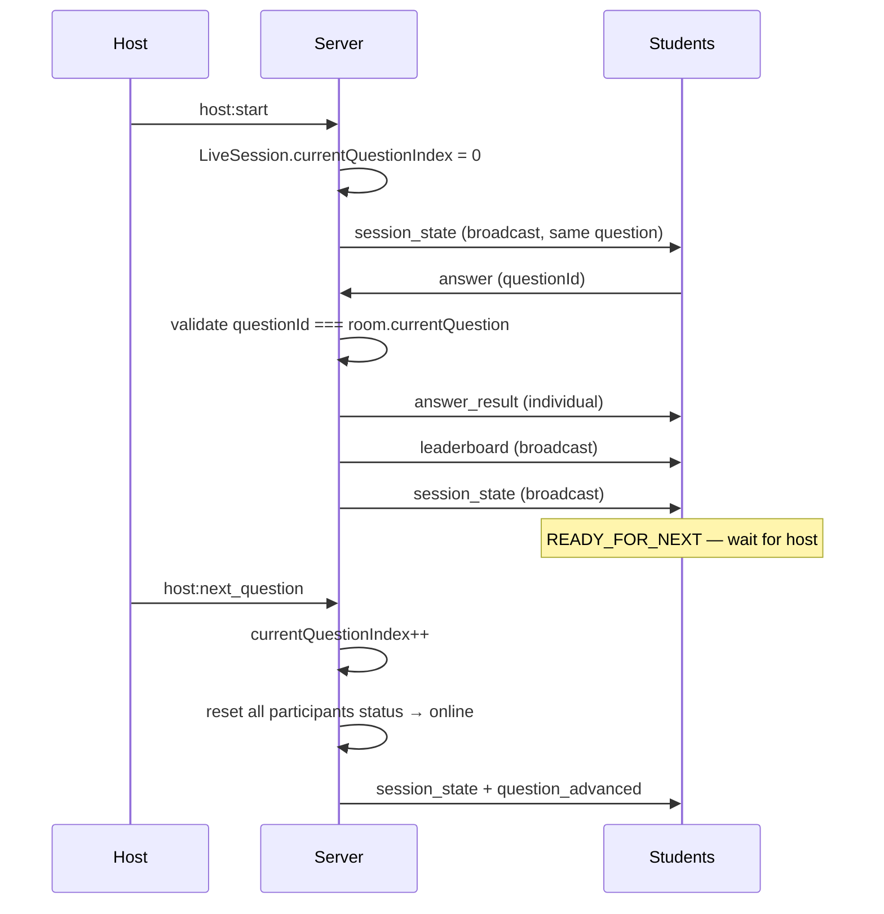
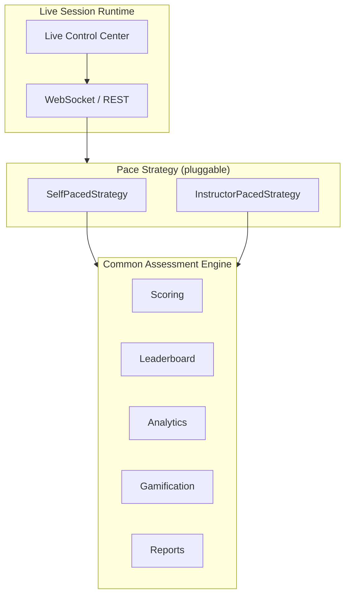
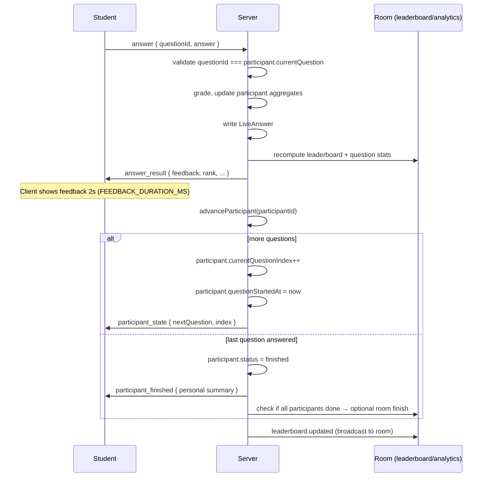
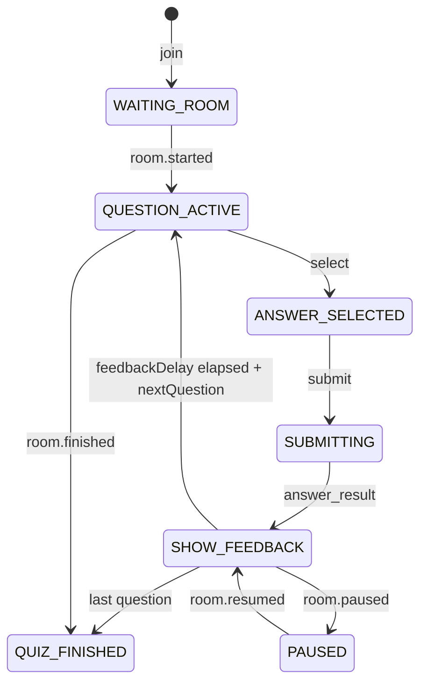
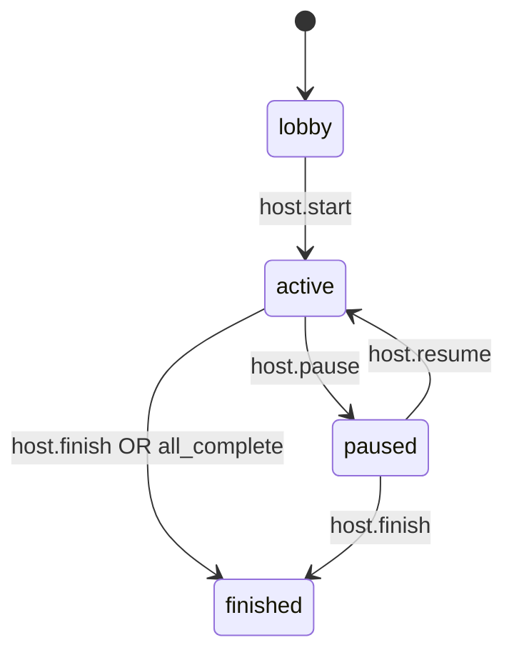

# Live Mode Redesign — Kahoot → Quizizz Live

> **Status:** ✅ **Approved** (Product Owner, July 6, 2026) — with dual pace modes + Configuration Matrix  
> **Date:** July 6, 2026  
> **Trigger:** Product design correction (not a bug)  
> **Implementation:** Blocked until Phase 0 checklist complete; architecture is approved

---

## Executive summary

THE GATEHUB live assessment was built as **instructor-paced only** (Kahoot model): one room-level `currentQuestionIndex`, host presses **Next** after every question, all students wait in sync.

The product vision is **not** to force one teaching style. THE GATEHUB supports **both** — with **self-paced live as the default** — through a shared **Pace Strategy** layer on top of a **common assessment engine** (scoring, leaderboard, analytics, reports, gamification).

```
Live Session
    ↓
Pace Mode (strategy)
    ├── Self-Paced      ← DEFAULT
    └── Instructor-Paced
    ↓
Common Assessment Engine
    ↓
Scoring · Leaderboard · Analytics · Reports · Gamification
```

| Mode | Pace | Primary controller | Best for |
|------|------|-------------------|----------|
| **Self-paced live** (default) | Per-participant | Student | Classrooms, placement training, college assessments |
| **Instructor-paced live** (option) | Room-synchronized | Host Next | Workshops, seminars, competitions, demos |
| Homework | Per-attempt async | Student + deadline | Async assignments (A2) |
| Mock test | Per-attempt timed | Student + exam rules | Simulations |

**We do not replace the current engine.** We **extend** it with `PaceStrategy` so instructor-paced behavior is preserved while self-paced becomes the default path.

All live session behavior is driven by a **Live Session Configuration Matrix** (§16) — not hardcoded logic.

---

## Table of contents

1. [Product requirement](#1-product-requirement)
2. [Current architecture](#2-current-architecture)
3. [Why the current model fails](#3-why-the-current-model-fails)
4. [New architecture](#4-new-architecture)
5. [Database changes](#5-database-changes)
6. [Socket & API changes](#6-socket--api-changes)
7. [State machines](#7-state-machines)
8. [Scoring & response time](#8-scoring--response-time)
9. [Leaderboard & projector](#9-leaderboard--projector)
10. [Unified assessment engine alignment](#10-unified-assessment-engine-alignment)
11. [Migration plan](#11-migration-plan)
12. [Advantages](#12-advantages)
13. [Backward compatibility](#13-backward-compatibility)
14. [Risks & open questions](#14-risks--open-questions)
15. [Approval checklist](#15-approval-checklist)
16. [Live Session Configuration Matrix](#16-live-session-configuration-matrix)

---

## 1. Product requirement

### 1.1 Desired student flow

```
Join lobby
  ↓
Instructor starts (once)
  ↓
Question N
  ↓
Submit
  ↓
Immediate feedback (~2 seconds)
  ↓
Automatically load Question N+1
  ↓
(repeat until last question)
  ↓
Personal results + leaderboard
```

**There is no “Waiting for next question…” blocked on the host.**

### 1.2 Two pace modes (product vision)

**Mode 1 — Self-Paced Live (default)**

Instructor creates quiz → students join → instructor clicks **Start once** → students progress independently → feedback after every question → next question appears automatically → instructor watches analytics and leaderboard → instructor can Pause, Resume, End.

Least stressful for instructors. Best default for everyday teaching.

**Mode 2 — Instructor-Paced Live (option)**

Same lobby and engine. Host controls when **everyone** moves to the next question. Useful for workshops, seminars, quiz competitions, events, and demonstrations.

### 1.3 Live Control Center (instructor never “disappears”)

After Start, the instructor stays in a **Live Control Center** — not a passive observer, not a “Next button machine.”

| Control | Self-paced | Instructor-paced |
|---------|:----------:|:----------------:|
| Start Quiz | ✅ (lobby) | ✅ (lobby) |
| Pause | ✅ | ✅ |
| Resume | ✅ | ✅ |
| End Quiz | ✅ | ✅ |
| Announcements | ✅ | ✅ |
| Kick Student | ✅ | ✅ |
| Projector View | ✅ | ✅ |
| Leaderboard | ✅ | ✅ |
| Analytics | ✅ | ✅ |
| Room Health | ✅ | ✅ |
| **Next Question** | ❌ hidden | ✅ |

The Control Center is the primary instructor surface for the entire session. Configuration chosen at create time (§16) determines which controls and overlays are available.

### 1.4 Instructor responsibilities (summary)

| Action | Self-paced live | Instructor-paced live |
|--------|:---------------:|:---------------------:|
| Start quiz | ✅ Once | ✅ Once |
| Pause / Resume | ✅ | ✅ |
| End quiz | ✅ | ✅ |
| Projector view | ✅ | ✅ |
| Kick student | ✅ | ✅ |
| Announcements | ✅ | ✅ |
| Live analytics + room health | ✅ Continuous | ✅ Continuous |
| Next question | ❌ | ✅ |

### 1.5 Early finishers (self-paced)

When a student completes all questions **before** the room ends:

1. **Personal completion screen** — not a dead wait.
2. Show: 🎉 Quiz Completed, final score, accuracy, XP earned, **current live rank**, streak, time taken.
3. Then: *“Waiting for other students…”* — but keep it engaging:
   - Live leaderboard updating in real time
   - Podium animation
   - Fun facts / motivational messages (rotating copy)
   - *“Instructor will end the session shortly”*
4. **No further answers** — read-only spectator mode until `host:finish` or room auto-end.

This resolves Q1 (§14). Students stay engaged without breaking session integrity.

### 1.6 Student responsibilities

Each student owns their progression:

| Field | Owner |
|-------|-------|
| `currentQuestionIndex` | Participant |
| `currentQuestion` | Derived from participant index + frozen `questionOrder` |
| `questionStartedAt` | Participant (timer anchor) |
| `submitted` / answer rows | Participant |
| `score`, `streak`, `xp`, `accuracy` | Participant (aggregated) |
| `status` | Participant |
| `responseTimeMs` | Per answer |

### 1.7 Room responsibilities

The room tracks **session-level** state only:

| Field | Owner |
|-------|-------|
| `status` | Room (`lobby` \| `active` \| `paused` \| `finished`) |
| `startedAt` / `endedAt` | Room |
| `participants` | Room registry |
| `leaderboard` | Room aggregate (recomputed on each answer) |
| `analytics` | Room aggregate (`SessionAnalytics`) |
| `settings` | Room (timer, shuffle, scoring weights) |
| `questionOrder` | Room (frozen at start) |

**The room does not own “which question everyone is on.”**

---

## 2. Current architecture

### 2.1 Data model (legacy — Phase A)

```
LiveSession
├── currentQuestionIndex      ← ROOM-LEVEL (single source of truth)
├── questionStartedAt         ← ROOM-LEVEL timer anchor
├── status, settings, quizId
├── LiveParticipant[]
│   ├── score, xp, streak, status
│   └── (no question index)
└── LiveAnswer[]              ← keyed by participant + questionId
```

Relevant Prisma (`backend/prisma/schema.prisma`):

- `LiveSession.currentQuestionIndex` — default `-1`, set to `0` on `startSession`
- `LiveParticipant` — engagement aggregates only; no progression pointer
- `LiveAnswer` — `@@unique([sessionId, participantId, questionId])`

### 2.2 v2 schema (not wired — same flaw)

`AssessLiveRoom` duplicates the room-level index pattern:

```
AssessLiveRoom
├── currentQuestionIndex      ← still room-level
└── AssessParticipant[]       ← no currentQuestionIndex
```

`AssessmentAttempt` + `AssessmentAttemptQuestion` already model **per-attempt** progression — the correct pattern for self-paced modes — but live sessions do not use them yet.

### 2.3 Server flow (today)



**Key functions** (`backend/src/services/liveSession/liveSessionService.ts`):

| Function | Behavior |
|----------|----------|
| `startSession` | Sets room `currentQuestionIndex: 0`, `questionStartedAt: now` |
| `advanceQuestion` | Increments **room** index; resets participant statuses |
| `submitLiveAnswer` | Rejects if `questionId !== getQuestionByIndex(room.currentQuestionIndex)` |
| `buildSessionState` | Returns **one** `currentQuestion` for entire room |
| `getPlayerSessionView` | Restore uses **room** index |

### 2.4 WebSocket (today)

Endpoint: `/live-sessions/ws/:sessionId`

| Client → Server | Effect |
|-----------------|--------|
| `host:start` | Room active, index 0 |
| `host:next_question` | Room index++ (or finish) |
| `host:finish` | Room finished |
| `answer` | Grade against room question |

| Server → Client | Scope |
|-----------------|-------|
| `session_state` | **Broadcast** — identical question for all |
| `question_advanced` | **Broadcast** |
| `leaderboard` | Broadcast |
| `answer_result` | Individual |

**Missing today:** `host:pause`, `host:resume`, `host:announce`, `host:kick` (specified in v2 architecture doc but not implemented).

### 2.5 Frontend (today)

| Layer | Assumption |
|-------|------------|
| `playerStateMachine.ts` | `READY_FOR_NEXT` waits for room index change |
| `useLivePlayerFlow.ts` | Advances when `sessionState.currentQuestionIndex` changes |
| `LiveSessionHostPage` | **Next Question** button calls `hostNextQuestion` |
| `LiveSessionPlayerPage` | Header shows room `currentQuestionIndex` |
| `LiveLeaderboardDisplayPage` | Shows room question progress |

### 2.6 Latent setting (unused)

`LiveSessionSettings.autoNextQuestion` exists in schema/settings UI but is **never read** by server or client. It was intended for a different behavior and must not be hacked on — replace with explicit `paceMode`.

---

## 3. Why the current model fails

| Symptom | Root cause |
|---------|------------|
| “Waiting for next question…” after every submit | Client waits for `host:next_question` / room index change |
| Fast students idle | Room pace capped by slowest + host click cadence |
| Instructor fatigue | Host must click Next for every question × every class |
| Wrong product positioning | Kahoot sync, not Quizizz Live |
| A1.5 polish insufficient | UX improved the wait state; **did not remove the wait** |
| `responseTimeMs` inaccurate on skew | Uses `session.questionStartedAt` (room), not per-student start |
| Homework/Mock divergence | Async modes need per-attempt progression; live invented a parallel model |
| v2 `AssessmentAttempt` unused | Live bypasses the universal engine |

---

## 4. New architecture

### 4.1 Core principle: Pace Strategy — extend, do not replace

**Do not throw away the instructor-paced engine.** Extract progression into a **`PaceStrategy`** interface; both strategies call the same scoring, leaderboard, analytics, and gamification services.



Introduce **`paceMode`** in the Configuration Matrix (§16):

```typescript
type PaceMode =
  | "self_paced"        // Quizizz Live — DEFAULT for new live sessions
  | "instructor_paced"; // Kahoot — optional, explicit opt-in
```

| | Self-paced live | Instructor-paced live |
|--|-----------------|---------------------|
| Question pointer | `participant.currentQuestionIndex` | `room.currentQuestionIndex` |
| Advance trigger | Server after submit + feedback delay | `host:next` |
| Timer anchor | `participant.questionStartedAt` | `room.questionStartedAt` |
| `session_state` broadcast | Room metadata only | Room metadata + shared question |
| Student question payload | `participant_state` (targeted) | `session_state` (broadcast) |

### 4.2 Target data model

```
LiveSession (room)
├── paceMode: "self_paced" | "instructor_paced"
├── status: lobby | active | paused | finished
├── pausedAt?: DateTime
├── settings (questionOrder, scoring, feedbackDelayMs, ...)
├── (instructor_paced only) currentQuestionIndex, questionStartedAt
└── participants[]
    ├── currentQuestionIndex          ← NEW (self_paced)
    ├── questionStartedAt             ← NEW (self_paced)
    ├── finishedAt?: DateTime         ← NEW (when student completes all Qs)
    ├── score, xp, streak, accuracy, status
    └── answers[] (unchanged)
```

### 4.3 Self-paced submit + advance (server)



**Advance is server-authoritative.** Client may animate feedback locally, but must not load the next question until the server confirms (prevents cheating / desync).

**Feedback delay:** configurable `settings.feedbackDelayMs` (default `2000`). Server can either:

- **Option A (recommended):** Include `nextQuestion` in `answer_result` after internal advance; client delays render by `feedbackDelayMs`.
- **Option B:** Server schedules `participant_state` push after `feedbackDelayMs`.

Option A reduces round-trips and matches offline-tolerant REST fallback.

### 4.4 Pause / resume semantics

When room `status === "paused"`:

| Behavior | Self-paced |
|----------|------------|
| New submissions | Rejected with `ROOM_PAUSED` |
| Timer | Frozen per participant (`pausedAt` stored; resume adjusts anchor) |
| In-flight feedback animation | Completes; advance queued until resume |
| Leaderboard / projector | Still live (read-only) |
| Host announcements | Allowed |

### 4.5 End session

`host:finish` sets room `status = finished` and:

- Self-paced: students mid-quiz see results based on **questions answered so far** (policy TBD in §14)
- No further submissions accepted
- Final leaderboard snapshot persisted

### 4.6 Service layer refactor (strategy pattern — both modes retained)

**Extend** `liveSessionService.ts` — preserve `InstructorPacedStrategy` as a first-class citizen (current behavior), add `SelfPacedStrategy` as default:

```
backend/src/services/liveSession/
├── liveSessionService.ts          # Room lifecycle, join, finish
├── pace/
│   ├── PaceStrategy.ts            # Interface
│   ├── SelfPacedStrategy.ts       # participant advance
│   └── InstructorPacedStrategy.ts # room advance (legacy)
├── progression/
│   ├── participantProgression.ts  # index, timer, completion
│   └── questionResolver.ts        # frozen order, shuffle
├── scoring/
│   └── liveScoring.ts             # unchanged logic, new timer input
└── state/
    ├── buildRoomState.ts          # room-level DTO
    └── buildParticipantState.ts   # per-player DTO
```

**Rule:** `submitLiveAnswer` delegates to `PaceStrategy.validateAndSubmit()` — no `if (paceMode)` spaghetti in one 900-line file.

**Configuration rule:** All behavioral branches read from `LiveSessionConfig` (§16) via a single `configResolver` — never scattered magic booleans.

### 4.7 Live Control Center (UI architecture)

Dedicated host route: `/instructor/quiz-room/:sessionId/host` becomes the **Control Center** shell.

| Panel | Content |
|-------|---------|
| **Header** | Title, room code, connection, pace mode badge, pause state |
| **Controls bar** | Start · Pause · Resume · End · Announce · Kick · Projector (contextual per §16) |
| **Room health** | Joined, active, finished, disconnected, progress histogram (self-paced) |
| **Analytics** | Per-question stats, avg time, correct %, pending spread |
| **Leaderboard** | Live top N + podium (respects leaderboard visibility config) |
| **Instructor-paced only** | Current question preview + **Next Question** |

Students never see host controls. Projector (`/live/display`) is a read-only slice of Control Center data.

### 4.8 REST parity

All WS flows must have REST equivalents (already partially true):

| REST | Purpose |
|------|---------|
| `GET /player-view` | Returns **participant** state (index, current question, pending feedback) |
| `POST /answer` | Submit + receive `answer_result` + optional `nextQuestion` |
| `POST /host/pause` | New |
| `POST /host/resume` | New |

---

## 5. Database changes

### 5.1 Phase 1 — extend legacy tables (minimal migration)

**`LiveSession`** — add:

```prisma
paceMode String @default("self_paced") @map("pace_mode")
pausedAt DateTime? @map("paused_at")
```

Keep `currentQuestionIndex` / `questionStartedAt` for `instructor_paced` backward compatibility.

**`LiveParticipant`** — add:

```prisma
currentQuestionIndex Int       @default(-1) @map("current_question_index")
questionStartedAt    DateTime? @map("question_started_at")
finishedAt           DateTime? @map("finished_at")
```

**`LiveSessionSettings` JSON** — add:

```typescript
paceMode: "self_paced" | "instructor_paced";  // mirror column or settings-only
feedbackDelayMs: number;                        // default 2000
autoFinishWhenAllComplete: boolean;             // default true
```

Deprecate: `autoNextQuestion` → map to `paceMode === "self_paced"` on read.

### 5.2 Phase 2 — v2 alignment

**`AssessLiveRoom`** — same `paceMode`, `pausedAt`; room index only if instructor-paced.

**`AssessParticipant`** — add `currentQuestionIndex`, `questionStartedAt`, `finishedAt`.

**`AssessmentAttempt`** — live self-paced should create/link an attempt at join:

```
join live room
  → create AssessmentAttempt (mode=live_quiz, status=in_progress)
  → AssessParticipant.attemptId = attempt.id
  → AssessmentAttemptQuestion rows materialized from frozen order
```

Progression then mirrors homework/mock: update `AssessmentAttemptQuestion.status` + `AssessmentResponse` on each answer.

### 5.3 Analytics

`SessionAnalytics.questionStats` today assumes room-synchronized question “windows.” For self-paced:

- Stats keyed by `questionId` (already mostly true)
- Add `participantsAtQuestion` distribution (histogram of how many students are on Q1…Qn at time T)
- `dropOffData` per question index (when participant finishes or stalls)

### 5.4 Indexes

```prisma
@@index([sessionId, currentQuestionIndex])  // on LiveParticipant
@@index([sessionId, status])                // completion queries
```

---

## 6. Socket & API changes

### 6.1 Event model shift

| Today | New (self-paced) |
|-------|------------------|
| `session_state` (full, broadcast) | `room_state` (broadcast) — status, settings, leaderboard, analytics summary |
| — | `participant_state` (unicast) — current question, index, timer anchor |
| `question_advanced` (broadcast) | **Removed** in self-paced |
| `answer_result` | Extended with `nextQuestion?`, `participantIndex`, `isPersonalComplete` |
| — | `participant_finished` (unicast) |
| — | `room.paused` / `room.resumed` (broadcast) |
| — | `host.announce` (broadcast) |
| — | `host.kick` → `participant_removed` |

Align naming with [ASSESSMENT-PLATFORM-ARCHITECTURE.md §8](./ASSESSMENT-PLATFORM-ARCHITECTURE.md) over time; Phase 1 may keep `/live-sessions/ws/` path with new message types.

### 6.2 Host actions

| Event | Self-paced | Instructor-paced |
|-------|:----------:|:----------------:|
| `host:start` | ✅ | ✅ |
| `host:pause` | ✅ NEW | ✅ |
| `host:resume` | ✅ NEW | ✅ |
| `host:finish` | ✅ | ✅ |
| `host:next_question` | ❌ ignored / error | ✅ |
| `host:announce` | ✅ NEW | ✅ |
| `host:kick` | ✅ NEW | ✅ |

### 6.3 `GET /player-view` response shape

```typescript
interface PlayerView {
  participantId: string;
  paceMode: PaceMode;
  room: {
    status: LiveSessionStatus;
    title: string;
    questionCount: number;
    settings: LiveSessionSettings;
    pausedAt: string | null;
  };
  progress: {
    currentQuestionIndex: number;
    questionStartedAt: string | null;
    isComplete: boolean;
    currentQuestion: QuestionForClient | null;
  };
  pendingFeedback: LiveAnswerResult | null;  // if refresh mid-feedback
  leaderboard: LeaderboardEntry[];
  myRank: number;
}
```

### 6.4 WebSocket connection bootstrap

On connect:

1. Send `connected`
2. Send `room_state` (broadcast-safe subset)
3. Send `participant_state` (**unicast** to that socket only)

On reconnect: same — never rely on last broadcast `session_state` for question content.

---

## 7. State machines

### 7.1 Student — self-paced (new default)



**Removed:** `READY_FOR_NEXT` (host-dependent), `SHOW_LEADERBOARD` as blocking gate (optional non-blocking toast/overlay only).

### 7.2 Student — instructor-paced (retained)

Existing A1.5 machine remains for `paceMode === "instructor_paced"`:

`SHOW_FEEDBACK` → `READY_FOR_NEXT` → wait for `question_advanced` broadcast.

### 7.3 Room lifecycle



### 7.4 Participant lifecycle (self-paced)

```
online → thinking → answered → (auto advance) → thinking → … → finished
```

`finished` when `currentQuestionIndex >= questionCount` after last submit.

---

## 8. Scoring & response time

### 8.1 Timer anchor

| Mode | `responseTimeMs` calculation |
|------|------------------------------|
| Self-paced | `now - participant.questionStartedAt` |
| Instructor-paced | `now - room.questionStartedAt` |

Set `participant.questionStartedAt` when:

- Session starts (index → 0)
- Participant advances to next question
- Room resumes (adjust for pause duration)

### 8.2 Scoring engine

No change to point formula (`calculateLivePoints`). Input changes only.

### 8.3 Leaderboard

Recomputed after every `submitLiveAnswer` — **unchanged**. Rank may change while students are on different questions; that is correct for Quizizz Live.

---

## 9. Leaderboard & projector

### 9.1 Leaderboard — configurable visibility

Configured at session create (§16). The engine always **computes** rankings; visibility controls **when students see** them.

| Setting | Student experience |
|---------|-------------------|
| **After every question** | Brief overlay after feedback (non-blocking in self-paced) |
| **Every N questions** | Overlay when `participant.currentQuestionIndex % N === 0` |
| **End only** | No mid-session overlays; final results + podium |
| **Hidden** | No student-facing leaderboard; host/projector may still show (host preference) |

Implementation: `LeaderboardVisibilityPolicy` reads config; `PaceStrategy` emits `leaderboard.show` events only when policy allows.

- Updates on every answer server-side (already implemented)
- No synchronization with question changes required
- Host dashboard always shows live leaderboard unless host collapses panel

### 9.2 Projector (`/live/display`)

**Does not** drive student pace.

Display:

- Live leaderboard / podium
- Top players
- Aggregate question statistics (correct % per question across all who reached it)
- Room health (joined, active, completed, paused banner)
- Host announcements

Remove misleading copy: ~~“Question 3 of 8”~~ as room-level truth. Replace with:

- “Live leaderboard”
- Optional: “Most students on Question X” (analytics histogram)

### 9.3 Host analytics panel

| Metric | Source |
|--------|--------|
| Players joined | `participants.length` |
| Players finished | `participants where finishedAt != null` |
| On each question | histogram of `currentQuestionIndex` |
| Per-question correct % | `LiveAnswer` grouped by `questionId` |
| Avg response time | per `questionId` |
| Pending on current spread | derived |

---

## 10. Unified assessment engine alignment

### 10.1 Goal

One progression model for all async/self-driven modes:

```
AssessmentDeployment (mode config)
    └── AssessmentAttempt (per user)
            └── AssessmentAttemptQuestion[] (ordered)
                    └── AssessmentResponse (per question)
```

Live self-paced maps:

| Live legacy | Universal engine |
|-------------|------------------|
| `LiveSession` | `AssessmentDeployment` + `AssessLiveRoom` |
| `LiveParticipant` | `AssessParticipant` + `AssessmentAttempt` |
| `LiveAnswer` | `AssessmentResponse` |
| `participant.currentQuestionIndex` | first `pending` `AssessmentAttemptQuestion.order - 1` |

### 10.2 Mode registry (target)

```
backend/src/assessment/modes/
├── liveQuizMode.ts       # paceMode, WS hooks, leaderboard
├── homeworkMode.ts       # deadline, late policy
├── mockTestMode.ts       # strict timer, no pause
└── modeRegistry.ts
```

Each mode implements:

```typescript
interface AssessmentModeHandler {
  onStart(deployment, attempt): void;
  onSubmit(attempt, questionId, answer): SubmitResult;
  onAdvance(attempt): AdvanceResult;      // self-paced live + homework
  onFinish(attempt): FinishResult;
  canSubmit(attempt, room): boolean;       // pause, deadline, etc.
}
```

### 10.3 Player shell

`AssessmentPlayer` (future) receives `ParticipantView` instead of `LiveSessionState`:

- Same UI components as today (`LiveQuestionDisplay`, `LiveAnswerFeedback`)
- Flow driven by mode config, not hard-coded `READY_FOR_NEXT`

---

## 11. Migration plan

### Phase 0 — Architecture approval (this document)

- [ ] Product sign-off on self-paced default
- [ ] Confirm pause/finish edge policies (§14)
- [ ] Confirm instructor-paced retention

### Phase 1 — Schema + strategy layer (backend only)

- [ ] Migration: `paceMode`, participant index columns
- [ ] Implement `PaceStrategy` + `SelfPacedStrategy`
- [ ] Refactor `submitLiveAnswer`, `startSession`
- [ ] New `buildParticipantState`, slim `buildRoomState`
- [ ] Update `GET /player-view`, `POST /answer`
- [ ] Feature flag: `LIVE_SELF_PACED_ENABLED` default `false` in staging

### Phase 2 — WebSocket protocol

- [ ] `participant_state` unicast
- [ ] `room_state` broadcast split
- [ ] `host:pause` / `host:resume` / `host:announce` / `host:kick`
- [ ] Gate `host:next_question` behind `instructor_paced`
- [ ] Update `validate:a1-pat` + new `validate:self-paced-live` script

### Phase 3 — Frontend

- [ ] New `useLiveParticipantFlow` (or branch in `useLivePlayerFlow` by `paceMode`)
- [ ] Remove **Next Question** from host UI when self-paced
- [ ] Add Pause / Resume / Announce UI
- [ ] Auto-advance after `FEEDBACK_DURATION_MS` from `answer_result.nextQuestion`
- [ ] Delete host-wait UX (`READY_FOR_NEXT` default path)
- [ ] Projector + analytics updates

### Phase 4 — v2 bridge

- [ ] Create `AssessmentAttempt` on live join
- [ ] Dual-write `LiveAnswer` + `AssessmentResponse`
- [ ] `legacySessionId` link on deployment

### Phase 5 — Default flip + cleanup

- [ ] New sessions default `paceMode: self_paced`
- [ ] Update docs (A1.5, A1.6 corrections)
- [ ] Deprecation notice for instructor-paced in UI (optional mode)

### Phase 6 — Homework (A2)

- [ ] Implement homework using same `AssessmentModeHandler` + attempt progression
- [ ] No separate homework player engine

**Estimated effort:** 2–3 engineering weeks (backend protocol + frontend + tests), excluding v2 full bridge.

---

## 12. Advantages

| Advantage | Detail |
|-----------|--------|
| **Correct product** | Matches Quizizz Live — students stay engaged, no host click fatigue |
| **Pedagogically sound** | Fast learners aren’t penalized with idle time |
| **Instructor role clarity** | Monitor, intervene, announce — not “human next button” |
| **Engine unification** | Same progression model as homework and mock tests |
| **Accurate timing** | Per-participant timer anchors |
| **Better analytics** | Progress distribution across class in real time |
| **Scalable host UX** | Host actions O(1) per session, not O(questions) |
| **v2 ready** | Aligns with frozen `ASSESSMENT-PLATFORM-ARCHITECTURE.md` |
| **Resilient reconnect** | `player-view` restores **personal** index, not room |

---

## 13. Backward compatibility

### 13.1 Existing sessions

| Scenario | Policy |
|----------|--------|
| Active instructor-paced sessions at deploy | Continue on `paceMode: instructor_paced` until finished |
| Draft / lobby sessions | Migrate settings to `paceMode: self_paced` on next launch (configurable) |
| Historical results | Unchanged — `LiveAnswer` rows immutable |

### 13.2 API compatibility

| Endpoint / event | Compatibility |
|------------------|---------------|
| `host:next_question` | Supported when `paceMode === instructor_paced"` |
| `session_state` | Deprecated — emit `room_state` + `participant_state`; keep `session_state` shim for one release |
| `currentQuestionIndex` on room DTO | Present but `null` / ignored in self-paced clients |

### 13.3 Settings UI

- Replace “Auto next question” toggle with **Pace mode** select:
  - **Live (students go at their own pace)** — default
  - **Synchronized (host advances everyone)** — advanced
- Existing rooms with `autoNextQuestion: true` → map to `self_paced` on read

### 13.4 Tests

- Keep `playerStateMachine.test.ts` for instructor-paced branch
- Add `selfPacedPlayerStateMachine.test.ts`
- PAT matrix splits by `paceMode`

---

## 14. Risks & open questions

| # | Question | Status | Decision |
|---|----------|--------|----------|
| Q1 | Student finishes before others? | ✅ **Resolved** | Personal completion screen + live spectator lobby (§1.5) |
| Q2 | Host ends while students mid-quiz? | Open | Grade answered only; mark incomplete with badge |
| Q3 | Late join after start? | Open | `lateJoin` config (§16): allow → start at Q0; deny → block |
| Q4 | Auto-finish room when all complete? | Open | Default `true`; host can end early |
| Q5 | Leaderboard overlay timing? | ✅ **Resolved** | Config matrix: every Q / every N / end / hidden (§16) |
| Q6 | Pause mid-feedback? | Open | Queue advance until resume |
| Q7 | Cheating? | Closed | Server-authoritative advance only |
| Q8 | Hack via `autoNextQuestion`? | Closed | **Rejected** — use `paceMode` + config matrix |
| Q9 | Timer mode? | ✅ **Resolved** | Per-question / whole-quiz / none (§16) |

---

## 15. Approval checklist

| Stakeholder | Item | Sign-off |
|-------------|------|:--------:|
| Product | Self-paced is default; host does not click Next | ☐ |
| Product | Instructor-paced remains optional | ☐ |
| Product | Student finish-before-room policy (Q1) | ☐ |
| Engineering | PaceStrategy refactor acceptable | ☐ |
| Engineering | WS unicast `participant_state` | ☐ |
| Engineering | v2 attempt bridge in Phase 4 (not blocking Phase 1–3) | ☐ |
| QA | New PAT matrix for self-paced | ☐ |
| Docs | A1.5 / A1.6 marked superseded for pace model | ☐ |

---

## 16. Live Session Configuration Matrix

Every live session is configured at **create / edit** time. Settings are stored in `LiveSession.settings` (JSON) and validated by `LiveSessionConfigSchema`. **No hardcoded behavior** — the Pace Strategy and visibility policies read this matrix at runtime.

### 16.1 Configuration fields

#### Progress (Pace Mode)

| Value | Description |
|-------|-------------|
| `self_paced` | **Default.** Each participant owns `currentQuestionIndex`; auto-advance after feedback. |
| `instructor_paced` | Room-level index; host **Next Question** advances everyone. |

```typescript
paceMode: "self_paced" | "instructor_paced";  // default: "self_paced"
```

#### Leaderboard

| Value | Description |
|-------|-------------|
| `every_question` | Show student overlay after each answered question |
| `every_n_questions` | Show every N questions (`leaderboardEveryN`, default 5) |
| `end_only` | Only on personal / room completion |
| `hidden` | No student-facing leaderboard UI |

```typescript
leaderboardVisibility: "every_question" | "every_n_questions" | "end_only" | "hidden";
leaderboardEveryN?: number;  // required when every_n_questions; default 5
```

#### Feedback

| Value | Description |
|-------|-------------|
| `immediate` | **Default.** ~2s animated feedback after submit |
| `delayed` | Longer pause (`feedbackDelayMs`, e.g. 5000) |
| `hidden` | No feedback UI; advance directly (competition mode) |

```typescript
feedbackMode: "immediate" | "delayed" | "hidden";
feedbackDelayMs: number;  // default 2000; used by immediate + delayed
```

#### Timer

| Value | Description |
|-------|-------------|
| `per_question` | **Default.** Countdown per question (`questionTimerSeconds`) |
| `whole_quiz` | Single countdown for entire session (`totalDurationMinutes`) |
| `none` | No timer pressure |

```typescript
timerMode: "per_question" | "whole_quiz" | "none";
questionTimerSeconds: number;   // per_question; default 30
totalDurationMinutes?: number;  // whole_quiz
autoSubmitOnTimerExpiry: boolean;  // default true when timer enabled
```

#### Show Correct Answer

| Value | Description |
|-------|-------------|
| `yes` | Show in feedback (default) |
| `no` | Correct/incorrect only |
| `after_end` | Reveal on session / personal completion |

```typescript
showCorrectAnswer: "yes" | "no" | "after_end";
```

#### Randomization

```typescript
randomizeQuestions: boolean;  // default false
randomizeOptions: boolean;    // default false
// questionOrder + optionOrders frozen at start when enabled
```

#### Guest Join

```typescript
guestMode: boolean;       // allow anonymous display names
requireLogin: boolean;    // default true for institutional use
```

#### Pause Allowed

```typescript
pauseAllowed: boolean;  // default true; when false, hide Pause/Resume in Control Center
```

#### Late Join

```typescript
lateJoin: boolean;  // default true; false = lock lobby after start
```

#### Auto Submit

```typescript
autoSubmitOnTimerExpiry: boolean;  // when timer fires, submit selection or blank
```

#### End Behavior

What students see when the room ends (or they finish early):

| Value | Description |
|-------|-------------|
| `wait_room` | Early finishers: spectator lobby (§1.5) until host ends |
| `show_results` | **Default.** Full personal results + podium |
| `return_dashboard` | Redirect to student assessments dashboard |

```typescript
endBehavior: "wait_room" | "show_results" | "return_dashboard";
autoFinishWhenAllComplete: boolean;  // default true (self-paced)
```

### 16.2 Full config type (canonical)

```typescript
interface LiveSessionConfig {
  // Pace
  paceMode: "self_paced" | "instructor_paced";

  // Leaderboard
  leaderboardVisibility: "every_question" | "every_n_questions" | "end_only" | "hidden";
  leaderboardEveryN: number;

  // Feedback
  feedbackMode: "immediate" | "delayed" | "hidden";
  feedbackDelayMs: number;

  // Timer
  timerMode: "per_question" | "whole_quiz" | "none";
  questionTimerSeconds: number;
  totalDurationMinutes?: number;
  autoSubmitOnTimerExpiry: boolean;

  // Answers & content
  showCorrectAnswer: "yes" | "no" | "after_end";
  showExplanations: boolean;
  randomizeQuestions: boolean;
  randomizeOptions: boolean;

  // Access
  guestMode: boolean;
  requireLogin: boolean;
  lateJoin: boolean;
  maxPlayers?: number;

  // Host controls
  pauseAllowed: boolean;

  // End
  endBehavior: "wait_room" | "show_results" | "return_dashboard";
  autoFinishWhenAllComplete: boolean;

  // Scoring (unchanged)
  negativeMarking: boolean;
  multipleAttempts: boolean;
  scoring: {
    correctnessWeight: number;
    speedWeight: number;
    streakBonus: number;
    perfectBonus: number;
  };

  // Frozen at start
  questionOrder?: string[];
  optionOrders?: Record<string, string[]>;
}
```

### 16.3 Defaults (new sessions)

| Field | Default |
|-------|---------|
| `paceMode` | `self_paced` |
| `leaderboardVisibility` | `every_question` |
| `leaderboardEveryN` | `5` |
| `feedbackMode` | `immediate` |
| `feedbackDelayMs` | `2000` |
| `timerMode` | `per_question` |
| `questionTimerSeconds` | `30` |
| `autoSubmitOnTimerExpiry` | `true` |
| `showCorrectAnswer` | `yes` |
| `pauseAllowed` | `true` |
| `lateJoin` | `true` |
| `endBehavior` | `show_results` |
| `autoFinishWhenAllComplete` | `true` |

### 16.4 Config → behavior mapping

| Config | Read by | Effect |
|--------|---------|--------|
| `paceMode` | `PaceStrategy` factory | Self vs instructor progression |
| `leaderboardVisibility` | `LeaderboardVisibilityPolicy` | When to emit `leaderboard.show` to student |
| `feedbackMode` + `feedbackDelayMs` | `FeedbackPolicy` | Client animation duration / skip |
| `timerMode` | `TimerPolicy` | Per-participant vs room vs none |
| `showCorrectAnswer` | `FeedbackPolicy` | What to include in `answer_result` |
| `pauseAllowed` | Control Center | Show/hide Pause |
| `lateJoin` | `joinSession` | Block join after `start` |
| `endBehavior` | `participant_finished` handler | Early finisher vs room end UI |
| `autoFinishWhenAllComplete` | Room lifecycle | Auto `host:finish` when all participants `finished` |

### 16.5 UI: session create / edit

`QuizRoomSettingsForm` becomes the **Configuration Matrix** editor:

- Grouped sections: Progress · Timer · Leaderboard · Feedback · Access · End behavior
- Presets: **Classroom (default)** · **Competition** · **Workshop (instructor-paced)** · **Custom**
- Live preview of which Control Center buttons appear

### 16.6 Migration from legacy settings

| Legacy field | Maps to |
|--------------|---------|
| `autoNextQuestion: true` | `paceMode: "self_paced"` |
| `autoNextQuestion: false` | `paceMode: "instructor_paced"` (if was sync) |
| `showLeaderboard: false` | `leaderboardVisibility: "hidden"` |
| `showLeaderboard: true` | `leaderboardVisibility: "every_question"` |
| `lockLateJoin: true` | `lateJoin: false` |

---

## Related documents

| Doc | Relationship |
|-----|--------------|
| [ASSESSMENT-PLATFORM-ARCHITECTURE.md](./ASSESSMENT-PLATFORM-ARCHITECTURE.md) | Target v2 engine — this redesign aligns live with it |
| [HOMEWORK-PRODUCT-SPEC.md](./HOMEWORK-PRODUCT-SPEC.md) | A2 blocked until pace refactor approved |
| [features/A1.5-live-player-polish.md](./features/A1.5-live-player-polish.md) | UX polish — **pace model incorrect**, keep visual patterns |
| [features/A1.6-live-product-review.md](./features/A1.6-live-product-review.md) | Production verdict **superseded** pending this redesign |
| [ASSESSMENT-ROADMAP.md](./ASSESSMENT-ROADMAP.md) | Insert **A1.7 Live Pace Redesign** before A2 |

---

## Decision

### ✅ Approved (Product Owner — July 6, 2026)

Architecture approved with these modifications:

1. **Keep both pace modes** — do not replace the instructor-paced engine.
2. **Self-paced is the default** for new live sessions.
3. **Pace Strategy pattern** — both modes share scoring, leaderboard, analytics, reports, gamification.
4. **Live Session Configuration Matrix** (§16) — all behavior config-driven, not hardcoded.
5. **Live Control Center** — instructor remains active after Start; **Next Question** only in instructor-paced mode.
6. **Early finisher UX** (§1.5) — completion screen + engaging spectator lobby.

### Implementation gate

| Gate | Status |
|------|--------|
| Architecture approval | ✅ |
| §16 config schema + presets in UI spec | Required before Phase 1 code |
| Engineering sign-off (WS, v2 bridge) | ☐ |
| PAT for both pace modes | ☐ |

**May begin Phase 1** once engineering checklist items are acknowledged.

**Still blocked until pace refactor ships:**

- A2 Homework (shares attempt progression model)
- A1.6 “Production Ready” for live (pace model)
- Further live UX work on wrong assumptions

**Retained from prior work:** A1.5/A1.6 visual polish (cards, feedback animation, Control Center shell) applies to both modes.
