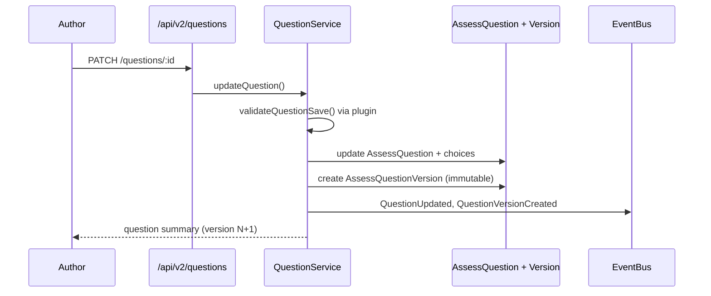
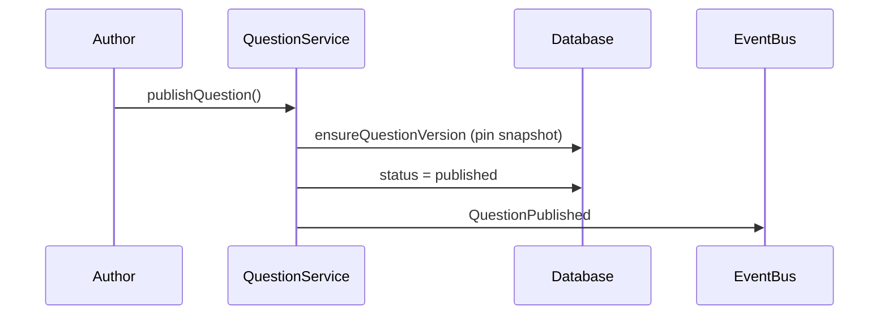

# Phase 1 — Module 04: Question Service

> **Status:** ✅ Complete  
> **Prerequisite:** Module 01 Core Domain Models, Module 02 Database Migration, Module 03 Assessment Service  
> **Next module:** [Module 05 — Universal Renderer Framework](./PHASE1-MODULE-05-UNIVERSAL-RENDERER.md)

---

## Summary

The Question Service is the **single source of truth** for all assessment content. One canonical `AssessQuestion` is reusable across practice, homework, live quiz, mock tests, coding assessments, placement tests, and future modes. Every edit creates an immutable `AssessQuestionVersion`; historical attempts always render the pinned version.

This module is **additive** — legacy quiz builder, bank questions, and live sessions are untouched.

---

## Success Criteria

| Criterion | Status |
|-----------|--------|
| Single source of truth for assessment content | ✅ |
| Future assessment modes consume questions without core changes | ✅ |
| New question types via plugins (no switch statements) | ✅ |
| Historical attempts reproducible via immutable versions | ✅ |
| Analytics, AI metadata, search, media designed in | ✅ |
| Backward compatible; legacy APIs untouched | ✅ |

---

## Deliverables

| Artifact | Path |
|----------|------|
| Question metadata types | `backend/src/assessment-platform/domain/questionMetadata.ts` |
| Plugin registry | `backend/src/assessment-platform/infra/pluginRegistry.ts` |
| Built-in plugins (MCQ, multi-select, T/F, poll, essay) | `backend/src/assessment-platform/plugins/registerQuestionPlugins.ts` |
| Access control | `backend/src/assessment-platform/services/questionAccess.ts` |
| Validation pipeline | `backend/src/assessment-platform/services/questionValidation.ts` |
| Question service | `backend/src/assessment-platform/services/questionService.ts` |
| Media service | `backend/src/assessment-platform/services/mediaService.ts` |
| Import normalization | `backend/src/assessment-platform/services/questionImport.ts` |
| Collections service | `backend/src/assessment-platform/services/questionCollectionService.ts` |
| Controller | `backend/src/assessment-platform/controllers/questionController.ts` |
| Routes | `backend/src/assessment-platform/routes/questions.ts` |
| Validation script | `backend/src/assessment-platform/scripts/validate-question-service.ts` |

---

## ER Updates (Module 04)

Extended existing Phase 1 models — no legacy table changes.

```
AssessQuestion
├── AssessQuestionVersion (immutable snapshots)
├── AssessChoice (current editable options)
├── AssessQuestionAnalytics (lifetime metrics)
├── AssessQuestionRelation (parent/child/passage/case/coding subtasks)
├── AssessQuestionCollectionItem → AssessQuestionCollection
└── MediaUsage → MediaAsset (questions never own files)

AssessQuestion fields added:
  departmentId, subject, courseId, unit, chapter, topic, subtopic,
  learningOutcome, marks, negativeMarks, keywords, aliases,
  placementTags, companyTags, skillTags, visibility, permissionMode,
  language, aiGenerated, aiConfidence, forkedFromId, searchText
```

### Versioning Flow



### Publish Flow



---

## API Documentation

Base path: `/api/v2/questions` (authenticated)

### Questions

| Method | Path | Description |
|--------|------|-------------|
| POST | `/` | Create question (draft + v1) |
| GET | `/` | Search/list with filters |
| GET | `/:id` | Full question with relations, media, analytics |
| PATCH | `/:id` | Update (creates new version) |
| POST | `/:id/publish` | Publish + pin version |
| POST | `/:id/archive` | Archive question |
| POST | `/:id/fork` | Clone with `forkedFromId` |
| POST | `/:id/validate` | Dry-run validation pipeline |
| POST | `/:id/tags` | `{ tags: string[] }` |
| POST | `/:id/relations` | `{ childQuestionId, relationType, order? }` |
| DELETE | `/relations/:relationId` | Remove relation |
| GET | `/:id/versions` | Version history |
| GET | `/:id/versions/:versionId` | Immutable snapshot |
| POST | `/versions/:versionId/evaluate` | Plugin evaluate (preview) |

### Media

| Method | Path | Description |
|--------|------|-------------|
| POST | `/:id/media` | `{ assetId, role, pinToVersion? }` |
| DELETE | `/media/:usageId` | Detach media usage |

### Import

| Method | Path | Description |
|--------|------|-------------|
| POST | `/import` | `{ source, questions: [] }` — normalization pipeline |

Supported sources: `excel`, `csv`, `json`, `moodle`, `canvas`, `quizizz`, `google_forms`, `ai_generated`, `question_bank`, `legacy_quiz`

### Collections

| Method | Path | Description |
|--------|------|-------------|
| GET | `/collections` | List banks/folders |
| POST | `/collections` | Create collection |
| GET | `/collections/:id/questions` | List members |
| POST | `/collections/:id/items` | Add question |
| DELETE | `/collections/:id/items/:questionId` | Remove question |

### Search Filters (GET `/`)

`q`, `typeSlug`, `subject`, `topic`, `difficulty`, `bloomLevel`, `visibility`, `status`, `authorId`, `aiGenerated`, `hasMedia`, `language`, `collectionId`, `minHealthScore`, `limit`, `offset`

Fuzzy/full-text search deferred to Phase 2 (PostgreSQL `tsvector` or Elasticsearch). `searchText` column is populated on every save for `contains` queries today.

---

## Domain Events

Persisted to `PlatformAnalyticsEvent` via event bus:

| Event | When |
|-------|------|
| `QuestionCreated` | New question |
| `QuestionUpdated` | Metadata/choices changed |
| `QuestionVersionCreated` | Immutable version row created |
| `QuestionPublished` | Status → published |
| `QuestionArchived` | Status → archived |
| `QuestionImported` | Import pipeline success |
| `QuestionTagged` | Tags updated |
| `MediaAttached` | MediaUsage created |
| `HintGenerated` | Reserved — AI hook (Module 14+) |
| `AIExplanationGenerated` | Reserved — AI hook (Module 14+) |

---

## Plugin Interface

Each question type self-registers via `registerPlugin()`. Core paths use `requirePlugin("questionType", slug)` — **no switch statements**.

```typescript
interface QuestionTypePlugin {
  key: string;
  typeSlug: string;
  validate(question): string[];           // structural validation
  sanitize(metadata): Record<string, unknown>;
  toSnapshot(input): Partial<QuestionVersionSnapshot>;
  evaluate(answer, question): Promise<LearningGradeResult>;
  score?(answer, question, responseTimeMs): EngagementGradeResult;
  feedback(result, question): string | null;
  analytics(result): AnalyticsMetric[];
}
```

Built-in plugins (Phase 1): `multiple_choice`, `multiple_select`, `true_false`, `poll`, `essay`

Renderer plugins (Module 05) will pair with these via `rendererKey` on `AssessQuestionType`.

---

## Validation Pipeline

Every create/update runs `validateQuestionSave()`:

1. **Type registry** — slug exists and enabled in `AssessQuestionType`
2. **Plugin structure** — `validate()` per type (choices, stem, scoring rules)
3. **Required fields** — stem, marks ≥ 0
4. **Media integrity** — referenced `MediaAsset` IDs exist
5. **Publish gate** — `POST /:id/validate` for dry-run before publish

Invalid questions are rejected with `400` before any version is created.

---

## Import Pipeline

All external sources normalize through one path:

```
Source (Excel/CSV/Moodle/AI/…) 
  → normalizeImportPayload() 
  → CreateQuestionInput 
  → validateQuestionSave() 
  → createQuestion() 
  → QuestionImported event
```

Phase 1 implements JSON/array normalization. Format-specific parsers (Moodle XML, Canvas QTI) are Phase 2 adapters that feed the same normalizer.

---

## AI Integration Points

AI operations **never mutate** the canonical question. They create sidecar content or new versions:

| Operation | Phase 1 | Future |
|-----------|---------|--------|
| Generate Hint | Metadata `hints[]` append via PATCH | `HintGenerated` event |
| Generate Explanation | `explanation` field or metadata.ai | `AIExplanationGenerated` |
| Generate Similar / Easier / Harder | `forkQuestion()` + AI fill | Copilot service |
| Translate / Grammar | New version via PATCH | AI service |
| Distractor Generation | choices via PATCH | Assessment Studio bridge |
| Bloom / Difficulty Prediction | `metadata.ai.bloomPrediction` | AI classifier |

Fields: `aiGenerated`, `aiConfidence`, `aiHistoryId`, extended metadata in `questionMetadata.ts`.

---

## Analytics

`AssessQuestionAnalytics` created on every question. Lifetime fields:

`timesUsed`, `attempts`, `correctCount`, `skipCount`, `avgTimeMs`, `avgAccuracy`, `discriminationIdx`, `pValue`, `skipRate`, `guessRate`, `popularity`, `healthScore`, `facultyRating`, `studentRating`, `aiSuggestedRevision`, `lastUsedAt`

Population hooks wire in Module 07 (Attempt Engine) and Module 08 (Scoring Engine).

---

## Permission Model

| Field | Values |
|-------|--------|
| `visibility` | `private`, `department`, `organization`, `shared`, `public` |
| `permissionMode` | `owner_only`, `department_read`, `org_read`, `public_read`, `fork_allowed`, `approval_required` |

- Author + admin: full edit
- `assertCanViewQuestion`: public published, org/shared read modes
- `assertCanForkQuestion`: owner, admin, `fork_allowed`, or public

---

## Question Relationships

`AssessQuestionRelation` supports:

`parent`, `follow_up`, `case_study_passage`, `case_study_item`, `coding_subtask`, `linked`, `passage`

Example: Reading comprehension → passage parent → 5 child items.

---

## Media Architecture

Questions **never own files**. Pattern:

```
MediaAsset (uploaded once)
  → MediaUsage (role: stem_image, explanation_video, attachment, …)
    → AssessQuestion (current)
    → AssessQuestionVersion (optional pin via pinToVersion)
```

---

## Test Coverage Summary

```bash
cd backend
npx tsx src/assessment-platform/scripts/seed-question-types.ts   # if needed
npx tsx src/assessment-platform/scripts/validate-question-service.ts
```

**15 checks passed:**

- Plugin registration (MCQ, essay)
- Create draft + version 1
- Validation pipeline
- Edit → immutable version 2
- Plugin evaluate (correct answer)
- Question relations
- Fork
- Publish + events
- Import normalization
- Collection membership
- Domain events persisted
- Searchable metadata

---

## Backward Compatibility

- Legacy `/api/quiz-builder/*`, `/api/live-sessions/*`, `BankQuestion`, `Quiz` — **unchanged**
- New tables: `AssessQuestion*`, `MediaAsset`, `MediaUsage`, collections
- v2 API is additive; frontend adoption via feature flag later
- `legacyBankId`, `legacyQuizQId` bridge fields ready for Module 12 migration adapters

---

## Approval Gate

- [x] Canonical reusable question model
- [x] Immutable versioning on every edit
- [x] Rich metadata + search foundation
- [x] Question relationships
- [x] MediaAsset + MediaUsage (no direct file ownership)
- [x] Plugin-based validate/evaluate/score/feedback/analytics
- [x] Self-registering question type plugins
- [x] Import normalization pipeline
- [x] AI metadata hooks (non-destructive)
- [x] Analytics model + lifetime fields
- [x] Validation pipeline on save
- [x] Search with structured filters
- [x] Collections (banks, placement sets)
- [x] Permission model (visibility + fork)
- [x] Domain events
- [x] Integration validation script passes
- [x] Routes registered at `/api/v2/questions`

**Approved to proceed → Module 05: Universal Renderer Framework**
