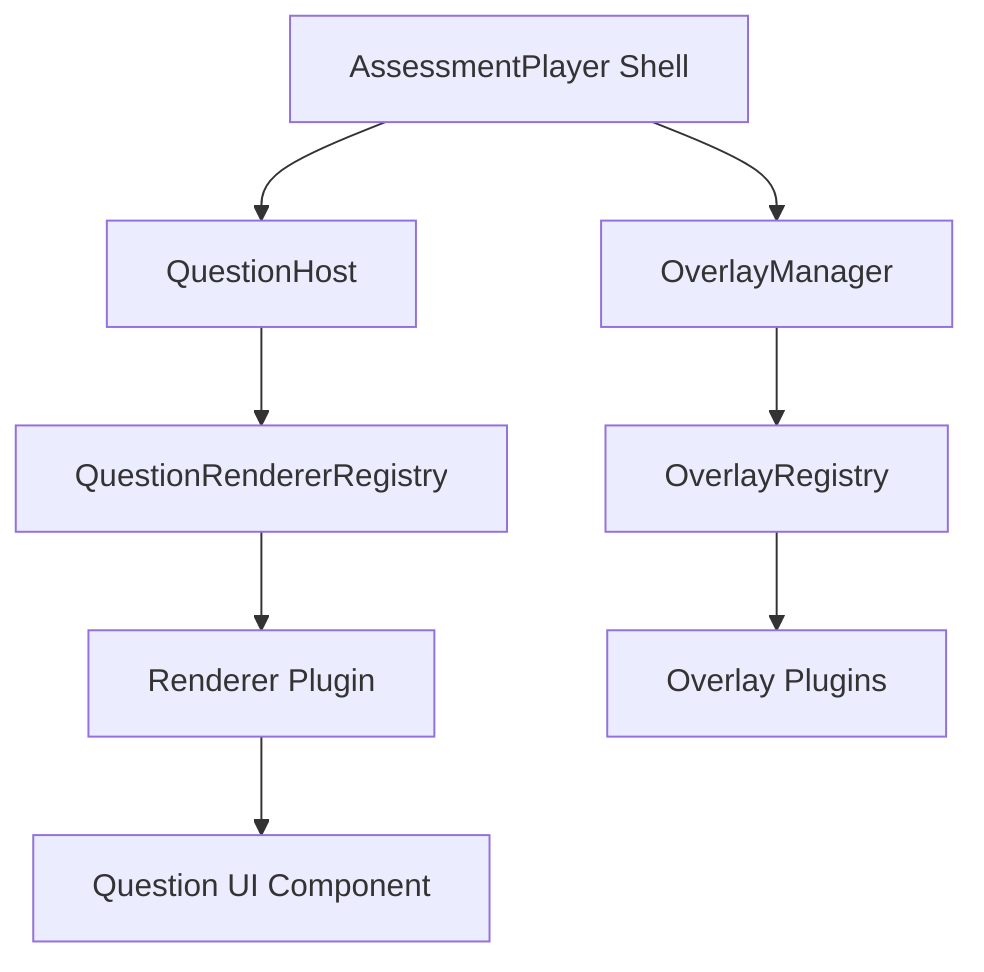
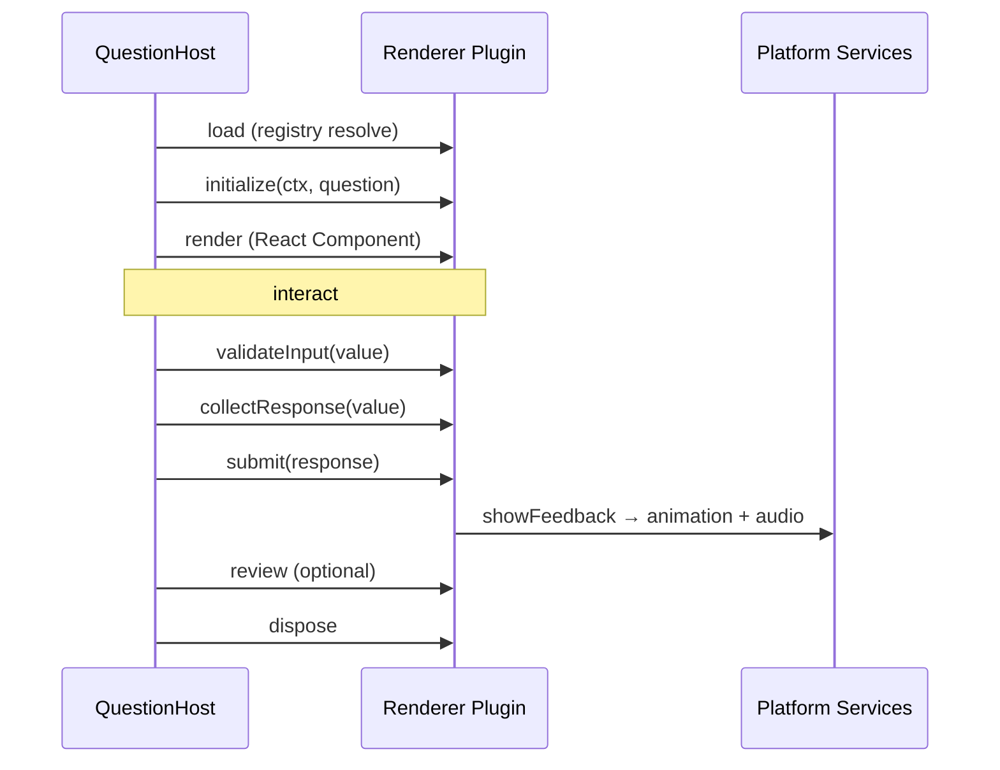
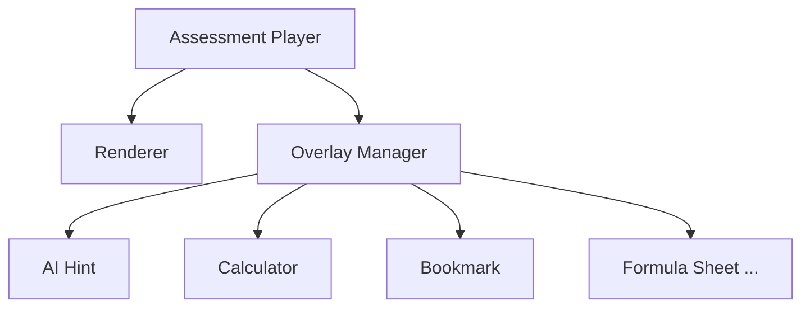
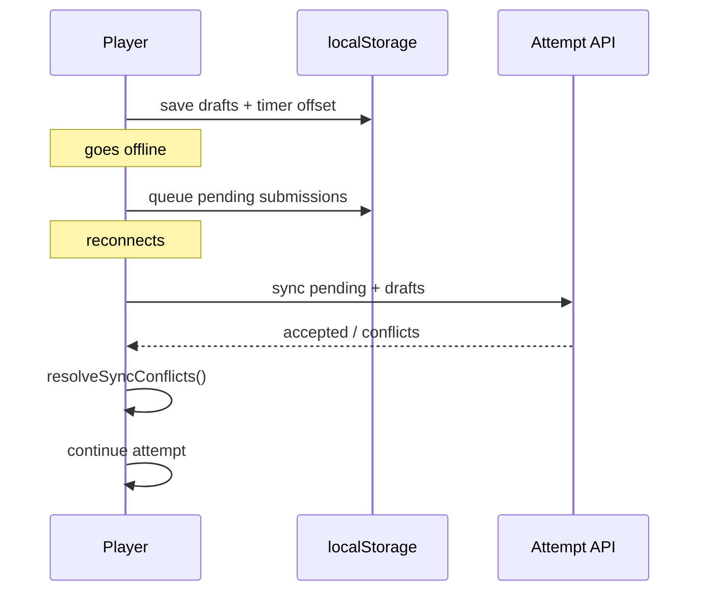

# Phase 1 — Module 05: Universal Renderer Framework

> **Status:** ✅ Complete  
> **Prerequisite:** Module 01–04  
> **Next module:** [Module 06 — Attempt Engine](./PHASE1-MODULE-06-ATTEMPT-ENGINE.md)

---

## Summary

The Universal Assessment Rendering Engine powers every assessment experience in THE GATEHUB from a **single renderer-agnostic player shell**. The player never knows what question type it renders — it resolves plugins via `QuestionRendererRegistry`. The **Learning Overlay Layer** adds AI hints, calculators, scratch pads, and more without modifying renderers.

---

## Success Criteria

| Criterion | Status |
|-----------|--------|
| Player entirely renderer-agnostic (no switch statements) | ✅ |
| New question types via renderer plugins only | ✅ |
| Overlays independent of renderers | ✅ |
| Accessibility, offline, theme, audio, animation as platform services | ✅ |
| All assessment modes use same shell + mode config | ✅ |
| Standardized response pipeline for Attempt Engine | ✅ |

---

## Deliverables

| Artifact | Path |
|----------|------|
| Renderer contracts | `frontend/src/assessment-platform/types/renderer.ts` |
| Response schema | `frontend/src/assessment-platform/types/response.ts` |
| Overlay contracts | `frontend/src/assessment-platform/types/overlay.ts` |
| Mode presets | `frontend/src/assessment-platform/types/modeConfig.ts` |
| Renderer registry | `frontend/src/assessment-platform/registry/rendererRegistry.ts` |
| Overlay registry | `frontend/src/assessment-platform/registry/overlayRegistry.ts` |
| Platform services | `frontend/src/assessment-platform/services/*` |
| Built-in renderers | `frontend/src/assessment-platform/renderers/*` |
| Overlay manager | `frontend/src/assessment-platform/overlays/OverlayManager.tsx` |
| Player shell | `frontend/src/assessment-platform/components/player/AssessmentPlayer.tsx` |
| Question host | `frontend/src/assessment-platform/components/player/QuestionHost.tsx` |
| Bootstrap | `frontend/src/assessment-platform/bootstrap.ts` |
| Tests | `frontend/src/assessment-platform/**/*.test.ts` |
| Validation script | `frontend/src/assessment-platform/scripts/validate-renderer-framework.ts` |

---

## Renderer Architecture



**No switch statements.** `QuestionHost` calls `getRenderer(typeSlug)` or `loadRenderer(typeSlug)` — never `if (type === "MCQ")`.

---

## Renderer Plugin Interface

```typescript
interface QuestionRendererPlugin {
  id: string;
  typeSlug: string;
  Component: QuestionRendererComponent;
  accessibility: RendererAccessibilityContract;

  initialize(ctx, question): void | Promise<void>;
  validateInput(value, question): string[];
  collectResponse(value, question, responseTimeMs): StandardRendererResponse;
  submit?(response): Promise<void>;
  showFeedback?(result, question): void;
  review?(value, result, question): ReactNode;
  analyticsView?(response): Record<string, unknown>;
  dispose(): void;
}
```

### Built-in Renderers (Phase 1)

| Type Slug | Plugin ID | Offline |
|-----------|-----------|---------|
| `multiple_choice` | mcq-renderer | ✅ |
| `multiple_select` | multi-select-renderer | ✅ |
| `true_false` | true-false-renderer | ✅ |
| `poll` | poll-renderer | ✅ |
| `essay` | essay-renderer | ✅ |
| `coding` | coding-renderer | lazy load |
| `fill_blank`, `matching`, `ordering` | lazy stubs | lazy load |

---

## Renderer Lifecycle



Phases: `load → initialize → render → interact → validate → collect → submit → feedback → review → dispose`

---

## Component Hierarchy

```
AssessmentPlayer (shell)
├── PlayerProgress
├── PlayerTimer
├── QuestionHost
│   └── RendererContextProvider
│       └── [Plugin].Component
├── OverlayManager
│   └── [Overlay].Component
└── PlayerNavigation
```

Shell responsibilities only: timer, progress, navigation, session state, auto-save, connectivity, accessibility shortcuts, review mode, offline cache.

---

## Registry Design

```typescript
registerRenderer(plugin);                    // sync
registerLazyRenderer(typeSlug, () => import(...));  // code-split

getRenderer(typeSlug);     // sync lookup
loadRenderer(typeSlug);    // async with cache
```

Plugins self-register in `bootstrapAssessmentPlatform()` called from `App.tsx`.

---

## Assessment Mode Configuration

Same `AssessmentPlayer`, different `ModeShellConfig`:

| Mode | Timer | Navigation | Offline | Gamification |
|------|-------|------------|---------|--------------|
| practice | ❌ | ✅ | ✅ | ❌ |
| homework | ❌ | ✅ | ✅ | ❌ |
| live_quiz | ✅ | ❌ | ❌ | ✅ |
| mock_test | ✅ | ✅ | ✅ | ❌ |
| timed_assessment | ✅ strict | ✅ | ✅ | ❌ |
| coding_assessment | ✅ | ✅ | ❌ | ❌ |
| adaptive | ❌ | ❌ | ✅ | ❌ |
| ai_interview | ✅ | ❌ | ❌ | ❌ |
| survey / poll | ❌ | varies | varies | ❌ |

Config: `frontend/src/assessment-platform/types/modeConfig.ts`

---

## Response Schema

```typescript
interface StandardRendererResponse {
  questionVersionId: string;
  rendererId: string;
  answer: unknown;
  confidence?: number;
  responseTimeMs: number;
  attachments?: RendererAttachment[];
  metadata?: Record<string, unknown>;
  collectedAt: string;
}
```

Mapped to Attempt Engine via `toAttemptPayload()` — engine never cares which renderer produced the response.

---

## Learning Overlay Layer



Overlays register independently via `registerOverlay()`. Enabled per mode through `ModeShellConfig.defaultOverlays` and `OverlayPlugin.enabledModes`.

Phase 1 overlays: `ai_hint`, `calculator`, `bookmark` + stubs for `ai_tutor`, `formula_sheet`, `scratch_pad`, `translate`, `read_aloud`, etc.

---

## Platform Services

| Service | Responsibility |
|---------|----------------|
| `ThemeEngine` | light / dark / high_contrast / org_brand tokens |
| `AnimationService` | correct, incorrect, transition, streak, achievement, completion |
| `AudioService` | correct, wrong, countdown, timer, live_join, completion |
| `PlayerEventBus` | decoupled shell/renderer/overlay events |
| `offlineCache` | question, drafts, timer offset, pending queue, sync conflicts |
| `PerformanceMonitor` | renderer load, transition, initial render metrics |

Renderers receive these via `RendererContext` — **no global state**.

---

## Accessibility Contract

Every renderer plugin exposes:

- `keyboardNavigable: true`
- `screenReaderLabels: true`
- `supportsHighContrast` / `supportsFontScaling`
- `getAriaLabel(question)` optional
- Components use `role`, `aria-checked`, `aria-live`, focus rings
- Font scaling via `--player-font-scale` CSS variable

---

## Offline Flow



---

## Performance Benchmarks

| Metric | Target |
|--------|--------|
| Initial render | < 100ms |
| Question transition | < 50ms |
| Renderer lazy load | < 200ms |

Tracked via `PerformanceMonitor` in `useRendererLifecycle`. Lazy loading via `registerLazyRenderer`.

---

## Theme System

Renderers use CSS variables from `ThemeEngine.applyToElement()`:

- `--player-bg`, `--player-fg`, `--player-primary`
- `--player-correct`, `--player-incorrect`
- `--player-font-scale`
- Org branding via `--org-*` custom properties

---

## Test Coverage Summary

```bash
cd frontend
npm install
npm test
npm run validate:renderer
```

| Suite | Tests |
|-------|-------|
| rendererRegistry | sync + lazy registration |
| overlayRegistry | mode filtering |
| response pipeline | StandardRendererResponse + toAttemptPayload |
| offlineCache | queue + conflict resolution |
| themeEngine | tokens + high contrast |
| modePresets | all 11 modes |
| rendererContract | validate + collect + a11y |

Validation script: **20+ checks passed**

---

## Backward Compatibility

- Legacy `CourseLectureQuizBlock`, `LiveQuestionDisplay`, quiz builder preview — **unchanged**
- `AssessmentPlayer` is additive; adoption via feature flag per surface
- Bootstrap runs at app init; no impact on routes without v2 player

---

## Approval Gate

- [x] Renderer-agnostic player shell
- [x] Plugin registry with lazy loading
- [x] Full renderer lifecycle contract
- [x] Standardized response pipeline
- [x] 11 assessment mode presets
- [x] Learning Overlay Layer
- [x] Theme, animation, audio platform services
- [x] Offline cache + sync conflict resolution
- [x] Accessibility contract on all built-in renderers
- [x] Performance targets documented
- [x] Unit tests + validation script
- [x] Bootstrap registered in App.tsx

**Approved to proceed → Module 06: Attempt Engine**
