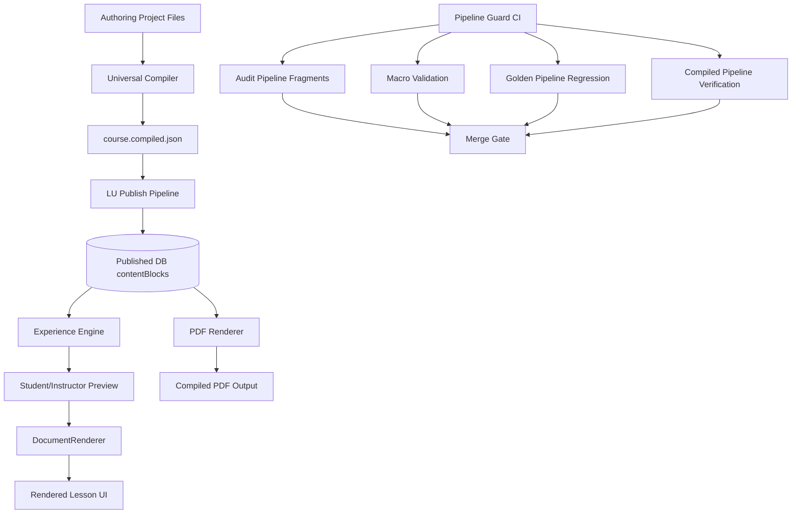

# Universal Pipeline v2.0 Dependency Graph

## System Graph

## Responsibility Boundaries

- Universal Compiler: source normalization + AST generation.
- `course.compiled.json`: canonical compile artifact contract.
- Publish Pipeline: persistence of compiled AST-backed blocks.
- Experience Engine: lesson-step composition from persisted blocks.
- DocumentRenderer: canonical runtime renderer for AST nodes.
- PDF Renderer: canonical document/PDF projection from AST content.
- CI Guard: merge blocker for pipeline regressions.

## Allowed Extension Points

- Add new AST node type (compiler + renderer + PDF + tests together).
- Add new interactive block type through structured block path.
- Add validation rules to pipeline guard scripts.

## Forbidden Patterns

- Runtime TeX parse in production render path.
- Runtime AST reconstruction from legacy markdown/html.
- Runtime media reinjection to patch published lesson bodies.
- Introducing parallel preview/PDF pipelines with different source-of-truth.
