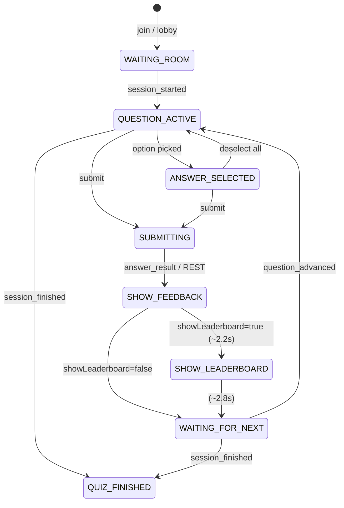
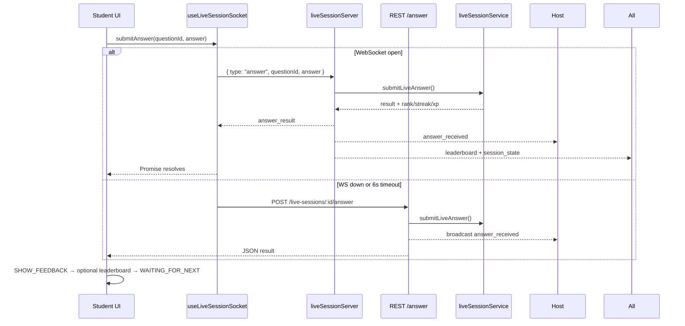

# A1.2 — Live Quiz Experience (Quizizz-style)

Production rebuild of the end-to-end **Live Quiz** flow for THE GATEHUB Assessment Hub. Backend architecture is **extended, not redesigned**. Frontend gains an explicit student state machine, REST submit fallback, reconnect UX, and phased feedback/leaderboard/waiting UI.

## Scope

| Priority | Delivered |
|----------|-----------|
| **P0** | Submit pipeline: WS → scoring → persistence → host notify → state; REST fallback on disconnect/timeout |
| **P1** | Student state machine (`playerStateMachine.ts` + `useLivePlayerFlow`) |
| **P2** | Post-submit feedback (correct/wrong, points, XP, streak, speed bonus, explanation) |
| **P3** | Instructor **Next Question** → auto question reset via `question_advanced` + `session_state` |
| **P4** | “Answer submitted / Waiting for instructor…” with progress animation; no double submit |
| **P5** | Leaderboard is **momentary** (after feedback), controlled by `settings.showLeaderboard` |
| **P6** | WS reconnect: exponential backoff, inline banner, **one toast** after exhaustion |
| **P7** | Host analytics refresh + pulse on each `answer_received` |
| **P8** | `GET /player-view` restores submitted state on refresh |
| **P9** | Disabled submit until selection, spinners, transitions, timer urgency |
| **P10** | Regression script `npm run validate:a1-live` |

**Out of scope (this release):** Homework (A2), Reports, Session History.

---

## Routes

| Role | URL |
|------|-----|
| Host | `/instructor/quiz-room/:sessionId/host` |
| Student | `/live/play/:sessionId` |
| Projector | `/live/display/:sessionId` |
| WebSocket | `/live-sessions/ws/:sessionId?token=…&mode=play\|host` |

---

## Student state machine



Implementation: `frontend/src/lib/liveSession/playerStateMachine.ts`, orchestrated by `frontend/src/hooks/useLivePlayerFlow.ts`.

---

## Submit pipeline (P0)



### Root causes fixed

1. **Submit appeared to do nothing** — fire-and-forget WS send with no Promise; UI depended on async `answer_result` without REST fallback.
2. **Selection reset on phase change** — `onSelectionChange` in question `useEffect` deps cleared answers when parent re-rendered.
3. **Error toast spam (host)** — `ws.onerror` + `useEffect([error])` toasted every reconnect attempt.

---

## WebSocket message flow

| Message | Direction | Purpose |
|---------|-----------|---------|
| `connected` | S→C | `participantId`, `isHost` |
| `session_state` | S→C | Full `LiveSessionState` |
| `session_started` | S→C | Quiz began |
| `question_advanced` | S→C | Host pressed Next |
| `answer` | C→S | Student submit |
| `answer_result` | S→C | Scoring feedback to submitter |
| `answer_received` | S→C | Host analytics trigger |
| `leaderboard` | S→C | Rankings update |
| `session_finished` | S→C | Final podium |
| `error` | S→C | Action errors only (not connection blips) |

Connection phases: `connecting` → `connected` → `reconnecting` (backoff 1s→30s, max 8 attempts) → `failed`.

---

## REST fallback

| Endpoint | Method | Purpose |
|----------|--------|---------|
| `/api/live-sessions/:id/player-view` | GET | Restore question + submitted answer on refresh |
| `/api/live-sessions/:id/answer` | POST | Submit when WS unavailable or timed out |

Body: `{ questionId, answer }` — participant resolved from auth token.

---

## State sync on refresh (P8)

1. WebSocket reconnects → `session_state` restores lobby/active/finished + current question index.
2. `GET /player-view` checks `liveAnswer` for current question.
3. If already submitted → `WAITING_FOR_NEXT` + feedback payload (no re-submit).
4. Server rejects duplicate answers (`multipleAttempts: false`).

---

## UI components

| Component | Phase |
|-----------|-------|
| `LiveQuestionDisplay` | `QUESTION_ACTIVE` / `ANSWER_SELECTED` / `SUBMITTING` |
| `LiveAnswerFeedback` | `SHOW_FEEDBACK` |
| `LiveLeaderboardReveal` | `SHOW_LEADERBOARD` (if `showLeaderboard`) |
| `LiveWaitingForHost` | `WAITING_FOR_NEXT` |

Leaderboard is **not** pinned under the question card during play (P5).

---

## Host dashboard (P7)

- Inline reconnect banner (no toast spam).
- `actionError` banner for start/next/finish validation errors (dismissible).
- `LiveSessionAnalyticsPanel` refetches on `answer_received`; `answerPulse` key triggers refresh animation.
- Podium remains on host view between questions (instructor context).

---

## Screenshots (manual E2E)

Capture during regression:

1. Waiting room — host + student lobby
2. Active question — student before submit
3. Feedback — green/red animation with points
4. Waiting for instructor
5. Host analytics — answered count increment
6. Next question — student auto-advance without refresh
7. Final results podium

Store under `docs/features/assets/a1.2/` when captured.

---

## Validation

```bash
cd backend
npm run validate:a1-live
```

### Manual regression (P10)

1. Instructor: Assessment Hub → launch quiz room
2. Student: open `/live/play/:sessionId`
3. Host: Start when ≥1 student ready
4. Student: select answer → Submit → see feedback → waiting
5. Host: see answered count increase
6. Host: Next Question
7. Student: question 2 without refresh
8. Repeat through finish → results
9. Refresh student mid-wait → still waiting, no duplicate submit
10. Kill network briefly → reconnect banner, no toast spam; submit via REST if needed

---

## Key files

| Area | Path |
|------|------|
| State machine | `frontend/src/lib/liveSession/playerStateMachine.ts` |
| Player flow hook | `frontend/src/hooks/useLivePlayerFlow.ts` |
| Socket + reconnect | `frontend/src/hooks/useLiveSessionSocket.ts` |
| Student page | `frontend/src/pages/student/LiveSessionPlayerPage.tsx` |
| Host page | `frontend/src/pages/instructor/LiveSessionHostPage.tsx` |
| Submit + player view | `backend/src/services/liveSession/liveSessionService.ts` |
| WS server | `backend/src/ws/liveSessionServer.ts` |
| REST routes | `backend/src/routes/liveSessions.ts` |

---

## Backward compatibility

- Existing WS host actions (`host:start`, `host:next_question`, `host:finish`) unchanged.
- `showLeaderboard` setting now controls **post-answer reveal** on student client, not a permanent sidebar.
- `useLiveSessionSocket` still exposes deprecated `error` / `clearError` aliases for `actionError`.

---

## Follow-ups (not blocking)

- Confetti on streak milestones (P9 future-ready hook in `LiveAnswerFeedback`)
- Idempotent REST submit returning existing answer on duplicate
- Projector view phased UI parity with student flow
