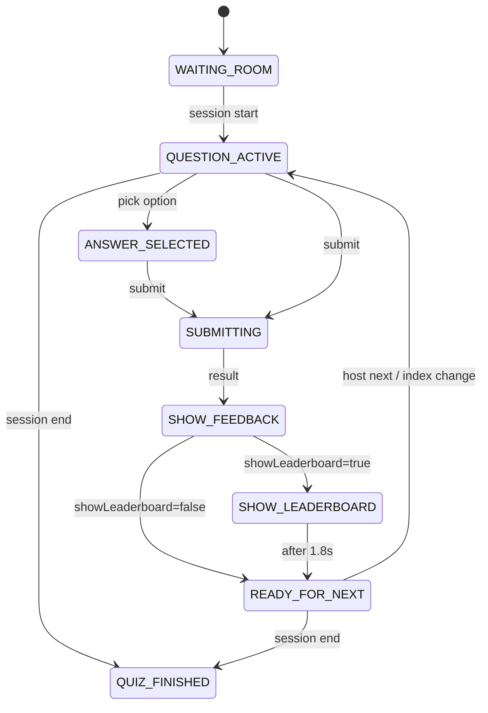

# A1.5 — Live Player Polish (Quizizz-Inspired)

> **Status:** Implemented — awaiting manual QA  
> **Date:** July 6, 2026  
> **Prerequisite:** A1.4 selection fix ✅  
> **Blocks:** A2 Homework until manual 10-question walkthrough passes

---

## 1. Old flow (broken engagement)

```
Question
  ↓ Submit
Full-screen "Answer submitted — Waiting for instructor…"
  ↓ (blocks entire player)
Host Next
  ↓
Question N+1
```

**Problems:**
- No immediate gratification after submit
- Full-page waiting replaced all context (score, streak, progress)
- Felt like a dead end, not a live game
- Feedback phase was too short or skipped visually before wait screen

---

## 2. New flow (instructor-paced, Quizizz-inspired)

```
Question Active
  ↓ Submit
SHOW_FEEDBACK (2.6s full animation)
  ✓/✗  Points  XP  Streak  Rank  Accuracy  Time
  Animated countdown bar
  ↓
[Optional] SHOW_LEADERBOARD (1.8s modal overlay)
  ↓
READY_FOR_NEXT
  Compact result card stays visible
  + small pill: "Waiting for next question…"
  Header stays live (score, rank, XP update)
  ↓
Host Next → session_state index change
  ↓
Fade transition → Question N+1
```

**If host advances during feedback:** `session_state` question index change resets player immediately — no wait page, no blank screen.

---

## 3. Updated state machine



**Removed:** `WAITING_FOR_NEXT` full-screen state (replaced by `READY_FOR_NEXT` + `LiveReadyStatusBar`).

| Phase | UI |
|-------|-----|
| `SHOW_FEEDBACK` | Full `LiveAnswerFeedback` variant=full |
| `SHOW_LEADERBOARD` | Compact feedback + modal overlay |
| `READY_FOR_NEXT` | Compact feedback + status pill |

---

## 4. UX improvements

| Area | Change |
|------|--------|
| **Answer cards** | Larger touch targets (min 3.5rem), A/B/C letter badges, spring tap animation |
| **Colors** | Gradient timer, primary ring on selection, emerald/red feedback gradients |
| **Header** | `LivePlayerHeader` — quiz progress bar, rank, score, accuracy, streak, XP |
| **Feedback** | 24px icons, stat pills, correct answer on wrong, explanation |
| **Waiting** | Non-blocking `LiveReadyStatusBar` pill — not full page |
| **Leaderboard** | Modal overlay with backdrop — player shell stays mounted |
| **Transitions** | Question slide fade (`x: 24 → 0`); feedback spring scale |
| **Mobile** | max-w-3xl, responsive padding, compact header stats |

Inspired by Quizizz instructor-paced mode; visual identity remains THE GATEHUB (gold primary, premium cards).

---

## 5. Animation timings

| Constant | Value | Purpose |
|----------|-------|---------|
| `FEEDBACK_DURATION_MS` | **2600ms** | Full feedback before compact/leaderboard |
| `LEADERBOARD_REVEAL_MS` | **1800ms** | Overlay duration when enabled |
| Question enter | **350ms** | Slide + fade |
| Feedback icon spring | stiffness **400** | Bounce-in correct/wrong |
| Countdown bar tick | **40ms** | Smooth fill during feedback |
| Timer tick | **200ms** | Question countdown |

Source: `frontend/src/lib/liveSession/livePlayerTimings.ts`

---

## 6. Files changed

| File | Role |
|------|------|
| `playerStateMachine.ts` | `READY_FOR_NEXT`, post-submit helpers |
| `livePlayerTimings.ts` | Shared timing constants |
| `useLivePlayerFlow.ts` | Post-feedback transitions |
| `LiveSessionPlayerPage.tsx` | Shell layout, no full-page wait |
| `LiveAnswerFeedback.tsx` | full/compact variants, countdown |
| `LiveReadyStatusBar.tsx` | Non-blocking status pill |
| `LivePlayerHeader.tsx` | Progress + live stats |
| `LiveQuestionDisplay.tsx` | Premium option cards |
| `LiveLeaderboardReveal.tsx` | Modal overlay |

---

## 7. Screenshots

| State | Capture |
|-------|---------|
| Question (polished cards) | Manual QA |
| Full feedback (correct) | Manual QA |
| Full feedback (incorrect + correct answer) | Manual QA |
| Ready pill + compact feedback | Manual QA |
| Leaderboard overlay | Manual QA |
| Question transition | Manual QA |

Store at `docs/features/assets/a1.5/`

---

## 8. Manual QA checklist

| # | Step | Pass |
|---|------|:----:|
| 1 | Select option → highlight + letter badge | ☐ |
| 2 | Submit → **immediate** full feedback (not wait screen) | ☐ |
| 3 | See points, XP, streak, rank, accuracy, time on feedback | ☐ |
| 4 | After ~2.6s → compact card + "Waiting for next question…" pill | ☐ |
| 5 | Header score updates after submit | ☐ |
| 6 | Host Next → fade to Q+1, no blank/full wait page | ☐ |
| 7 | Host Next **during** feedback → immediate Q+1 | ☐ |
| 8 | Leaderboard overlay (if enabled) → dismisses, ready pill remains | ☐ |
| 9 | Refresh while ready → compact feedback + pill restored | ☐ |
| 10 | Complete 10-question quiz end-to-end | ☐ |

---

## Validation

```bash
cd frontend && npm test -- playerStateMachine.test.ts   # 5/5
cd backend && npm run validate:a1-pat                    # 10/10
```

---

## Regression

| Area | Status |
|------|--------|
| A1.4 option selection | Unaffected — separate disabled props |
| Submit pipeline | Unchanged |
| Reconnect / refresh | READY_FOR_NEXT on restore |
| WebSocket next question | `session_state` index effect |

**A2 Homework blocked** until checklist above is signed off.
